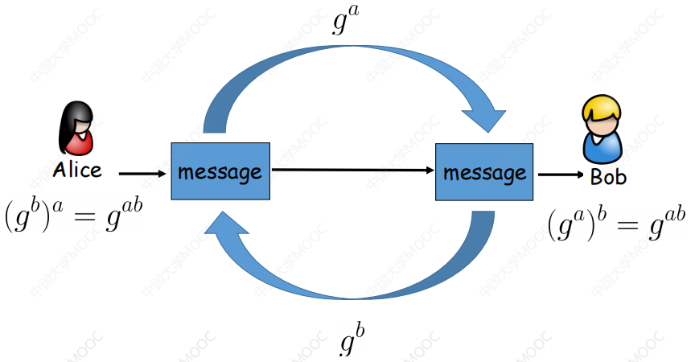

# 第三章 群

## 3.1 二元运算

近世代数起源：求解高次方程→证明出五次和五次以上一般代数方程没有求根公式→引入了扩域和群的概念，发现了高次代数方程可解的法则→近世代数

集合A上的代数运算/二元运算：设A为集合，一个映射$f:A\times A\rightarrow A$称为集合A上代数运算或二元运算。

一个集合A上的二元运算必须满足以下条件：
①可运算性：A中任意两个元素都可以进行这种运算
②单值性：A中任意两个元素的运算结果都是唯一的
③封闭性：A中任意两个元素运算的结果都属于A

一个代数运算一般可以用：$\circ,\cdot,+,\times$等符号表示，如f为集合A上的一个代数运算，$f(x,y)=z$可以写成$z=x\circ y$。

如：整数集合Z上的加法运算是代数运算，自然数集合N上的减法运算不是代数运算，因为不符合封闭性。

结合律：若“$\circ$”是A上的代数运算，如果对于A中的任意3个元素$a,b,c$都有$(a\circ b)\circ c=a\circ(b\circ c)$，则称“$\circ$”在集合A上满足结合律。

交换律：若“$\circ$”是A上的代数运算，如果对于A中的任意2个元素$a,b$都有$a\circ b=b\circ a$，则称“$\circ$”在集合A上满足交换律。

分配律：若“$\circ$”是A上的代数运算，如果对于A中的任意3个元素$a,b,c$都有
$\left\{\begin{aligned}a\circ (b+c)=a\circ b+a\circ c\\(b+c)\circ a=b\circ a+b\circ a\end{aligned}\right.$，则称“$\circ$”对“+”在集合A上满足分配律。

## 3.2 群的定义和简单性质

群：设G是一个具有代数运算$\circ$的非空集合，并且满足：
①结合律：$\forall a,b,c\in G,有(a\circ b)\circ c=a\circ (b\circ c)$
②有单位元：$\exist e\in G,\forall a \in G,e\circ a=a\circ e=a$
③有逆元：$\forall a\in G,\exist a^{-1}\in G,a\circ a^{-1}=a^{-1}\circ a=e$
则称非空集合G关于代数运算$\circ$构成一个群。

如①全体整数Z对于加法构成一个群，称为**整数加群$(z,+)$**，单位元为0，a的逆元为-a，同理全体有理数集合Q，全体实数集合R，全体复数集合C也对加法构成群，分别记为$(Q,+),(R,+),(C,+)$。
②非零实数$R^*$对于通常的乘法构成一个群，全体正实数$R^+$对于通常的乘法也构成一个群
③模正整数n的最小非负完全剩余系$Z_n$对于模n的加法构成一个群，称为**整数模n加群**，其单位元为0，a的逆元为n-a。
④元素在数域P的全体n级可逆矩阵对于矩阵的乘法构成一个群，这个群记为$GL_n(P)$，称为**n级一般线性群**。

性质①（单位元唯一）：群G中存在唯一的元素e，使得对于所有的$a\in G$，有$e\circ a=a\circ e=a$。
证明：若还有另一个单位元$e^{'}$满足上述性质，则$ee^{'}=e=e^{'}$，则$e\equiv e^{'}$。

性质②（逆元唯一）：若对群G中任意一元素a，存在唯一元素$b\in G$使得$a\circ b=b\circ a=e$。
证明：由群的定义可知，存在一个元素a是a的逆元，设其为b，再假设一个c有上述性质，则$c=c\circ e=c\circ (a\circ b)=(c\circ a)\circ b=e\circ b=b$，所以$c\equiv b$。

性质③（消去律成立）：设$a,b,c$是群G中的任意三个元素，则若$a\circ b=a\circ c$，则$b=c$（左消去律）；若$b\circ a=c\circ a$，则$b=c$（右消去律）。
证明：若$a\circ b=a\circ c$，则
$$
\begin{align}
a^{-1}\circ(a\circ b)&=a^{-1}\circ(a\circ c)\\
(a^{-1}\circ a)\circ b&=(a^{-1}\circ a)\circ c\\
e\circ b&=e\circ c\\
b&=c\\
\end{align}
$$
同理，由$b\circ a=c\circ a$也可得$b=c$。

性质④（一次方程解唯一）：对于群G中的任意元素$a,b$，方程$ax=b和xa=b$在群G中有唯一解。
证明：显然，$x=a^{-1}b$是方程的接，所以有解。假设$x_1,x_2$是方程的两个解，则$ax_1=ax_2$，根据消去律可得$x_1=x_2$。这就证明了唯一性。$xa=b$同理可证。

性质⑤（乘积的逆等于逆的乘积）：对群G中的任意元素$a,b$，都有$(ab)^{-1}=b^{-1}a^{-1}$。
证明：由于$abb^{-1}a^{-1}=b^{-1}a^{-1}ab=e$所以$(ab)^{-1}=b^{-1}a^{-1}$。

群的判定定理①：设G为一非空集合，G上**乘法封闭**且满足**结合律**。若对于任意$a,b\in G$，**方程$ax=b,ya=b$在G中有解**，则G是群。
证明：①有单位元：G中任意一个固定元素b，设方程$yb=b$在G中的解用e表示，即有$eb=b$。再任取$a\in G$，设方程$bx=a$在G中的解为e，即有$bc=a$。于是$ea=e(be)=(eb)c=bc=a$，所以对于任一个a都有$ea=a$，即e是做单位元。同理可证有一个$e^{'}$为右单位元。又$e=ee^{'}=e^{'}$，所以左单位元与右单位元相同，所以有单位元。
②有逆元：对任意元素a，由于ya=e在G中有解，设其为$a^{'}$，则$a^{'}$为a的左逆元。同理有一个$a^{''}$为a的右逆元。又$a^{''}=ea^{''}=a^{'}aa^{''}=a^{'}e=a^{'}$，所以左逆元与右逆元相同。所以$\forall a\in G$有逆元。
综上所述：有单位元，有逆元，满足结合律，是群。
即：$\exist e,a^{-1}\iff\forall a,b\in G,\exist x,y\in G,ax=b,ya=b$

有限群：群G中只含有有限个元素，则称G为有限群。

无限群：群G中含有无限多个元素，则称G为无限群。

群的阶：群G中的元素个数称为群的阶，记为|G|，如对整数模n加群$Z_n$，有$|Z_n|=n$。

群的判定定理②（有限群）：有乘法的**有限**集合G，若其乘法在G中**封闭**，且满足**结合律**和**消去律**，则G是群。
证明：设集合G中元素个数为n，则设$G=\{a_1,a_2,\cdots,a_n\}$。
全部左乘$a,a\in G$，得到$G^{'}=\{aa_1,aa_2,\cdots,aa_n\}\subseteq G$（封闭性）。
$i\neq j$时，$aa_i\neq aa_j$，否则由于消去律可得$a_i=a_j$，矛盾。
所以$G^{'}$的元素个数与G相同，也为n，所以$G^{'}=G$。
所以$\forall b\in G,\exist a_k\in G^{'}=G,b=aa_k$。即$ax=b$在G中有解，同理，右乘一个$a\in G$可证$ya=b$在G中也有解。
根据群的判定定理①，G是群，得证。

例子：证明模m的最小非负简化剩余系$Z_m^*$，关于模m的乘法构成一个群。

解：$Z_M^*$的元素个数为$\varphi(m)$个，显然其对于模m的乘法封闭（因为$gcd(a,m)=1,gcd(b,m)=1\Rightarrow gcd(ab,m)=1$），且满足结合律。由2.2乘法逆元的定义，$Z_m^*$中的所有元素都存在模m的乘法逆元。对于任意$a,b,c\in Z_m^*$，若$ab\equiv ac(mod\ m)$，则有$a^{-1}ab\equiv a^{-1}ac(mod\ m)$，即$b\equiv c(mod\ m)$。因此，模m的乘法在$Z_M^*$上满足消去律。根据群的判定定理②，$Z_m^*$是群。

## 3.3 子群、陪集

**子群**：如果群G的非空子集合H对于G中的运算也构成一个群，那么H为G的子群，记为$h\le G$。

**平凡子群和非平凡子群**：仅有单位元素构成的子集合$\{e\}$和G本身也是G的子群，这两个称为G的平凡子群，其他的子群称为非平凡子群。

设n为一个正整数，在整数加群$Z$中所有n的倍数对于加法显然构成一个群，且是Z的子群。这个子群记为$nZ$。

一个群G和它的一个子群H有：
性质①：G的单位元和H的单位元是同一的
性质②：如果$a\in H$,$a^{-1}$是n在G中的逆元，则$a^{-1}\in H$
证明：对于任意$a\in H$，有$a\in G$。
①设G的单位元为$e$，H的单位元为$e^{'}$，则$ee^{'}=e^{'}=e^{'}e^{'}$，由消去律得$e=e^{'}$
②对于任意$a\in H$，假设$a^{-1}\notin H$，则在H中有另一个逆元$a^{'}$，由于$a^{'}\in G$，a在G中有两个逆元，矛盾，所以$a^{-1}\in H$。

对乘法构成群的时候，规定$a^n=\overbrace{aa\cdots a}^{n个}\\a^0=e\\a^{-n}=(a^{-1})^n$所以$a^ma^n=a^{m+n}\\(a^m)^n=a^{mn}$。

**子群构造定理①**：设G是群，对于任意$a\in Z$，定义$\langle a\rangle=\{a^i|i\in Z\}$，则$\langle a\rangle$是G的子群。
证明：①因为对任意$i,j\in Z$，有$a^ia^j=a^{i+j}$，所以$\langle a\rangle$对于G中的**乘法封闭**。②**乘法结合律**在$\langle a\rangle$中显然成立。③设e是群G中的单位元，由于$a^0=e$,且对于任意$i\in Z$，有$a^ia^0=a^0a^i=a^i$，所以$\langle a\rangle$中存在**单位元**$e=a^0$。④又$\forall a^i\in\langle a\rangle,\exist a^{-1}\in \langle a\rangle,a^ia^{-i}=a^{-i}a^i=a^0=e$，所以有**逆元**。综上所述，$\langle a\rangle$为G的子群。

$\langle a\rangle$称为由a生成的子群。

**子群的判定定理**：群G的非空集合H是一个子群的充要条件是：对于任意$a,b\in H$，有$ab^{-1}\in H$。
证明：必要性：显然。充分性：H非空，则H中至少存在一个元素，设为a，因而令$b=a$，有$aa^{-1}=e\in H$（对任意a，H有单位元e）
令$a=e,b=a$。有$ea^{-1}=a^{-1}\in H$（对任意a，H有逆元$a^{-1}$）
对任意$b\in H$，有$b^{-1}\in H$，所以令$a=a,b=b^{-1}$，有$a(b^{-1})^{-1}=ab\in H$（H满足封闭性）
所以H是群。

例题①：找出$Z_6$关于模6加法所构成群的子群。
$$
这里由于是加法群，所以a^k=\underbrace{a+\cdots+a}_{k个a}\\
\begin{align}
Z_6=&\{0,1,2,3,4,5\}\\
\langle 0\rangle=&\{0\}\\
\langle 1\rangle=&\{0,1,2,3,4,5\}=\langle 5\rangle=Z_6\\
\langle 2\rangle=&\{0,2,4\}=\langle 4\rangle\\
\langle 3\rangle=&\{0,3\}\\
\langle 4\rangle=&\{0,4,2\}=\langle 2\rangle\\
\langle 5\rangle=&\{0,5,4,3,2,1\}=\langle 1\rangle=Z_6\\
\end{align}\\
子群：\langle 0\rangle,\langle 2\rangle,\langle 3\rangle,Z_6\\
平凡子群：Z_6,\langle 0\rangle\\
非平凡子群:\langle 2\rangle,\langle 3\rangle
$$
例题②：找出$Z_7^*$关于模7乘法所构成群的子群。
$$
这里由于是乘法群，所以a^k=\underbrace{a\times\cdots\times a}_{k个a}\\
\begin{align}
Z_7^*=&\{1,2,3,4,5,6\}\\
\langle 1\rangle=&\{1\}\\
\langle 2\rangle=&\{1,2,4\}=\langle 4\rangle\\
\langle 3\rangle=&\{1,3,2,6,4,5\}=\langle 5\rangle=Z_7^*\\
\langle 4\rangle=&\{1,4,2\}=\langle 2\rangle\\
\langle 5\rangle=&\{1,5,4,6,2,3\}=\langle 3\rangle=Z_7^*\\
\langle 6\rangle=&\{1,6\}\\
\end{align}\\
子群：\langle 1\rangle,\langle 2\rangle,\langle 6\rangle,Z_7^*\\
平凡子群：Z_7^*,\langle 1\rangle\\
非平凡子群:\langle 2\rangle,\langle 6\rangle
$$
**等价关系**：集合A上的一个二元关系$\sim$，满足自反性、对称性、传递性，那么称$\sim$是集合A上的一个等价关系。

**等价类$[a]$**：若$\sim$是A上的一个等价关系，$a\in A$，则和a等价的所有元素组成的一个子集成为A中由a确定的等价类，记为$[a]$。

**由子群H诱导的等价关系$R_H$**：设G为群，H是群G的一个子群，在群G上定义关系$a\sim b$当且仅当$b^{-1}a\in H$，则$\sim$是G上的一个等价关系，记为$R_H$

$R_H$是等价关系的证明：①自反性：$a^{-1}a=e\in H\Rightarrow a\sim a$②对称性：$a\sim b\Rightarrow b^{-1}a\in H\Rightarrow a^{-1}b=(b^{-1}a)^{-1}\in H\Rightarrow b\sim a$③传递性：$a\sim b\sim c\Rightarrow b^{-1}a,c^{-1}b\in H\Rightarrow c^{-1}a=(c^{-1}b)(b^{-1}a)\in H\Rightarrow a\sim c$。

**陪集**：设H是群G的一个子群，对于G中的任意元素a，称集合$aH=\{ah|h\in H\}$为H的左陪集。集合$Ha=\{ha|h\in H\}$为H的右陪集。

对于任意元素$a\in G$，$H,aH,Ha$有相同的元素个数，$\because e\in H\therefore a\in aH,a\in Ha$。

设G是一个群：
**陪集的性质①**：对任意$a\in G$，集合$aG=\{ah|h\in G\}=G$。
**陪集的性质②**：$GG=\{ah|h\in G,a\in G\}=G$。
证明：①：由于封闭性$aG\subseteq G$，反之，对任意$b\in G$，有$b=eb=(aa^{-1})b=a(a^{-1}b)\in aG$，所以$G\subseteq aG$，所以$G=aG$。
②：$GG=\bigcup\limits_{a\in G}aG=\bigcup\limits_{|G|个G} G=G$。

**陪集的性质③**：设H是G的子群，$a\in G$，则在等价关系$R_H$下，a的等价类$[a]=aH$。
证明：$[a]=\{b|b\sim a\}=\{b|a^{-1}b\in H\}=\{b|b\in aH\}=aH$

**陪集的性质④**：设H是G的一个子群。H的任意两个陪集的关系只能是相等或无公共元素。群G可以表示成H的若干个不相交的陪集的并集。
证明：设$aH,bH$是两个左陪集，若他们有公共元素，即$\exist h_1,h_2\in H,ah_1=bh_2$，则$a=bh_2h_1^{-1}\in bH$，所以$aH\subseteq bH$ ，同理$bH\subseteq aH$，所以$aH=bH$。
因为$a\in aH$，所以$G=\bigcup\limits_{a\in G}aH=\bigcup\limits_ia_iH(i\neq j,a_iH\cap a_jH=0)$

**H在G中的指数**：群G在关于子群H的左陪集的个数称为H在G中的指数，记为$|G:H|$。（也就是两两不相交的陪集的个数）

推论①（拉格朗日定理）：设群G是一个有限群，H是群G的一个子群，则H的阶$|H|$是群G的阶$|G|$的因子，而且$|G|=|H||G:H|$。
证明：设$|G|=n,|H|=m,|G:H|=t$，由陪集的性质④可得$G=a_1H\cup\cdots\cup a_tH$。又$|a_iH|=|H|=m$，所以有$n=mt$，即$|G|=|H||G:H|$。

**元素的阶**：群G中的任意元素a，若存在正整数k，使得$a^k=e$，那称满足此式子的最小正整数k为元素a的阶，记为$o(a)$。a生成的子群$\langle a\rangle$的阶也为$o(a)$。若不存在上述的正整数k，则称a为无限阶原，记$o(a)=\infin$。

**推论②**：设G是一个有限群，则G中每一个元素的阶一定为$|G|$的因子。设$|G|=n$，对于G中的每一个元素a，有$a^n=e$

**推论③**（欧拉定理）（2.2提供直接证明）：设m是正整数，$\varphi(m)$为m的欧拉函数，$r\in Z_m$，若$gcd(r,m)=1$，则$r^{\varphi(m)}\equiv1(mod\ m)$。
证明：$r\in Z^*_M,|Z^*_m|=\varphi(m)$，根据推论②就有$r^{\varphi(m)}\equiv1(mod\ m)$。

## 3.4正规子群、商群和同态

**正规子群**：若H是G的子群，且对于任意元素$a\in G$，均有$aH=Ha$（交换律），则称H是G的正规子群，记为$H\lhd G$。

交换群（符合交换律的群）的所有子群都是正规子群（如整数加法群Z是交换群，所以它的子群nZ是正规子群。）

**群的中心**：设N是群G中所有满足交换律（$na=an,\forall a\in G,n\in N$）的元素构成的集合，那么N是G的正规子群，这个正规子群称为G的中心。
证明：因为$\forall a\in G,ea=ae$，左移$e\in N$，N非空。
又$\forall n_1,n_2\in N,n_1a=an_1,n_2a=an_2$，所以$an^{-1}_2=n^{-1}_2a$，所以$n_1n_2^{-1}a=n_1an_2^{-1}=an_1n_2^{-1}$，所以$n_1n_2^{-1}$也属于N，N是G的子群。
根据正规子群的定义，N是G的正规子群。

**正规子群**的等价定义：设H是G的子群，$a\in G$。令$a^{-1}Ha=\{a^{-1}ha|h\in H\}$，则$\begin{align}&H是G的正规子群\\\iff&\forall a\in G,h\in H,a^{-1}ha\in H\\\iff&\forall a\in G,a^{-1}Ha\subseteq H\\\iff&\forall a\in G,a^{-1}Ha=H\end{align}$。
证明：①→②：H是G的正规子群，所以$\forall a\in G,aH=Ha$，所以$\forall h\in H,ha\in Ha=aH$，所以$\exist h^{'}\in H,ha=ah^{'}$，即$a^{-1}ha=h^{'}\in H$
②→③：显然。
③→④：$\forall a\in G,a^{-1}Ha\subseteq H$。同样$\forall a^{-1}\in G,(a^{-1})^{-1}Ha^{-1}\subseteq H$，即$aHa^{-1}\subseteq H$，所以$a^{-1}Ha\subseteq H$，所以$a^{-1}Ha=H$。
④→①：$Ha=aa^{-1}Ha=aH$

**商群**：设H是G的正规子群，记$G/H=\{aH|a\in G\}$，在集合$G/H$上定义运算$(aH)\cdot(bH)=(ab)H$。则上述定义的运算给出了$G/H$上的一个乘法，且$G/H$在这个乘法下构成群，称为G关于正规子群H的商群。
证明：①首先证明当$a_1H=a_2H,b_1H=b_2H$时，$(a_1b_1)H=(a_2b_2)H$。
即证：$a_1H=a_2H,b_1H=b_2H\Rightarrow(a_2b_2)^{-1}(a_1b_1)\in H$。
而$(a_2b_2)^{-1}(a_1b_1)=b_2^{-1}a_2^{-1}a_1b_1=(b_2^{-1}b_1)(b_1^{-1}(a_2^{-1}a_1)b_1)$，
又H是正规子群，所以$b_1^{-1}(a_2^{-1}a_1)b_1\in H$所以$(a_2b_2)^{-1}(a_1b_1)\in H$，
即有$(a_1b_1)H=(a_2b_2)H$。
②然后证明$G/H$在该乘法下构成群。
结合律：显然满足；
单位元：$\forall aH\in G/H,\exist eH,eH\cdot aH=aH\cdot eH=aH$所以$eH$是$G/H$中的单位元；
逆元：$\forall aH\in G/H,a^{-1}H\in G/H$，又$aH\cdot a^{-1}H=eH$，所以$\forall aH\in G/H,\exist 逆元a^{-1}H\in G/H$
所以$G/H$在该乘法下构成群。

例子：对于正整数m，mZ是整数家发群Z的正规子群，其所有加法陪集为$r+mZ=\{mk+r|k\in Z\},0\le r\le m$，可分别用$[0],[1],\cdots,[m-1]$表示这m个陪集，则$Z/mZ=\{[0],[1],\cdots,[m-1]\}$，定义加法$[a]+[b]=[a+b(mod\ m)]$，则$Z/mZ$构成一个加群，由于[a]又表示a这个整数所在的剩余类，所以$Z/mZ$称为**剩余类群**。

**同态映射**：设G和$G^{}$是两个群，f是群G到群$G^{'}$的一个映射。若$\forall a,b\in G,f(ab)=f(a)f(b)$（保运算性），则称f为群G到群$G^{'}$的一个同态映射。

**满同态映射**：若上文提到的映射f是满射，称f为群G到群$G^{'}$的一个满同态映射。

**同构映射**：若上文提到的映射f是一一映射，称f为群G到群$G^{'}$的一个同构映射。

**群与群同态和同构**：若群G和群$G^{}$之间存在同态或同构映射，则对应称群G和群$G^{'}$同态或同构。群G和群$G^{'}$同构用符号$G\cong G^{'}$

**内自同构**：群G到群G自身的同构成为内自同构

在满同态映射下，单位元映射到单位元，逆元映射到映射象的逆元。

例子：证明整数加法群Z和商群Z/mZ同态。
证明：定义映射$f:Z\rightarrow Z/mZ,\forall a\in Z,f(a)=[a]$。则f是一个满射，且对Z中任意两个整数$a,b$，有$f(a+b)=[a+b]=[a]+[b]$。所以f是整数家发群Z到商群Z/mZ的一个同态映射，即整数加法群Z和商群Z/mZ同态。

**自然同态**：一个群G和它的每一个商群G/H同态，映射$\varphi(a)=aH$为群G到它的商群G/H的自然同态。
证明：设H是G的正规子群。定义映射$\varphi:G\rightarrow G/H$为：$\varphi(a)=aH$由商群的定义可得，G和G/H同态

**象**：f是群G到群$G^{}$的一个同态映射，称$f(G)=\{f(a)|a\in G\}$为同态的象。

**完全逆象**：对于任意的$a^{'}\in G$，集合$\{a\in G|f(a)=a^{'}\}$称为元素$a^{'}$的完全逆象，记为$f^{-1}(a^{'})$。

**核**：单位元素$e^{'}\in G$的完全逆像$f^{-1}(e^{'})$称为同态f的核，记为$ker(f)$。

$f(G)$是$G^{}$的一个子群。自然同态的核为正规子群H。

**群同态基本定理**：设f是群G到群$G^{'}$的一个满同态映射，N为f的核，则N是G的一个正规子群，且$G/N\cong G^{'}$。
证明：①证明N是G的一个正规子群：设e为群G的单位元，$e^{'}$为群$G^{'}$的单位元，设$a,b\in N$，则有$f(a)=f(b)=e^{'}$。
所以$f(ab^{-1})=f(a)f(b^{-1})=e^{'}(e^{'})^{-1}=E^{'}$，即$a,b\in N\Rightarrow ab^{-1}\in N$，即N是G的子群。
又$\forall c\in G,a\in N,f(cac^{-1})=f(c)e^{'}f^{-1}(c)=e^{'}$
则$\forall c\in G,a\in N,cac^{-1}\in N$，所以N是G的正规子群。
②构造G/N和$G^{'}$之间的同构映射：定义$\varphi:G/N\rightarrow G^{'}$为$\varphi(aN)=f(a)$。
单值性：$aN=bN\Rightarrow b^{-1}a\in N\Rightarrow e^{'}=f(b^{-1}a)=f^{-1}(b)f(a)\Rightarrow f(a)=f(b)$，所以在$\varphi$下G/N的一个元素只有一个唯一的象。
满射：对$G^{'}$中的任意一个元素$a^{'}$，在G中至少有一个元素a满足$f(a)=a^{'}$，则有$\varphi(aN)=f(a)=a^{'}$，即$\varphi$是G/N到$G^{'}$的满射。
单射：$aN\neq bN\Rightarrow b^{-1}a \not\in N\Rightarrow f^{-1}(b)f(a)\neq e^{'}\Rightarrow f(a)\neq f(b)$，所以$\varphi$是单射。
保运算：$aNbN=abN\Rightarrow\varphi(aNbN)=\varphi(abN)=f(ab)=f(a)f(b)=\varphi(aN)\varphi(bN)$
综上所述，有$G/N\cong G^{'}$。

## 3.5 循环群

**循环群**：设G是一个群，若存在一个元素a，使得G=$\langle a\rangle$，则称G为循环群。元素a为G的**生成元**（并不唯一）。若$o(a)=\infin$，则G称为**无限循环群**，若$o(a)=n（n是某个正整数）$，则G称为**有限循环群**。

如：整数加法群Z为循环群，其生成元为1或-1。模整数m剩余类加群$Z_m$是循环群，其生成元为$[1]$。

定理①（无限循环群的生成元）：设$G=\langle a\rangle$是无限循环群，则G只有两个生成元a和$a^{-1}$。
证明：因为$a=(a^{-1})^{-1}\in\langle a^{-1}\rangle$，所以a和$a^{-1}$都是G的生成元。假设$k\in Z$，$a^k$是G的生成元，即$G=\langle a^k\rangle$，则$a\in G=\langle a^k\rangle$，那么存在整数m使得$a=(a^k)^m=a^{mk}$，而$o(a)=\infin$，所以$mk=1,k=±1$。所以G只有两个生成元a和$a^{-1}$。

定理②（有限循环群的生成元）：设$G=\langle a\rangle$是n阶循环群，则群G中的元素都是$a^k(gcd(a,k)=1)$的形式$a^k$是群G的生成元的充要条件为$gcd(a,k)=1$。
证明：$a^k$是群G的生成元$\iff\langle a^k\rangle=G\iff o(a^k)=|\langle a^k\rangle|=|G|=n$。即证明$gcd(k,n)=1\iff o(a^k)=n$。
引理①：设a是群G中的一个有限阶元素，$o(a)=n$，则对于任意正整数m，$a^m=e\iff n\mid m$。
引理②：设a是群G中的一个有限阶元素，$o(a)=n$，则对于任意正整数k，$o(a^k)=\frac{n}{gcd(k,n)}$。
由引理②：$o(a^k)=\frac{n}{gcd(n,k)}$，则$gcd(k,n)=1\iff o(a^k)=n$，得证。
证明引理①：充分性：假设$n\mid m$，则存在整数t使得m=nt，所以$a^m=a^{nt}=(a^n)^t=e^t=e$。必要性：$a^m=e$，设m=nq+r，其中$q,r$为非负整数，$0\le r\lt n$，则$e=a^m=a^{nq+r}=(a^n)^qa^r=a^r$，又$0\le r\lt n$，所以r=0，所以$n\mid m$。
证明引理②：令$d=gcd(k,n)$。有$(a^k)^{\frac{n}{d}}=a^{\frac{nk}{d}}=(a^n)^{\frac{k}{d}}=e$。设l为$a^k$的阶，那么由引理①可得$k\mid \frac{n}{d}$。又$a^{kl}=(a^k)^l=e$，由引理①$n\mid kl,d\mid n,d\mid k$，所以$\frac{n}{d}\mid\frac{k}{d}l$，又$gcd(\frac{n}{d},\frac{k}{d})=1$，所以有$\frac{n}{d}\mid l$，所以$\frac{n}{d}=l$，即$o(a^k)=\frac{n}{gcd(k,n)}$。

定理②→n阶循环群$G=\langle a\rangle$的生成元的个数为$\varphi(n)$.

定理②→模整数m的剩余类加群$Z_m$中的生成元有$\varphi(m)$个，其生成元a满足$gcd(a,m)=1$。

**原根**：设$a\in Z^*_m$，若a的阶为$\varphi(m)$，则a成为$Z^*_m$的生成元或原根。

若$Z^*_m$有一个生成元a，则$Z^*_m$是循环群，且$Z^*_m=\{a^i(mod\ m)|0\le i\le\varphi(n)-1\}$，则若a为$Z^*_m$的一个生成元，$b=a^i(mod\ m)$为$Z^*_m$的生成元$\iff gcd(i,\varphi(m))=1$。

若$Z^*_m$为循环群，则生成元的个数有$\varphi(\varphi(m))$。

定理③：$Z^*_m$有生成元$\iff m=2,4,p^k,2p^k(p为一个奇素数，k\gt1)$，特别地，若p为一素数，则$Z^*_p$有生成元。

定理④（循环群的子群和商群）：循环群的子群和商群也是循环群。
证明：设$G=\langle a\rangle$是循环群，H是G的子群，设$H\neq\{e\}$。则在自然数N的子集$S=\{s\in N|a^s\in H\}$中，有$a^s\in H\iff(a^s)^{-1}=a^{-s}\in H$，所以S非空，取S中最小元素d，则$H=\langle a^d\rangle$。
任取$a^t\in H$，不妨设$t\gt0$。令$t=dq+r,0\le r\lt d,q\in Z$。所以有$a^r=a^{t-dq}=a^t(a^d)^q=\in\langle a^d\rangle$，所以$H=\langle a^d\rangle$是个循环群。

aH是商群$G/H$的生成元。

定理⑤（循环群的结构）：设$G=\langle a\rangle$是循环群，有：a的阶无限→G与整数加群Z同构，a的阶是某个正参数m→G与整数模m的剩余类加群同构。
证明：定理$f:Z\rightarrow G$为$f(k)=a^k$，则f是个蟒蛇。又对任意整数$l,n\in Z$，有$f(l+n)=a^{l+n}=a^la^n=f(l)f(n)$保运算，所以f是个群同态。
若$o(a)=\infin,n\in ker(f)$，则$f(n)=a^n=e$，所以n=0，即$ker(f)=\{0\}$，根据定理④，有$Z=Z/\{0\}\cong G$。
若$o(a)=n,n\in ker(f)$，则$f(n)=a^n=e$，设$n=qm+r,0\lt r\lt m$，即$e=a^n=(a^m)^qa^r=a^r$，由阶的定义，r=0，所以$m\mid n$。反之若$m\mid n$，也有$a^n=e$。所以$ker(f)=\{mk|k\in Z\}$根据定理④，有$Z=Z/mZ\cong G$。

相对于生成元的离散对数：设$G=\langle a\rangle$是循环群。群G中的离散对数指给定G中一个元素h，找到正整数k使得$h=a^k$则k称为h相对于生成元的离散对数，记作$k=\log_{a}h$。

离散对数的例子：
①对整数加法群(Z,+)，两个生成元$\langle1\rangle,\langle-1\rangle$，$\log_1h=h,\log_{-1}h=-h$。
②对模m剩余类组成的加法群$Z_m$，a为$Z_m$的一个生成元，因为$ax\equiv h(mod\ m)$所以$log_ah=x\equiv ha^{-1}(mod\ m)$。（$a^{-1}$可以用欧几里得算法求出。）

## 3.6 EI-Gamal公钥体制

密钥生成：p是一个较大素数，g是$Z_P^*$的生成元，$\alpha\in Z_{p-1},\beta=g^amod\ p$，则$p,g,\beta$为公钥，$\alpha$为私钥。

加密：随机生成一个秘密数$k,k\in Z_{p-1}$，$E(x,k)=(r=g^kmod\ p,s=x\beta^kmod\ p)$。

解密：$D(r,s)=s(r^{\alpha})^{-1}mod\ p=xg^{\alpha k}g^{-\alpha k}mod\ p=x$。

Diffie-Hellman密钥协商：

Diffie-Hellman密钥协商无法抵御中间人攻击。

EI-Gamal数字签名：

密钥生成：同EI-Gamal公钥体制，p是一个较大素数，g是$Z_P^*$的生成元，$\alpha\in Z_{p-1},\beta=g^amod\ p$，则$p,g,\beta$为公钥，$\alpha$为私钥。

签名：随机产生，密钥$k\in Z^*_{p-1},S(m,k)=(r=g^kmod\ p,s=(m-ra)k^{-1}mod\ (p-1))$，即$m=ra+sk$。

验证：是否$\beta^rr^s\equiv g^m(mod\ p)?\beta^rr^s=g^{ar}g^{k(m-ra)k^{-1}}=g^{ar+(m-ra)}=g^mmod\ p$。

安全∶只有知道α可以签名的人，才能被β所证实。从β求解α，或从$r,m,p$求解s为离散对数。伪造的其他方式?未知。相同的K不能重复使用（使用两次之后就能解方程求k和a）。

变化∶许多变体，通过改变"签名方程"，$m=ra+sk$。如DSA的方式：$m=-ra＋sk$验证∶$\beta^rg^m=r^s(mod\ p)?(\equiv g^{m+ra})$。
