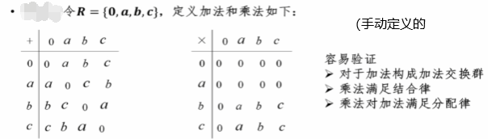
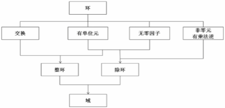

# 第四章 环和域

## 4.1 环的定义及基本概念

### 4.1.1 环的定义

**环**：设R是一个非空集合，R上定义由两个代数运算：加法（+）和乘法（$\cdot$），假如：
①R对于加法构成一个交换群
②R的乘法满足结合律。即对于任意$a,b,c\in R$，有$a\cdot(b\cdot c)=(a\cdot b)\cdot c$。
③乘法对加法满足左、右分配率，即对于任意$a,b,c\in R$，有$\begin{cases}a\cdot(b+c)=a\cdot b+a\cdot c\\(b+c)\cdot a=b\cdot a+c\cdot a\end{cases}$。
则称R为**环**。

**交换环**：若R还满足：
④乘法交换，即对于任意$a,b\in R$，有$a\cdot b=b\cdot a$，则称呼R为**交换环**。

**有单位元环、单位元**：若R中存在元素$1_R$，使得：
⑤对于任意$\alpha\in R$，有$\alpha\cdot1_R=1_R\cdot\alpha=\alpha$，则称R为**有单位元环**。元素$1_R$为R中的**单位元**。

**零元素**：R的加法群中的单位元素记为0，成为环R的**零元素**。

**负元**：R中的元素a加法逆元称为**负元**，记为-a。

### 4.1.2 环的例子

例子①：**整数环**：全体整数关于数的加法和乘法构成一个环，称为**整数环**，记为$\Z$。

例子②：**有理数域**：全体有理数（实数、复数）关于数的普通加法和乘法构成一个环，称为**有理数域**，记为$\Q(\R、\C)$。

例子③：整数n的所有倍数$\{nz|n,z\in\Z\}$关于数的普通加法和乘法构成一个环，记为$n\Z$。

例子④：**模n的剩余类环**：R={所有模n的剩余类}，规定运算为$[a]+[b]=[a+b],[a][b]=[ab]$。可以证明R关于上述问题构成一个环，称为**模n的剩余类环**，记为$\Z/n\Z$或$\Z_n$

$\Z,\Q(\R、\C)$都是有单位元的交换环，其单位元为整数1。$\Z$中只有±1有乘法逆元，$\Q(\R、\C)$中所有的非零元都有乘法逆元。

$\Z_n$也是有单位元的交换环，其单位元为$[1]$。

$n\gt1$时，$n\Z$没有单位元。

例子⑤：**F上的n阶方阵环**：数域F上的n阶方阵的全体关于矩阵的加法和乘法构成一个环，称为**F上的n阶方阵环**记为$M_n(F)$。这个环的单位元为n阶单位矩阵。因为矩阵的乘法不满足交换律，所以$M_n(F)$不是交换环。

例子⑥：

### 4.1.3 环中运算的性质

定理①：设R是一个环，$a,b\in R$，ma表示m个a相加，$a^m$表示m个a相乘，则：
①$a\cdot0=0\cdot a$
②$a\cdot(-b)=(-a)\cdot b=-ab$
③$n(a+b)=na+nb$
④$m(ab)=(ma)b=a(mb)$
⑤$a^ma^n=a^{m+n}$
⑥$(a^m)^n=a^{mn}$

证明：①由乘法对加法的分配率有$a\cdot0=a\cdot(0+0)=a\cdot0+a\cdot0$两边各加一个$-(a\cdot0)$得$a\cdot0=0$，同理$0\cdot a=0$，得证。
②由乘法对加法的分配率有$a\cdot(-b)+a\cdot b=a(-b+b)=a\cdot0=0$，所以$a\cdot(-b)$为ab的加法逆元，即$a\cdot(-b)=-ab$，同理，$(-a)\cdot b=-ab$，得证。
③$n(a+b)=\overbrace{a+b+\cdots+a+b}^{n个a+b}=\overbrace{a+\cdots+a}^{n个a}+\overbrace{b+\cdots+b}^{n个b}=na+nb$
④由于乘法对加法的分配率$m(ab)=\overbrace{ab+\cdots+ab}^{m个ab}=\begin{cases}\underbrace{(a+\cdots+a)}_{m个a}\cdot b=(ma)b\\a\cdot\overbrace{(b+\cdots+b)}^{m个b}=a(mb)\end{cases}$
⑤$a^na^m=\overbrace{a\times\cdots\times a}^{m个a}\cdot\overbrace{a\times\cdots\times a}^{n个a}=\overbrace{a\times\cdots\times a}^{m+n个a}=a^{m+n}$
⑥$(a^m)^n=\overbrace{a^m\times\cdots\times a^m}^{n个a^m}=\overbrace{\underbrace{(a\times\cdots\times a)}_{m个a相乘}\times\cdots\times\underbrace{(a\times\cdots\times a)}_{m个a相乘}}^{n个（m个a相乘）}=\overbrace{a\times\cdots\times a}^{m\times n个a}=a^{mn}$

$ab=0\Rightarrow a=0或b=0?$

当n是合数时，$\Z_n$中不成立。如$\Z_{12}$中$[3][4]=[12]=[0],[3]\neq0,[4]\neq0$。

**零因子、有/无零因子环**：设R是一个环，如果存在$a,b\in R$，满足$ab=0$，但$a\neq0,b\neq0$，则称环R为**有零因子环**，a为R的**左零因子**，b为R的**右零因子**，否则称R为**无零因子环**。对于交换环，左零引资和右零因子不加以区分，全称为**零因子**。

如：①$\Z,\Q,\C$都是无零因子环，而$\Z_n(n为合数)$为有零因子环；
②对$M_n(F)$，$n\ge2$时，这个环为有零因子环；
③对$R=\left\{\left.\begin{pmatrix}0&a\\0&b\end{pmatrix}\right|a,b\in\R\right\}$，$A=\begin{pmatrix}0&1\\0&0\end{pmatrix}$既是左零因子又是右零因子，因为$\begin{pmatrix}0&1\\0&0\end{pmatrix}\begin{pmatrix}0&1\\0&0\end{pmatrix}=\begin{pmatrix}0&0\\0&0\end{pmatrix},\begin{pmatrix}0&1\\0&1\end{pmatrix}\begin{pmatrix}0&1\\0&0\end{pmatrix}=\begin{pmatrix}0&0\\0&0\end{pmatrix}$。

例子⑦（无零因子环）：设p是一个素数，则$\Z_p$是无零因子环。
证明：根据2.2推论①，$\Z_p$中任何一个非零元均存在逆元。设$[a],[b]\in\Z_p$，若$[a][b]=[0]$，即$ab\equiv0(mod\ p)$，则有当$a\not\equiv0(mod\ p)$，$ab\equiv0(mod\ p)\Rightarrow b\equiv a^{-1}\cdot0(mod\ p)\Rightarrow b\equiv0(mod\ p)$。同理，当$b\not\equiv0(mod\ p)$，$a\equiv0(mod\ p)$。也就是说$[a][b]=[0]\Rightarrow[a]=[0]或[b]=[0]$，所以$\Z_p$是无零因子环。

**可逆元**：设R是一个有单位元环，$a\in R$若存在$b\in R$，满足$ab=ba=1$，则称a是一个**可逆元**。在整数环$\Z$中，只有±1是可逆元。可逆元一定不是零元，也不是零因子

例子⑧：设R是一个有单位元环，则R中所有可逆元构成的集合对于R中的乘法构成群，记为$R^*$。

证明：根据群和环的定义，$R^*$上乘法显然满足结合律，有单位元，有逆元，所以仅需证明$R^*$对环中的乘法封闭。若$a,b\in R^*$则有$ab\cdot b^{-1}a^{-1}=b^{-1}a^{-1}\cdot ab=1$。所以$ab\in R^*$，即对乘法封闭。

### 4.1.4 无零因子环的特征

定理③：设R是一个无零因子环，则R中非零元的加法阶相等，这个加法阶或者为$\infin$，或者为某个素数p。

证明：当环$\R$中每个非零元的加法阶都是无穷大时，定理成立。
设$a,b\in\R$是非零元，a的加法阶为n，b的加法阶为m。则由$(na)b=a(nb=0$，可得$nb=0$，所以$n\ge m$。同理可证$m\ge n$所以$m=n$。即所有非零元的加法阶相等。
设R中所有非零元的加法阶为n。若n不是素数，不妨设$n=n_1n_2,n_1\lt n,n_2\lt n$。对于$a\in R,a\neq 0$，有$(n_1a)(n_2a)=n_1n_2a^2=0$。又R是无零因子环，所以有$n_1=0$或$n_2a=0$。这与n是a的加法阶矛盾。所以n是素数。

**无零因子环的特征**：设R是一个无零因子环，称R中非零元的**加法阶**为**环R的特征**，记为$CharR$；当R中非零元的加法阶为**无穷大**时，称R的**特征为零**，记为$CharR=0$；当R中非零元的加法阶为某个素数p时，称R的**特征为p**，记为$CharR=p$。

例题⑨：设R是特征为p的交换环，$a,b\in R$则有$(a\pm b)^p=a^p\pm b^p$。

证明：$(a+b)^p=a^p+C_p^1a^{p-1}b+\cdots+C_p^{p-1}ab^{p-1}+b^p$。

因为对于$1\le k\le p-1,C_p^k=\frac{p!}{k!(p-k)!}=\frac{p\cdot(p-1)!}{k!(p-k)!}$，又$k!(p-k)!\mid p\cdot(p-1)!,gcd(k!(p-k)!,p)=1$，所以$C_p^k$是p的倍数，所以$C_p^ka^{p-k}b^k=0$。所以$(a+b)^p=a^p+b^p$。减法同理。

Ps.组合数$C_p^k$还写为$\begin{pmatrix}p\\k\end{pmatrix}$。

## 4.2 整环、除环和域

**整环**：一个有单位元、无零因子的交换环叫做一个**整环**。整环中不是所有的元素都有乘法逆元。
例子①：$\Z,\Q,\R,\C$都是整环，而$2\Z,\Z_n(n为合数),M_n(F)$不是整环。$\Q,\R,\C$中任何一个非零数a都有一个乘法逆元$\frac{1}{a}$，且$a(\frac{1}{a})=(\frac{1}{a})a=1$。而$\Z$中仅有$\pm1$有乘法逆元$\mp1$。

**除环**：一个环R满足以下条件称为**除环**：
①R中至少包含一个不等于零的元（R中至少有两个元素）
②R有单位元
③R的每一个不等于零的元有一个逆元。
（并不一定要满足乘法交换律）

**域**：交换除环称为**域**，如$\Q,\R,\C$都是域。

定理①：①除环都是无零因子环。
②设R是一个非零环，记$R^*={a\in R|a\neq0}=R/{0}$，则R是除环当且仅当$R^*$对于R的乘法构成一个群，称这个群为**除环R的乘法群**。
证明：①：设R是除环，$a,b\in R$，则$a\neq0,ab=0\Rightarrow a^{-1}ab=b=0$，得证。
②$R^*$对于R的乘法构成一个群，则R可满足除环定义的三个条件。反之，若R是除环，由于R是无零因子环，所以$R^*$对乘法封闭。由环的定义，乘法满足结合律。由除环的定义，$R^*$中有单位元，即R的单位元，且$R^*$中每一个元素均有逆元。因此$R^*$是群。

例子②（非交换除环）：设$H=\{a_0+a_1i+a_2j+a_3k|a_0,a_1,a_2,a_3\in\R\}$是实数域$\R$上的四维向量空间，$1,i,j,k$是一组基，规定其基元素之间的乘法为$i^2=j^2=k^2=-1,ij=k,jk=i,ki=j$，将其线性扩张为H中的元素之间的乘法。则H关于向量的加法和上面定义的乘法构成一个除环，称之为**Hamilton四元数除环**。

证明：只要证明$H^*$对于H的乘法构成一个群，为此只需证明H中的每个非零元均可逆：事实上，设$0\neq\alpha=a_+a_1i+a_2j+a_3k\in H$，则$\Delta=a_0^2+a_1^2+a_2^2+a_3^2\neq0$，令$\beta=\frac{a_0}{\Delta}-\frac{a_1}{\Delta}i-\frac{a_2}{\Delta}j-\frac{a_3}{\Delta}k\in H$，则$\alpha\beta=\beta\alpha=1$，即$\alpha$可逆，从而H为除环。

而对于$ij=k\Rightarrow jijj=jkj=ij\Rightarrow ji\cdot(-1)=ij$不满足交换律，所以Hamilton四元数除环是个非交换除环。

定理②：一个至少含有两个元素的无零因子的有限环是除环。

证明：设$R=\{0,a_1,\cdots,a_n\}$是一个无零因子环，n是正整数，$a_i\neq0,1\le i\le n$。要证明$R^*$对于R的乘法构成一个群。
因为R无零因子，所以$R^*$对于R中的乘法封闭。任选$a(\neq0)\in R$，考察$aa_1,aa_2,\cdots,aa_n$。若$aa_i=aa_j$，则$a(a_i-a_j)=0$，又$a\neq0$，所以$a_i=a_j$。因此，$\{aa_1,aa_2,\cdots,aa_n\}=\{a_1,a_2,\cdots,a_n\}$。同理可得$\{a_1a,a_2a,\cdots,a_na\}=\{a_1,a_2,\cdots,a_n\}$。所以对于任意的$a,b\in R^*$，方程$ax=b$和$xa=b$在R中有界。所以$R^*$对于R的乘法构成一个群。

推论①：有限整环是域。

证明：根据定理②，有限整环是除环，又整环满足乘法交换律，根据域的定义，有限整环是域。

例子③：模p的剩余类环$\Z_p$是域当且仅当p是素数。

证明：（$\Rightarrow$）：易得$p\neq0,1$，若p为合数，则$p=ab,a,b\neq\pm1$。于是$a\neq0(mod\ p),b\neq0(mod\ p)$，但$ab\equiv0(mod\ p)$，即$\Z_p$有零因子，这与$\Z_p$是域矛盾，所以p是素数。
（$\Leftarrow$）设p是素数。若$ab\equiv0(mod\ p)$，则$p\mid ab$，从而$p\mid a$或$p\mid b$，即有$a\equiv0(mod\ p)$或$b\equiv0(mod\ p)$，所以$\Z_p$是一个无零因子环，所以$\Z_p$是一个有限整环，根据推论①，$\Z_p$是域。

各个概念的关系：

## 4.3 子环、理想和商环

**子环和扩环**：设S是环R的一个非空子集合。如果S对R的两个运算也构成一个环，则称S是R的一个**子环**，称R为S的一个**扩环**。例如$\Z$是$\Q$的子环，$\Q$是$\R$的子环，$\R$是$\C$的子环，$n\Z$是$\Z$的子环。

**子整环、子除环、子域**的概念也与之类似。

**平方子环和真子环**：任意环R都至少有两个子环$\{0\}$和R，称为R的**平凡子环**。设$S\le R$且$S\neq R$，称S是R的一个**真子环**。易得，子环的交认为子环。

定理①：设R是环，S是R的一个非空子集，则$S是R的子环\iff a-b\in S（S是R的子加群）,ab\in S（乘法封闭）,\forall a,b\in S$；
设R是除环，S是R的一个非空子集，则$S是R的子环\iff a-b\in S（S是R的子加群）,ab^{-1}\in S（非零元是乘法群的子群）,\forall a,b(\neq0)\in S$

例子②：**环的中心**：设R是环，记集合$C(R)=\{a\in R|ab=ba,\forall b\in R\}$（同每一个元交换的元之集）称为环R的**中心**。这里的$C(R)$就是R的子环。

例子③：求模12的剩余类换$\Z_{12}$的所有子环。
解：由于$\Z_{12}$的加法群是一个循环群，所以剩余类换$\Z_{12}$的子环关于加法是$(\Z_{12},+)$的子循环群，共有下面6个：
$$
S_1&=&\langle[1]\rangle&=&R\\
S_2&=&\langle[2]\rangle&=&\{[0],[2],[4],[6],[8],[10]\}\\
S_3&=&\langle[3]\rangle&=&\{[0],[3],[6],[9]\}\\
S_4&=&\langle[4]\rangle&=&\{[0],[4],[8]\}\\
S_5&=&\langle[6]\rangle&=&\{[0],[6]\}\\
S_6&=&\langle[0]\rangle&=&\{[0]\}\\
$$
他们都乘法封闭，所以他们都是$\Z_{12}$的子环，从而$\Z_{12}$有以上六个子环。

子环的性质：设S是R的子环，S和R也可以有不同的性质。
对于交换律：$R是交换环\Rightarrow S是交换环；S是交换环\nRightarrow R是交换环$；
对于零因子：$R无零因子\Rightarrow S无零因子；S无零因子\nRightarrow R无零因子$；
对于单位元：$R有单位元\Rightarrow S有单位元；S有单位元\nRightarrow R有单位元$。

**环同态**：设$(R,+,\cdot)$和$(R^{'},\oplus,\circ)$是环，$f:R\rightarrow R^{'}$为映射。若f保持运算，即对任意$a,b\in R$有$f(a+b)=f(a)\oplus f(b),f(a\cdot b)=f(a)\circ f(b)$