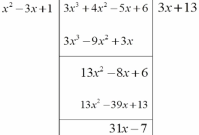
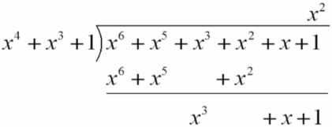
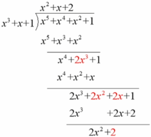
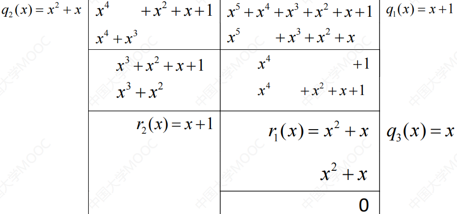
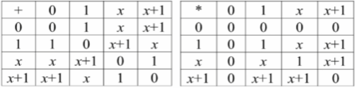
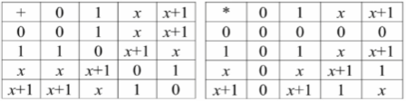

# 第五章 多项式环

## 5.1 多项式环

**多项式和系数**：如果R是整环，则R上未定元x的一个**多项式**是形如$f(x)=a_nx^n+\cdots++a_2x^2+a_1x+a_0(\forall0\le i\le n,a_i\in R)$的表达式，称$a_i$为$x^i$在$f(x)$中的**系数**。

**次数和首项系数**：使得$a_n\neq0$的最大整数n称为$f(x)$的**次数**，记为$deg(f(x))$，称$a_n$为$f(x)$的**首项系数**。

**次数为0**：若$f(x)=a_0(a_0\neq0)$，则记$f(x)$**次数为0**。

**零多项式**：所有系数都为零的多项式$f(x)$称为**零多项式**，为了方便，定义其次数为$-\infin$。

**首一的多项式**：若$f(x)$的首项系数为1，则称$f(x)$是**首一的**。

R上的全体多项式集合记为$R[x]$，约定$x^0=1$，集中1是整环R中的单位元。

用求和号表示多项式：$f(x)=\sum\limits^n_{i=0}a_ix^i$

**多项式相等**：设多项式$f(x)=\sum\limits^n_{i=0}a_ix^i$和$g(x)=\sum\limits^m_{i=0}b_ix^i$是整环R上的两个多项式，若满足$n=m;\forall 0\le i\le n,a_i=b_i$则称**f(x)等于g(x)**，记为$f(x)=g(x)$。即：两个多项式相等需满足次数相等且相同次数项对应的系数相等。

**多项式的加法**：相同次数项对应系数相加。

设多项式$f(x)=\sum\limits^n_{i=0}a_ix^i$和$g(x)=\sum\limits^m_{i=0}b_ix^i$是整环R上的两个多项式，令$M=max\{m,n\}$，约定$\begin{cases}a_{n+1}=a_{n+2}=\cdots=a_{M}=0（若n\le M）\\b_{m+1}=b_{m+2}=\cdots=b_{M}=0（若m\le M）\end{cases}$。则多项式$f(x)$和$g(x)$可以写成$f(x)=\sum\limits^M_{i=0}a_ix^i$和$g(x)=\sum\limits^M_{i=0}b_ix^i$，且有$f(x)+g(x)=\sum\limits^M_{i=0}(a_i+b_i)x^i$。

**多项式的乘法**：设多项式$f(x)=\sum\limits^n_{i=0}a_ix^i$和$g(x)=\sum\limits^m_{i=0}b_ix^i$是整环R上的两个多项式，则$f(x)\cdot g(x)=a_nb_mx^{n+m}+a_nb_{m-1}+a_{n-1}b_mx^{n+m-1}+\cdots+(a_1b_0+a_0b_1)x+a_0b_0=\sum\limits^{m+n}_{s=0}(\sum\limits_{i+j=s}a_ib_j)x^s$

**多项式运算律**：
加法交换律：$f(x)+g(x)=g(x)+f(x)$
加法结合律：$(f(x)+g(x))+h(x)=f(x)+(g(x)+h(x))$
乘法交换律：$f(x)g(x)=g(x)f(x)$
乘法结合律：$(f(x)g(x))h(x)=f(x)(g(x)h(x))$
乘法对加法的分配率：$f(x)(g(x)+h(x))=f(x)g(x)+f(x)h(x)$

**多项式环**：R为一个整环，x是R上的未定元，则$R[x]$对于多项式的加法和乘法构成环，称为**多项式环**。
①$R[x]$中的多项式对于加法和乘法封闭
②对于加法，$R[x]$为加法交换群（①满足交换律和结合律②有零元：零多项式0③有负元：对多项式$f(x)=\sum\limits^n_{i=0}a_ix^i$有$-f(x)=\sum\limits^n_{i=0}(-a_i)x^i$满足$f(x)+(-f(x))=(-f(x))+f(x)=0$）
③对于乘法，$R[x]$满足交换律和结合律，有单位元$x^0=1$
④乘法对加法满足分配律

定理①：整环R上的多项式环$R[x]$是整环。

证明：只要证明$R[x]$中无零因子。设$f(x),g(x)\in R[x]$，且$f(x)g(x)=0$。若$f(x)=0$，则定理得证。

设$f(x)=\sum\limits^n_{i=0}a_ix^i$，其中$a_n\neq0$，设$g(x)=\sum\limits^m_{i=0}b_ix^i$。所以$f(x)\cdot g(x)=a_nb_mx^{n+m}+a_nb_{m-1}+a_{n-1}b_mx^{n+m-1}+\cdots+(a_1b_0+a_0b_1)x+a_0b_0=\sum\limits^{m+n}_{s=0}(\sum\limits_{i+j=s}a_ib_j)x^s$。

所以$\begin{cases}a_nb_m=0\\a_nb_{m-1}+a_{n-1}b_m=0\\a_nb_{m-2}+a_{n-1}b_{m-1}+a_{n-2}b_m=0\\\vdots\\s_nb_0+a_{n-1}b_1+\cdots+a_{n-m}b_m=0\\\vdots\\a_1b_0+a_0b_1=0\\a_0b_0=0\end{cases}$，因为整环R中无零因子，所以$a_n\neq0,a_nb_m=0\Rightarrow b_m=0$，逐层代入下一个式子，依次推导可得$b_m=b_{m-1}=\cdots=b_1=b_0=0$，即$g(x)=0$，定理得证。

定理②（**多项式的带余除法**）：设$f(x),g(x)\in R[x]，g(x)\neq0$，则一定存在多项式$q(x),r(x)\in R[x]$，使得$f(x)=q(x)g(x)+r(x)$，其中$deg(r(x))\lt deg(g(x))$或$r(x)=0$，且$q(x)$和$r(x)$是唯一的。$q(x)$称为$g(x)$除$f(x)$的**商式**，记为$f(x)\ div\ g(x)$，$r(x)$称为$g(x)$除$f(x)$的**余式**，记为$f(x)\ mod\ g(x)$。

证明：要证明存在性和唯一性，分$deg(f(x))\lt deg(g(x))$和$deg(f(x))\ge deg(g(x))$两种情况。

例子①：求$f(x)=3x^3+4x^2-5x+6$除以$g(x)=x^2-3x+1$的余式和商式。
解：
$3x^3+4x^2-5x+5=(3x+13)(x^2-3x+1)+(31x-7)$。所以余式为31x-7，商式为3x+13。

例子②：求$q(x),r(x)\in Z_2[x]$使得$x^6+x^5+x^3+x^2+x+1=q(x)(x^4+x^3+1)+r(x)$，其中$deg(r(x))\lt deg(g(x))$。
解：
所以$q(x)=x^2,r(x)=x^3+x+1$。

例子③：$Z_3[x]$中取$f(x)=x^5+x^4+x^2+1,g(x)=x^3+x+1$，求余式和商式。
解：
所以余式为$2x^2+2$，商式为$x^2+x+2$。

## 5.2 多项式整除

**整除、不整除、因式、倍式**：设$f(x),g(x)\in F[x]$，如果存在$q(x)\in F[x]$，使得$f(x)=q(x)g(x)$，则称$g(x)$**整除**$f(x)$，记为$g(x)\mid f(x)$，反之则记为$g(x)\nmid f(x)$，称为$g(x)$**不整除**$f(x)$。当$g(x)\mid f(x)$时，称$g(x)$为$f(x)$的**因式**，称$f(x)$为$g(x)$的**倍式**。

**定理①**：设$f(x),g(x)\in F[x],g(x)\neq0$，则$g(x)$整除$f(x)$的充要条件是$g(x)$除$f(x)$的余式为零。

**定理②**：设$F[x]$是域F上的多项式环。
①设$f(x),g(x)\in F[x]$，若$f(x)\mid g(x),g(x)\mid f(x)$，则有$f(x)=cg(x)(c\in F)$
②设$f(x),g(x),h(x)\in F[x]$，若$f(x)\mid g(x),g(x)\mid h(x)$，则有$f(x)\mid h(x)$
③设$f(x),g_i(x),h(x)\in F[x](i=1,2,\cdots,l)$，若$\forall u,f(x)\mid g_i(x)$，则$f(x)\mid u_1(x)g_1(x)+\cdots+u_l(x)g_l(x)$，其中$u_i(x)\in F(x)$是域F上的任意多项式。

**公因式**：如果$h(x)$既是$f(x)$的因式，又是$g(x)$的因式，则称$h(x)$是$f(x)$和$g(x)$的**公因式**。

**最大公因式**：若$f(x)$和$g(x)$的公因式$d(x)$满足$f(x)$和$g(x)$的公因式都是$d(x)$的因式，则称$d(x)$为$f(x)$和$g(x)$的**最大公因式**。记**首项系数为1的最大公因式**为$(f(x),g(x))$。

根据带余除法和多项式整除的性质，如果有等式$f(x)=q(x)g(x)+r(x)$成立，那么$f(x),g(x)$，和$g(x),r(x)$有相同的公因式，因此有$(f(x),g(x))=(g(x),r(x))$。

**定理③**：对于$F[x]$中的多项式$f(x)$和$g(x)$，一定存在最大公因式$d(x)\in F[x]$，且$d(x)$可以表示成$f(x)$和$g(x)$的一个组合，即存在$u(x),v(x)\in F[x]$，使得$d(x)=u(x)f(x)+v(x)g(x)$。

证明：若$f(x),g(x)$有一个为零，如$g(x)=0$，则$a^{-1}_nf(x)$就是一个最大公因式，其中$a_n$为$f(x)$的首项系数，且又$a^{-1}_nf(x)=a^{-1}_nf(x)+1\cdot0$，结论成立。

若$f(x),g(x)\neq0$，根据带余除法，用$g(x)$除$f(x)$，得到商$q_1(x)$和余式$r_1(x)$，若$r_1(x)\neq0$，则用$r_1(x)$除$g(x)$，得到商$q_2(x)$和余式$r_2(x)$；若$r_2(x)\neq0$，则用$r_2(x)$除$r_1(x)$，得到商$q_3(x)$和余式$r_3(x)$。不断重复，有$deg(g(x))\gt deg(r_1(x))\gt deg(r_2(x))\gt \cdots$。在有限次的迭代后，总能得到$r_{l+1}(x)=0$，则$r_l(x)$就是$f(x),g(x)$的最大公因式。由迭代过程中的各个式子倒推，即可得到$u(x),v(x)\in F[x]$使得$d(x)=r_l(x)=u(x)f(x)+v(x)g(x)$。

例子①：求$Z_2[x]$中的多项式$x^5+x^4+x^3+x^2+x+1$和$x^4+x^2+x+1$的最大公因式，并将最大公因式表示为这两个多项式的组合。
解：
所以$x+1=(x^5+x^4+x^3+x^2+x+1,x^4+x^2+x+1)$
上述过程写为横式：$\begin{cases}x^5+x^4+x^3+x^2+x+1=(x+1)(x^4+x^2+x+1)+x^2+x\\x^4+x^2+x+1=(x^2+x)(x^2+x)+x+1\\x^2+x=x(x+1)\end{cases}$
所以：$\begin{aligned}x+1=&x^4+x^2+x+1+(x^+x)(x^2+x)\\=&x^4+x^2+x+1+(x^2+x)[(x^5+x^4+x^3+x+1)+(x+1)(x^4+x^2+x+1)]\\=&(x^2+x)(x^5+x^4+x^3+x^2+x+1)+(x^3+x+1)(x^4+x^2+x+1)\end{aligned}$。

**互素**：若$F[x]$中的多项式$f(x)$和$g(x)$满足$(f(x),g(x))=1$，则称$f(x)$和$g(x)$**互素**。

**定理④**：$F[x]$中的两个多项式$f(x)$和$g(x)$互素的充要条件是存在$u(x),v(x)\in F[x]$，使得$u(x)f(x)+v(x)g(x)=1$

**定理⑤**：若$gcd(f(x),g(x))=1$，且$f(x)\mid g(x)h(x)$，则有$f(x)\mid h(x)$。
若$f(x)\mid h(x),g(x)\mid h(x)$，且$gcd(f(x),g(x))=1$，则有$f(x)g(x)\mid h(x)$。

**不可约多项式**：如果域F上的次数大于等于1的多项式$p(x)$不能分解为域F上的两个次数比$p(x)$低的多项式的成绩，则称$p(x)$为域F上的**不可约多项式**。即：如果$p(x)$在$F[x]$中只有F中不等于0的元素c和$cp(x)$为因式，这称$p(x)$为域上的**不可约多项式**。

注：n次多项式$p(x)$为域F上的不可约多项式，当且仅当$p(x)$与次数比n小的多项式都互素。

**定理⑥**：设$p(x)$域F上的不可约多项式，对于任意两个多项式$f(x),g(x)\in F[x]$，若$p(x)\mid f(x)g(x)$，则有$p(x)\mid f(x)$或$p(x)\mid g(x)$。

例子：$GF(2)[x]$五次以内的不可约多项式

0次： 1
1次：$x,x+1$
2次：$x^2+x+1$
3次：$x^3+x^2+1,x^3+x+1$
4次：$x^4+x^3+x^2+x+1,x^4+x^3+1,x^4+x+1$
5次：$\begin{cases}x^5+x^3+x^2+x+1,x^5+x^4+x^2+x+1,x^5+x^4+x^3+x+1\\x^5+x^4+x^3+x^2+1,x^5+x^3+1,x^5+x^2+1\end{cases}$

**定理⑦（因式分解唯一性定理）**：域F上的任意次数大于等于一的多项式$f(x)$都可以表示为$F[x]$中一些不可约多项式的乘积。更进一步，若$f(x)=p_1(x)p_2(x)\cdots p_s(x)=q_1(x)q_2(x)\cdots q_l(x)$是将$f(x)$分解为不可约多项式的乘积的两种形式，则一定有$s=l$且适当排序后有$p_i(x)=c_iq_i(x),\forall 1\le i\le s,c_i\in F且c_i\neq0$。

 由因式分解唯一性定理，$F[x]$中的任何一个多项式$f(x)$都可以分解为$f(x)=cp^{r_1}_1(x)p^{r_2}_1(x)\cdots p^{r_m}_1(x)$的形式，其中c是$f(x)$的首项系数，$p^{r_1}_1(x)p^{r_2}_1(x)\cdots p^{r_m}_1(x)$是不同的首项系数为1的不可约多项式，$r_1,r_2,\cdots,r_m$是正整数。该分解式称为$f(x)$的**标准分解式**。

例子②：分解$GF(2)[x]$上的多项式：$f(x)=x^5+x^4+x^3+x^2+x+1$
解：由于$f(1)=0$，所以$f(x)$有因式x+1，多项式除法得$f(x)=(x+1)(x^4+x^2+1)$。又$(x^4+x^2+1)=(x^2+x+1)^2$，所以$f(x)=(x+1)(x^2+x+1)^2$。

实际上，在$GF(2)[x]$上有$(f(x)+g(x))^2=(f(x))^2+(g(x))^2$，所以可以$x^4+x^2+1=(x^2+x)^2+1^2=(x^2+x+1)^2$。

**多项式的根**：设$f(x)\in F[x]$，且$f(x)=a_nx^n+a_{n-1}x^{n-1}+\cdots+a_1x+a_0$，设$\alpha\in F$。在$f(x)$的表达式中用$\alpha$替代未定元$x$所得到的域F中的元素$f(\alpha)=a_n\alpha^n+a_{n-1}\alpha^{n-1}+\cdots+a_1\alpha+a_0$称为$f(x)$当$x=\alpha$时的值，记为$f(\alpha)$。若$f(\alpha)=0$，则称$\alpha$为$f(x)$在域F中的一个**根**。

**定理⑧（余元定理）**：设$f(x)\in F[x],\alpha\in F$，则用一次多项式$x-\alpha$去除$f(x)$所得余式是域F中的元素$f(\alpha)$。

**推论①**：设$f(x)\in F[x],\alpha\in F$，则$\alpha$是$f(x)$的根的充要条件是$x-\alpha\mid f(x)$。

**推论②**：设$f(x)\in F[x],deg(f(x))=n$，则$f(x)$在F中最多有n个不同的根。

## 5.3 多项式同余和剩余类环

**多项式同余**：设$g(x),h(x)\in F[x]$，如果$f(x)$整除$g(x)-h(x)$，则称$g(x)$与$h(x)$模$f(x)$**同余**，记为$g(x)\equiv h(x)(mod\ f(x))$。

**定理①**：
①$g(x)\equiv h(x)(mod\ f(x))\iff \exist k(x)\in F(x),g(x)=k(x)f(x)+h(x)$。
②设$g(x)=q_1(x)f(x)+r_1(x),h(x)=q_2(x)f(x)+r_2(x)$，其中$q_1(x),q_2(x),r_1(x),r_2(x)\in F[x],0\le deg(r_1(x))\lt deg(f(x)),0\le deg(r_2(x))\lt deg(f(x))$，则$g(x)\equiv h(x)(mod\ f(x))\iff r_1(x)=r_2(x)$。

**定理②（同余的性质）**：对于所有$g(x),h(x),g_1(x),h_1(x),s(x)\in F[x]$，有：
①（自反性）$g(x)\equiv g(x)(mod\ f(x))$
②（对称性）$g(x)\equiv h(x)(mod\ f(x))\Rightarrow h(x)\equiv g(x)(mod\ f(x))$
③（传递性）$f(x)\equiv h(x)(mod\ f(x)),h(x)\equiv s(x)(mod\ f(x))\Rightarrow g(x)\equiv s(x)(mod\ f(x))$
④（可加可乘性）若$g(x)\equiv g_1(x)(mod\ f(x))$且$h(x)\equiv h_1(x)(mod\ f(x))$，则$g(x)+h(x)\equiv(g_1(x)+h_1(x))(mod\ f(x))$且$g(x)\cdot h(x)\equiv(g_1(x)\cdot h_1(x))(mod\ f(x))$。
综上所述，模$f(x)$同余是$F[x]$上的一个等价关系。

**多项式的同余类**：每一个多项式$g(x)$都与唯一的一个次数比$deg(f(x))$低的多项式$r(x)$模$f(x)$同余，用$r(x)$作为包含$g(x)$的等价类的代表。记以$r(x)$为代表元的**等价类**为$[r(x)]$。记$\langle f(x)\rangle$为$f(x)$生成的理想。有$[r(x)]=r(x)+\langle f(x)\rangle$。
**多项式剩余类环**：商环$F[x]/\langle f(x)\rangle=\{[r(x)]|0\le deg(r(x))\lt deg(f(x))\}$，也可以简单地将$F[x]/\langle f(x)\rangle=\{r_{n-1}x^{n-1}+r_{n-21}x^{n-2}+\cdots+r_1x+r_0|n=deg(f(x)),r_i\in F,0\le i\le n-1\}$。
定义加法和乘法为模$f(x)$的加法和乘法，则$F[x]/\langle f(x)\rangle$是一个有单位元的交换环，这个环称为**多项式剩余类环**。

例子①：设$F=Z_2,f(x)=x^2+1$，则$F[x]/\langle f(x)\rangle=\{0,1,x,x+1\}$

**定理③**：设$f(x),g(x)\in F[x]$为非零多项式，$g(x)$模$f(x)$有乘法逆元当且仅当$gcd(f(x),g(x))=1$。

证明：必要性：设$gcd(f(x),g(x))=1$，根据5.2定理②，存在$u(x),v(x)\in F[x]$，使得$u(x)f(x)+v(x)g(x)=1$，即$-u(x)f(x)=v(x)g(x)-1$，所以$f(x)\mid v(x)g(x)-1$。根据同余定义有$v(x)g(x)\equiv1(mod\ f(x))$。所以$g(x)$模$f(x)$有乘法逆元$v(x)$。

充分性：$g(x)$模$f(x)$有乘法逆元，设其为$v(x)$，则有$g(x)v(x)\equiv1(mod\ f(x))$。根据5.3定理①，$\exist k(x)\in F[x],g(x)v(x)=k(x)f(x)+1$，即$g(x)v(x)-k(x)f(x)=1$。根据5.2定理②，有$gcd(f(x),g(x))=1$。

**推论①**：若$f(x)$在F上不可约，则$F[x]/\langle f(x)\rangle$为一个域。

证明：只需证明$F[x]/\langle f(x)\rangle$中任意非零元均有乘法逆元。设$r(x)\neq0\in F[x]/\langle f(x)\rangle$，则$0\le deg(r(x))\lt deg(f(x))$，又$f(x)$在F上不可约，所以$gcd(f(x),r(x))=1$。根据5.3定理③，$r(x)$在$F[x]/\langle f(x)\rangle$中有乘法逆元。

设$f(x)$的次数为n，$F[x]/\langle f(x)\rangle$中的元素可以表示成次数小于n的多项式，即$F[x]/\langle f(x)\rangle=\{r_{n-1}x^{n-1}+r_{n-2}x^{n-2}+\cdots+r_1x+r_0|n=deg(f(x)),r_i\in F,0\le i \le n-1\}$当$F=Z_p$时，$F[x]/\langle f(x)\rangle$中元素的个数为$p^n$。

例子②：设$F=Z_2,f(x)=x^2+x+1$，则$F[x]/\langle f(x)\rangle=\{0,1,x+1\}$

