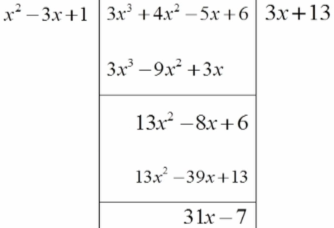
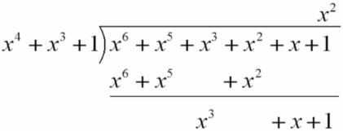
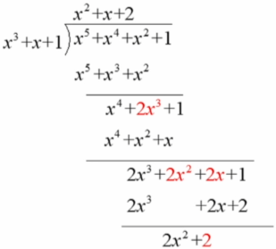

# 第五章 多项式环

## 5.1 多项式环

**多项式和系数**：如果R是整环，则R上未定元x的一个**多项式**是形如$f(x)=a_nx^n+\cdots++a_2x^2+a_1x+a_0(\forall0\le i\le n,a_i\in R)$的表达式，称$a_i$为$x^i$在$f(x)$中的**系数**。

**次数和首项系数**：使得$a_n\neq0$的最大整数n称为$f(x)$的**次数**，记为$degf(x)$，称$a_n$为$f(x)$的**首项系数**。

**次数为0**：若$f(x)=a_0(a_0\neq0)$，则记$f(x)$**次数为0**。

**零多项式**：所有系数都为零的多项式$f(x)$称为**零多项式**，为了方便，定义其次数为$-\infin$。

**首一的多项式**：若$f(x)$的首项系数为1，则称$f(x)$是**首一的**。

R上的全体多项式集合记为$R[x]$，约定$x^0=1$，集中1是整环R中的单位元。

用求和号表示多项式：$f(x)=\sum\limits^n_{i=0}a_ix^i$

**多项式相等**：设多项式$f(x)=\sum\limits^n_{i=0}a_ix^i$和$g(x)=\sum\limits^m_{i=0}b_ix^i$是整环R上的两个多项式，若满足$n=m;\forall 0\le i\le n,a_i=b_i$则称**f(x)等于g(x)**，记为$f(x)=g(x)$。即：两个多项式相等需满足次数相等且相同次数项对应的系数相等。

**多项式的加法**：相同次数项对应系数相加。

设多项式$f(x)=\sum\limits^n_{i=0}a_ix^i$和$g(x)=\sum\limits^m_{i=0}b_ix^i$是整环R上的两个多项式，令$M=max\{m,n\}$，约定$\begin{cases}a_{n+1}=a_{n+2}=\cdots=a_{M}=0（若n\le M）\\b_{m+1}=b_{m+2}=\cdots=b_{M}=0（若m\le M）\end{cases}$。则多项式$f(x)$和$g(x)$可以写成$f(x)=\sum\limits^M_{i=0}a_ix^i$和$g(x)=\sum\limits^M_{i=0}b_ix^i$，且有$f(x)+g(x)=\sum\limits^M_{i=0}(a_i+b_i)x^i$。

**多项式的乘法**：设多项式$f(x)=\sum\limits^n_{i=0}a_ix^i$和$g(x)=\sum\limits^m_{i=0}b_ix^i$是整环R上的两个多项式，则$f(x)\cdot g(x)=a_nb_mx^{n+m}+a_nb_{m-1}+a_{n-1}b_mx^{n+m-1}+\cdots+(a_1b_0+a_0b_1)x+a_0b_0=\sum\limits^{m+n}_{s=0}(\sum\limits_{i+j=s}a_ib_j)x^s$

**多项式运算律**：
加法交换律：$f(x)+g(x)=g(x)+f(x)$
加法结合律：$(f(x)+g(x))+h(x)=f(x)+(g(x)+h(x))$
乘法交换律：$f(x)g(x)=g(x)f(x)$
乘法结合律：$(f(x)g(x))h(x)=f(x)(g(x)h(x))$
乘法对加法的分配率：$f(x)(g(x)+h(x))=f(x)g(x)+f(x)h(x)$

**多项式环**：R为一个整环，x是R上的未定元，则$R[x]$对于多项式的加法和乘法构成环，称为**多项式环**。
①$R[x]$中的多项式对于加法和乘法封闭
②对于加法，$R[x]$为加法交换群（①满足交换律和结合律②有零元：零多项式0③有负元：对多项式$f(x)=\sum\limits^n_{i=0}a_ix^i$有$-f(x)=\sum\limits^n_{i=0}(-a_i)x^i$满足$f(x)+(-f(x))=(-f(x))+f(x)=0$）
③对于乘法，$R[x]$满足交换律和结合律，有单位元$x^0=1$
④乘法对加法满足分配律

定理①：整环R上的多项式环$R[x]$是整环。

证明：只要证明$R[x]$中无零因子。设$f(x),g(x)\in R[x]$，且$f(x)g(x)=0$。若$f(x)=0$，则定理得证。

设$f(x)=\sum\limits^n_{i=0}a_ix^i$，其中$a_n\neq0$，设$g(x)=\sum\limits^m_{i=0}b_ix^i$。所以$f(x)\cdot g(x)=a_nb_mx^{n+m}+a_nb_{m-1}+a_{n-1}b_mx^{n+m-1}+\cdots+(a_1b_0+a_0b_1)x+a_0b_0=\sum\limits^{m+n}_{s=0}(\sum\limits_{i+j=s}a_ib_j)x^s$。

所以$\begin{cases}a_nb_m=0\\a_nb_{m-1}+a_{n-1}b_m=0\\a_nb_{m-2}+a_{n-1}b_{m-1}+a_{n-2}b_m=0\\\vdots\\s_nb_0+a_{n-1}b_1+\cdots+a_{n-m}b_m=0\\\vdots\\a_1b_0+a_0b_1=0\\a_0b_0=0\end{cases}$，因为整环R中无零因子，所以$a_n\neq0,a_nb_m=0\Rightarrow b_m=0$，逐层代入下一个式子，依次推导可得$b_m=b_{m-1}=\cdots=b_1=b_0=0$，即$g(x)=0$，定理得证。

定理②（**多项式的带余除法**）：设$f(x),g(x)\in R[x]，g(x)\neq0$，则一定存在多项式$q(x),r(x)\in R[x]$，使得$f(x)=q(x)g(x)+r(x)$，其中$degr(x)\lt degg(x)$或$r(x)=0$，且$q(x)$和$r(x)$是唯一的。$q(x)$称为$g(x)$除$f(x)$的**商式**，记为$f(x)\ div\ g(x)$，$r(x)$称为$g(x)$除$f(x)$的**余式**，记为$f(x)\ mod\ g(x)$。

证明：要证明存在性和唯一性，分$degf(x)\lt degg(x)$和$degf(x)\ge degg(x)$两种情况。

例子①：求$f(x)=3x^3+4x^2-5x+6$除以$g(x)=x^2-3x+1$的余式和商式。
解：
$3x^3+4x^2-5x+5=(3x+13)(x^2-3x+1)+(31x-7)$。所以余式为31x-7，商式为3x+13。

例子②：求$q(x),r(x)\in Z_2[x]$使得$x^6+x^5+x^3+x^2+x+1=q(x)(x^4+x^3+1)+r(x)$，其中$degr(x)\lt degg(x)$。
解：
所以$q(x)=x^2,r(x)=x^3+x+1$。

例子③：$Z_3[x]$中取$f(x)=x^5+x^4+x^2+1,g(x)=x^3+x+1$，求余式和商式。
解：
所以余式为$2x^2+2$，商式为$x^2+x+2$。

## 5.2 多项式整除

## 5.3 多项式同余和剩余类环