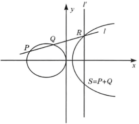
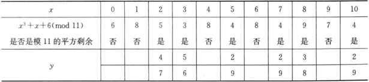

# 第七章 椭圆曲线

## 7.1  实数域上的椭圆曲线

由于椭圆曲线是双线性配对的理论基础，因此本节首先对其进行介绍。

椭圆曲线并非椭圆，之所以称为椭圆曲线是因为它的曲线方程与计算椭圆周长的方程相似。

一般的，椭圆曲线指的是由维尔斯特拉斯（Weierstrass）方程$y^2+axy+by=x^3+cx^2+dx+e$所确定的曲线，它是由方程的全体解$(x,y)$再加上一个无穷远点$O$构成的集合，其中$a,b,c,d,e$是满足一些简单条件的实数，$x$和$y$也在实数集上取值。

上述曲线方程可以通过坐标变换转化为下述形式：$y^2=x^3+ax+b$由它确定的椭圆曲线常记为$E(a,b)$，简记为E。

当$4a^3+27b^2\neq0$时，称$E(a,b)$是一条**非奇异椭圆曲线**。对于非奇异椭圆曲线，可以基于集合$E(a,b)$定义一个群。这是一个**Abel群**，具有重要的**加法规则属性**。

下面，首先给出加法规则的几何描述，然后给出加法规则的代数描述。

### 7.1.1 加法的几何描述：

椭圆曲线上的加法运算定义如下∶如果椭圆曲线上的3 个点位于同一直线上，那么它们的和为$O$。从这个定义出发，可以定义椭圆曲线的加法规则：

①：$O$为加法的零元，对于椭圆曲线上的任何一点$P$有$P+O=P$。

②：对于椭圆曲线上的一点$P=(x,y)$，它的逆元为$-P=(x,-y)$。注意到$P+(-P)=P-P=O$。

③：设P和Q是椭圆曲线上$x$坐标不同的两点，$P+Q$的定义为：做一条通过$P$和Q的直线$l$与椭圆曲线相交于$R$点（这一点是唯一的，除非这条直线在P点和Q点于该椭圆曲线相切，这时分别取$R=Q$和$R=P$），然后过$R$点作$y$轴的平行线$l^{'}$，$l^{'}$与椭圆曲线相交的另一点$S$就是$P+Q$，如下图所示：

④：上述几何解释也适用于具有相同.坐标的两个点$P$和$-P$的情形。用一条垂直的线连接这两个点，可看做是在无穷远点与椭圆曲线相交，因此有$P+(-P)=O$。这与上述第②条叙述是一致的。

⑤：为计算点$Q$的两倍，在$Q$点作一条切线并找到与椭圆曲线的另一个交点$T$，则$Q＋Q=2Q=-T$。

以上定义的加法满足加法运算的一般性质，如交换律、结合律等。

### 7.1.2 加法的代数描述：

对于椭圆曲线上不互为逆元的两点$P(x_1,y_1),Q(x_2,y_2)$，则$S(X_3,Y_3)=P+Q$符合：
$$
x_3=\lambda^2-x_1-x_2\\y_3=\lambda(x_1-x_3)-y_1\\
\lambda=\begin{cases}
\frac{y_2-y_1}{x_2-x_1}\quad P\neq Q\\
\frac{3x^2_1+a}{2y_1}\quad p=Q
\end{cases}
$$

## 7.2 有限域上的椭圆曲线

椭圆曲线密码体制使用的是有限域上的椭圆曲线，即变量和系数都为有限域中的元素。

有限域$GF(p)$上的椭圆曲线是指满足方程$y^3\equiv x^3=ax+b(mod\ p)$的所有点$(x,y)$再加上无穷远点O构成的集合。其中，$a,b,x,y$均在有限域$GF(p)$上取值，p是素数。

这里把该椭圆曲线记为$E_p(a,b)$。该椭圆曲线也只有有限个点，其个数N由Hasse定理确定。

**定理①（Hasse定理）：**设E是有限域$GF(p)$上的椭圆曲线，$N$是$E$上点的个数，则$p+1-2\sqrt{p}\le N\le p+1+2\sqrt{p}$。当$4a^3+27b^2(mod\ p)\neq0$时，基于集合$E_p(a,b)$可以定义一个阿贝尔（Abel）群，其加法规则和实数域上描述的代数方法一致。设$P,Q\in E_p(a,b)$，则：

①：$O$为加法的单位元，对于椭圆曲线上的任何一点$P$，有$P+O=P$。

②：对于$P(x,y)$，它的逆元$-P$为$(x,-y)$，$P+(-P)=O$。

③：$P(x_1,y_1),Q(x_2,y_2)$，则$S(X_3,Y_3)=P+Q$符合：
$$
x_3=\lambda^2-x_1-x_2(mod\ p)\\y_3=\lambda(x_1-x_3)-y_1(mod\ p)\\
\lambda=\begin{cases}
\frac{y_2-y_1}{x_2-x_1}(mod\ p)\quad P\neq Q\\
\frac{3x^2_1+a}{2y_1}(mod\ p)（a就是椭圆曲线公式里的a）\quad p=Q
\end{cases}
$$
④：倍点运算定义为重复加法，如$4P=P+P+P+P$。

例子①：p=11,a=1,b=6，即椭圆曲线方程为$y^2\equiv x^3+x+6(mod\ 11)$，要确定椭圆曲线上的点，对于每个$x\in GF(11)$，首先计算$z\equiv x^3+x+6(mod\ 11)$，然后再判定z是否是模11的平方剩余（方程$y^2\equiv z\ mod\ 11$是否有解），若不是，这椭圆曲线上没有与这一x相对应的点；若是，这求而出z的两个平方根。该椭圆曲线上的点如下表所示。

只有$x=2,3,5,7,8,10$时才有点在椭圆曲线上，所以$E_{11}(1,6)=\{O,(2,4),(2,7),(3,5),(3,6),(5,2),(5,9),(7,2),(7,9),(8,3),(8,8),(10,2),(10,9)\}$
设$P=(2,7)$，则计算2P先计算$\lambda\equiv\frac{3\times2^2+1}{2\times7}(mod\ 11)=\frac{2}{3}(mod\ 11)\equiv 8$
所以$\begin{cases}x_3\equiv8^2-2-2(mod\ 11)\equiv5\\y_3\equiv8\times(2-5)-7(mod\ 11)\equiv2\end{cases}$，所以$2P=(5,2)$。

同理：
$$
6P=(7,9)&7P=(7,2)&8P=(3,5)&9P=(10,9)\\
10P=(8,8)&11P=(5,9)&12P=(2,4)&13P=O
$$
，所以$E_{11}(1,6)$是一个循环群，其生成元为$P=(2,7)$。

## 7.3 椭圆曲线上的EI-Gamal加密体制

为了使用椭圆曲线来构造密码体制，需要找到类似大整数因子分解和离散对数这样的困难问题。

**椭圆曲线$E_p(a,b)$上点P的阶**：指满足$nP=\underbrace{P+P+\cdots+P}_{n个}=O$的最小正整数，记为$ord(P)$，其中O是无穷远点。

**椭圆曲线上的离散对数问题（Elliptic Curve Discrete Logarithm Problem，ECDLP）**：设G是椭圆曲线$E_p(a,b)$上的一个循环子群，P是G的一个生成元，$Q\in G$，已知P和Q，求满足$mP=Q$的整数$m,0\le m\le ord(P)-1$，称为**椭圆曲线上的离散对数问题**。计算$mP$的过程称为**点乘运算（Point multi-plication）**。

使用椭圆曲线密码体制是，首先要把要发送的明文m编码为椭圆曲线上的点$P_m=(x_m,y_m)$，然后再对点$P_m$做加密变换，在解密后还得把$P_m$逆向译码才能获得明文。

**椭圆曲线上的EI-Gamal密码体制**：

①密钥生成：在椭圆曲线$E_p(a,b)$上选区一个阶为n（n为一个大素数）的生成元P。随机选取整数$x(1\le x\le n)$，计算$Q=xP$。公钥为$P,Q$，私钥为x。

②加密：为了加密$P_m$，随机选取一个整数$k,1\lt k\le n$，计算$C_1=kP,C_2=P_m+kQ$，则密文$c=(C_1,C_2)$。

③解密：为了解密一个密文$c=(C_1,C_2)$，计算$C_2-xC_1=P_m+kQ-xkP=P_m+kxP-xkP=P_m$。

攻击者要想从$c=(C_1,C_2)$计算出$P_m$就必须知道k，而要从P和kP中计算出k就要求解椭圆曲线上的离散对数问题。