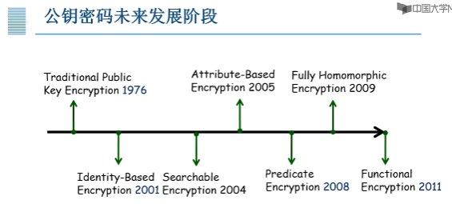
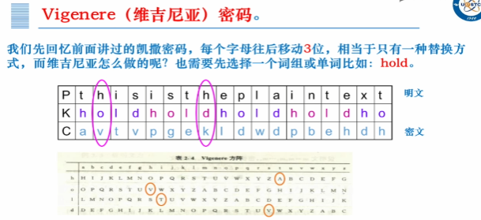

# 第一章 概述

## 1.1 密码学的基本概念

网络攻击手段：

被动攻击：监听（针对机密性）包括消息内容获取、业务流分析

主动攻击：中断（针对可用性）、篡改（针对完整性）、伪造（针对真实性）

否认传送（针对不可否认性）

### 1.1.2 密码学是网络安全的基础

密码：采用特定变换的方法对信息进行加密保护、安全认证的技术、产品和服务——《中华人民共和国密码法》

密码学：研究编制密码和破译密码的技术科学

密码编码学：研究密码变化的客观规律，应用于编制密码以保护通信秘密的

密码分析学/破译学：应用于破译密码以获取通信情报的

机密性、完整性、信息源认证、通信实体认证、不可否认性

密码算法本质上就是一个带秘密参数的函数
$$
\left\{
	\begin{aligned}
		明文&（Message/Plaintext)M：要处理的数据；\\
		密文&（Ciphertext）C：处理后的数据\\
		密钥&（Key）k_1,k_2：秘密参数\\
		加密函数&（Encryption）：C=E(K_1,M)或C=E_{K_1}(M)\\
		解密函数&（Decryption）：M=E(K_1,C)或M=E_{K_2}(C)\\
	\end{aligned}
\right.
$$
密码算法的需求：

可逆：算法的使用者可以把密文恢复成明文

不可逆：敌手无法将密文恢复成明文

秘密参数：密钥

即：知道秘密参数，求逆非常容易；不知道秘密参数，求逆是不可行的

### 1.1.3密码算法分类：

根据密码使用方式不同

①无密钥密码算法：杂凑函数、单向置换、随机序列

②对称密钥密码算法：流密码、分组密码、信息摘要函数

③公钥密码算法：公钥加密、数字签名、身份认证

功能的问题

机密性：对称密钥加密（流密码、分组密码）、公钥加密

完整性：杂凑函数、信息摘要函数

认证：数字签名、身份认证协议

不可否认性：数字签名

各种类型的特点

对称密钥：密钥用安全信道传送，密文用公共信道传送

对称密钥特点：加解密密钥相同、加解密速度快。常应用于大量数据加密、消息认证码，常见算法ZUC、DES、AES、SM4

公开密钥密码体制：公钥用于加密，可以公开发送，私钥用于解密，不发送。

公钥特点：加解密密钥不同、加解密速度慢。常应用于短消息加密、数字签名、身份认证，常见算法RSA、ECC、SM2、EIGamal……

杂凑函数/哈希函数：任意长度数据可以输出定长摘要值

Hash特点：任意长输入映射为定长输出，输入变化，输出发生不可预测变化，输出无法推导出输入，常应用于完整性校验，常见算法SHA、MD5、SM3……

### 1.1.4 密码学的作用和定位

在社会中已经广泛利用、是保障信息安全的基本技术、几乎所有信息安全的领域都有密码学的身影

密码是国家重要的战略资源是保障网络安全与信息安全的核心技术和基础支撑

密码学是党和国家的一项特殊重要工作，直接关系国家政治安全、经济安全、国防安全和信息安全。

## 1.2 中国古代密码艺术

### 1.2.1 中国民间艺术

图画传情、会意诗、藏头诗、叠痕法、漏格板加密法

### 1.2.2 中国古代军事密码

阴符、阴书、《武经总要》、反切法

### 1.2.3 中国近代密码

密本型、加乱型

## 1.3 外国古代密码艺术

## 1.3.1 代替密码：用图形或符号来代替字母

象形文字的修改、棋盘密码、兽栏法、跳舞的小人、摩斯电吗、凯撒密码（推广为Vigenere密码（一种分组加法密码））

### 1.3.2 换位密码：不改变本身的值，只是进行换位

报文倒置（简单，不安全）、Scytale密码（天书）、几何图形密码

### 1.3.3 密码机：加解密机械

杰弗逊密码（杰弗逊圆盘）、Enigma密码机（被波兰三杰设计的自动机械计算机（密码炸弹）破解）

## 1.4 密码学发展简史

密码学发展时间轴：古典密码（远古以来-1949）现代密码（1949-2000以后）

古典密码：古代密码（远古以来-1800）近代密码（1800-1949）

现代密码：现代密码1（1949-1976）、现代密码2（1976-1994）、现代密码3（1994-2000以后）

### 1.4.1 古代密码（远古以来-1800）

密码设计和分析被当作一门艺术，主要靠直觉和信念来进行设计和分析，而不是靠推理证明

数据的保密基于加密算法的保密，工作者多为语言学家，猜谜高手等

著名的密码算法：古斯巴达“天书”密码（置换）、古希腊棋盘密码（代替）、古罗马凯撒密码（代替）、维吉尼亚（Vigenere）密码（代替）

### 1.4.2 近代密码（1800-1949）

密码机迅速发展、数学家加入密码队伍

著名密码机：杰弗逊圆盘、M-138-T4、Enigma密码机、Kryha密码机、Haglin密码机、C-36、TYPEX密码机

### 以上合称为古典密码阶段

特点①密码学还不是科学，而是艺术②出现一些密码算法和加密设备③出现密码算法设计的基本手段（代替法、置换法）④数据的保密基于加密算法的保密

里程碑事件：1883年Kerckhoffs第一次明确提出密码编码的原则：加密算法应建立在算法的公开不影响明文和密钥的安全，即密码算法的安全性仅依赖于对密钥的保密（成为判断密码强度的衡量标准，成为古典密码和现代密码的分界线）

### 1.4.3 现代密码（1949-1976-1994-2000以后）

1949年香农（Shannon）发表了《保密系统的通信理论The Communication Theory of Secret System》①提出理论安全性，提出扩散和混淆原则②奠定了密码学的理论基础③密码学从艺术变成科学

#### 现代密码Ⅰ阶段（1949-1976）特点：数据的安全性基于密钥而不是算法的保密

1949香农的《保密系统的通信理论The Communication Theory of Secret System》

1967Kahn的The Codebreakers（密码破译者）

1971-1973IBM的Feistel等的几篇技术报告Lucifer→DES数据加密标准

#### 现代密码Ⅱ阶段（1976-1994）特点：对称密钥加密算法进一步发展，公钥开始出现，以Hash算法为代表的解决数据完整性的数据摘要算法也开始出现

1976Diffie&Hellman的New Directions In Cryptography

1977 Rivest，Shamir&Adleman的RSA公钥算法，同年DES成为了第一代公开的、完全说明细节的商业级密码标准。

90年代出现其他公钥算法

公钥算法解决了对称密钥算法密钥共享和密钥管理困难的问题

### 1.4.4 未来展望

#### 现代密码Ⅲ阶段（1994-未来）特点：

1994，Shor提出来量子计算机模型下分解大整数和求解离散对数的多项式时间算法

2000，AES真是取代DES成为新的加密标准

2006，第一届后量子密码学国际研讨会召开

2017，NTST开始征集后量子密码标准

后量子密码：基于编码的公钥密码、基于格的公钥密码、基于哈希的公钥密码、多变量公钥密码

2001，基于身份的密码学

2004，基于公钥的可搜索加密（对密文进行处理，解决密文数据的检索问题）

2005，基于属性的加密算法（解决数据的细粒度访问控制）

2008，谓词加密（求解一些密文的函数）

2009，全同态加密（解决大部分的密文计算，效率低）

2011，函数加密（公钥密码的抽象）

## 1.5 密码分析学

密码分析学和密码编码学是密码学两个既对立又统一的分支

### 1.5.1 安全的定义

Kerckhoffs假设：假定密码分析者和敌手知道所使用的密码系统。即密码体制的安全性仅依赖于对密钥的保密，而不应依赖于算法的保密

假设敌手知道①所使用的加密算法②明文的概率分布③密钥的概率分布④知道所有可能的破译方法⑤能够拿到加密装置可以对其进行能量消耗分析……

密码分析学的目标：回复合法密文对应的明文、恢复秘钥

### 1.5.2 密码分析方法的分类

按照攻击密码体制的方法：

①穷举攻击：试遍所有密钥进行破译（对策：增大密钥数量）

②统计分析攻击：分析密文和明文的统计规律来破译（对策：设法使明文和密文的统计规律不一样）

③解密变换攻击：针对加密变换的数学基础，通过数学求解设法找到解密变换（对策：选用具有坚实的数学基础和足够复杂的加密算法）

按照敌手获得的资源来分：

唯密文攻击（Ciphertext Only Attack）：密码分析者仅知道一些密文。

最困难。一般是穷搜索，对截获密文用所有可能的密钥去试，敌手知道的信息最少，最易抵抗。只要有足够的计算时间和存储容量，原则上可以成功。

已知明文攻击（Known Plaintext Attack）：密码分析者知道一些明文和相应的密文。

敌手截获了一个或多个明文以及对应的密文，或消息中出现了某种明文格式就成为一只明文攻击

选择明文攻击（Chosen Plaintext Attack）：密码分析者可以选择一些明文，并得到相应的密文

若攻击者能在加密系统中插入自己选择的明文消息，则通过该明文消息对应的密文有可能确定出密钥的结构

选择密文攻击（Chosen Ciphertext Attack）：密码分析者还可以选择一些密文，并得到对应的明文

利用解密算法，对自己选的密文解密出相应的明文，可能可以确定密钥信息，选择的密文可以和要破解的密文相关

### 1.5.3 无条件安全和计算上安全

无条件安全（不可破译的）：无论截获多少密文，都没有足够信息来唯一确定明文。则该密码是无条件安全的，对算法的破译不比猜测有优势

计算上安全：应用有效资源对一个密码系统进行分析而未能破译，则该密码是强的或计算上安全的

密码算法只要满足两条准则之一即可：

①破译密码的代价超过被加密信息的价值

②破译密码所花的时间超过信息的有效期

## 1.6 古典密码算法

### 1.6.1 置换密码：对明文字符或字符组进行位置移动的密码

明文的字母保持相同，但顺序被打乱了

### 1.6.2 代替密码：构造一个或多个密文字母表，用密文字母表中的字符或者字母组来代替明文字母或字母组。

各字母或字母组的相对位置不变，但本身的值改变了

#### 单表代替密码算法：分为加法密码、乘法密码、仿射密码

加法密码：如加密：$y=x+k(mod26)$，解密：$x=y-k(mod26)$

乘法密码：如加密：$y=kx(mod26)$，解密$x=k^{-1}y(mod26)$（其中k和26互素）Ps.计算$k^{-1}$方法：扩展的欧几里得算法，若(m,n)=1（即互素），则存在整数$k_1$，$k_2$使得$k_1m+k_2n=1$这里$k_1$就是$m^{-1}modn$（注意要把$k_1$变为正数如-7=19(mod26)）

仿射密码：如加密：$y=ax+b(mod26)$，解密$x=a^{-1}(y-b)(mod26)$（其中a和26互素）

单表加密的特点：相同的明文会加密成相同的密文，使得统计分析成为可能

#### 多表代替密码算法：如Vigenere（维吉尼亚）密码

多表代替密码：首先将明文M分为由n个字母构成的分组$M_1,M_2,M_3,\cdots,M_j$，对每个分组$M_j$的加密为：$C_i\equiv AM_i+B(modN),i=1,2\cdots,j$其中(A,B)是密钥，A是n×n的可逆矩阵，满足$gcd(|A|,N)=1$，$B=(B_1,B_2,\cdots,B_n)^T$，$C=(C_1,C_2,\cdots,C_n)^T$，$M_i=(M_1,M_2,\cdots,M_n)^T$对密文分组$C_i$的解密为$M_i\equiv A^{-1}(C_i-B)(modN),i=1,2\cdots,j$