# 第二章 流密码

## 2.1 流密码的基本概念

### 2.1.1 一次一密

一次一密密码：一种理想的加密方案，由Major Joseph Mauborgne和AT&T的Gilbert Vernam在1917年发明
明文x，密文y，密钥k
加密函数$y_i=x_i+k_i(mod26)$
解密函数$x_i=y_i-k_i(mod26)$
密钥k是随机产生的，且只使用一次

比特基本用异或进行加密和解密

优点①密钥随机产生，只使用一次②无条件安全③加密解密都是加法运算，效率高

缺点①密钥长度至少与明文长度一样长，密钥共享困难，不实用

### 2.1.2 流密码的定义

流密码/序列密码：一种重要的密码体制，明文消息按支付或比特逐位加密

20世纪50年代得到飞跃式发展

密钥流可以用移位寄存器电路产生，促进了线性和非线性移位寄存器的发展，主要基于硬件实现。

#### 基本思想

利用密钥k产生一个密钥流$z=z_0z_1z_2\cdots$密文$y=E_{Z_0}(x_0)E_{Z_1}(x_1)E_{Z_2}(x_2)\cdots$

密钥流由密钥流发生器产生：$z_i=f(k,\sigma_i)$（$\sigma_i$是加密器中记忆与案件在时刻i的状态，$f()$是由$k,\sigma_i$产生的函数）

流密码算法特点：在密钥流生成器中需要有一个内部记忆元件，其他都密码算法没有

### 2.1.3 同步流密码

同步流密码：内部记忆元件的状态$\sigma_i$与明文字符相独立，否则就是自同步流密码

因为$z_i=f(k,\sigma_i)$与明文字符无关，所以这时的密文字符$y_i=E_{z_i}(x_i)$也不依赖于之前的明文字符。可以把同步流密码的加密器分为密钥流产生器和加密变换器两个部分。

二元加法流密码：目前最常用的流密码体制，加密变换表示为$y_i-z_i\oplus x_i$

#### 流密码的需求

一次一密是加法流密码的圆形，如果密钥用作滚动密钥流，那么加法流密码就退化为一次一密密码

密钥设计者希望设计出滚动密钥生成器是的密钥经其拓展成的密钥流序列具有①极大的周期②良好的统计特性③抗线性分析

## 2.2 有限状态自动机

### 有限状态自动机的定义和组成

有限状态自动机：具有离散输入和输出（输入集和输出集都有限）的一种数学模型。
有限状态自动机由三部分组成：
①有限状态集$S=\{s_i|i=1,2,\cdots,l\}$
②有限输入字符集$A_1=\{A^{(1)}_j|j=1,2,\cdots,m\}$和有限输出字符集$A_2=\{A^{(2)}_k|k=1,2,\cdots,n\}$
③转移函数$A^{(2)}_k=f_1(s_i,A^{(1)}_j),s_h=f_2(s_i,A^{(1)}_j)$，即在状态$s_i$，输入为$A^{(1)}_j$时，输出为$A^{(2)}_j$，状态转移为$s_h$

### 有限状态自动机的表现方式

转移图：用与表示有限状态自动机的有向图，定点对应为状态，有向边对应状态的转移（上面标上输入和输出值）
如：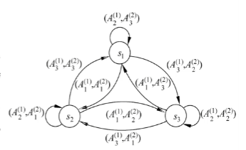
矩阵：上一半为输出矩阵，下一半为状态转换矩阵。
如：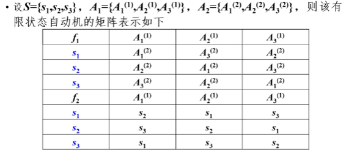

### 密钥流产生器

可以看做一个参数为k的有限状态自动机

组成：一个输出符号集$Z$、一个状态集$\Sigma$、输出函数 $\phi:\sigma_i\rightarrow\sigma_{i+1}$、状态转移函数$\psi:\sigma_i\rightarrow z_i$以及一个初始状态$\sigma_0$

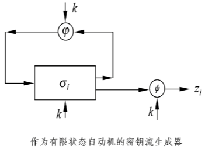

关键：找到适当的输出函数$\phi$和状态转移函数$\psi$，使得输出序列z满足密钥流序列z应满足的随机性条件，并要求设备上节省和容易实现。

一般采用非线性的输出函数$\phi$和线性的状态转移函数$\psi$，这样能够进行深入分析并得到好的生成器。

密钥流生成器可分为驱动器部分和非线性组合部分。

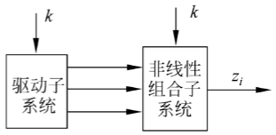

驱动部分：控制生成器的状态转移，并为非线性组合部分提供统计性能好的序列

非线性组合部分：利用这些序列组合出满足要求的密钥流序列

目前最为流行和使用的密钥流产生器，驱动部分为一个或多个线型反馈移位寄存器，

包括滤波生成器/前馈生成器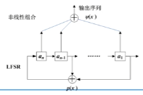和非线性组合生成器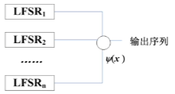，还有钟控生成器，缩减生成器，停走生成器等。

## 2.3 二元序列的伪随机性

### 2.3.1 二元序列的相关概念

#### 二元序列

二元序列：$GF(2)$上的一个无限序列$\underset{\rightarrow}{a}=(a_1,a_2,\cdots,a_n)$称为二元序列，其中$a_i\in GF(2)$

#### 周期

周期：对于二元序列$\underset{\rightarrow}{a}$，如果存在正整数l，使得对于一切正整数k都有$a_k=a_{k+l}$，则称$\underset{\rightarrow}{a}$是周期的。满足上述条件的最小正整数称为的周$\underset{\rightarrow}{a}$期，记为$p(\underset{\rightarrow}{a})$

#### 周期的性质

周期的性质：设$GF(2)$上的一个二元序列$\underset{\rightarrow}{a}=(a_1,a_2,\cdots,a_n)$是周期为$p(\underset{\rightarrow}{a})$的二元序列，并设正整数$l$对任何非负整数$k$都有$a_k=a_{k+l}$，则一定有$p(\underset{\rightarrow}{a})\mid l$

证明：
$$
设&l=qp(\underset{\rightarrow}{a})+r(q,r为正整数，且0\le r\le p(\underset{\rightarrow}{a}))\\
则&\forall a_k=a_{k+l}\\
\Rightarrow&a_k=a_{qp(a)+r+k}\\
\Rightarrow&a_k=a_{r+k}\\
又&0\le r\le p(\underset{\rightarrow}{a}),p(\underset{\rightarrow}{a})极小\\
\therefore&r=0\\
\therefore&p(\underset{\rightarrow}{a})\mid l\\
$$

游程：设$\underset{\rightarrow}{a}$是$GF(2)$上周期为$p(\underset{\rightarrow}{a})$的周期序列。将$\underset{\rightarrow}{a}$的一个周期依次排列在一个圆周上使得$a_{p(\underset{\rightarrow}{a})}$与$a_1$相连，把这个圆周上形如$011\cdots100$或$100\cdots001$的一串练练相邻的项分别称为$\underset{\rightarrow}{a}$的一个1游程或0游程。游程中间1或0的个数称为游程的长度。

#### 自相关函数

自相关函数：$GF(2)$上周期为$T$的序列$\{a_i\}$的自相关函数定义为：
$$
R(t)=\sum\limits_{k=1}^T(-1)^{a_k}(-1)^{a_{k+t}},0\le t\le T-1
$$
当$t=0$时，$R(t)=T$；当$t\neq0$时，称$R(t)$为异相自相关函数。

### 2.3.2 伪随机序列

#### Golomb伪随机公设

3个随机性公设：

①在序列的一个周期内，0与1的个数相差至多为1。
即：序列$\{a_i\}$中0与1出现的概率基本上相同。

②在序列的一个周期内，长为i的游程站游程总数的$1/2^i(i=1,2,\cdots)$，且在等长的游程中0的游程个数和1的游程个数相等。
即：说明0和1在序列中每一个位置上出现的概率相同。

③异相自相关函数是一个参数。
即：通过对序列与其平移后的序列做比较，并不能给出其他任何信息。

#### 伪随机序列

伪随机序列（万哲先院士的定义）：设$\underset{\rightarrow}{a}=(a_1,a_2,\cdots,a_n)$是$GF(2)$上的一个周期为$p(\underset{\rightarrow}{a})$的周期序列。若对于一切$t\neq0(modp(\underset{\rightarrow}{a}))$有$R(t)=-1$，则称$\underset{\rightarrow}{a}=(a_1,a_2,\cdots,a_n)$为伪随机序列。

（这个定义满足Golomb伪随机公设）

#### 伪随机序列要作为流密码的密钥流还应该满足的条件：

①周期p要足够大，如大于$10^{50}$
②序列$\{a_i\}_{i\ge1}$产生应易于高速生成
③序列$\{a_i\}_{i\ge1}$的任何部分暴露时，要分析整个序列，提取产生它的电路结构信息，在计算上不可行，称为不可预测性

第三点决定了密码的强度，是流密码理论的核心，包含了流密码要研究的许多主要问题，包括线性复杂度、相关免疫性、不可预测性等

## 2.4 线性反馈移位寄存器

### 反馈移位寄存器

移位寄存器：流密码产生密钥流的一个主要组成部分

$GF(2)$上一个n级反馈移位寄存器由n个二元存储器与一个反馈函数$f(a_1,a_2,\cdots,a_n)$组成。

如：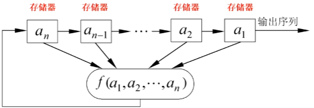

状态：对应与$GF(2)$上的一个n维向量，共有$2^n$种可能的状态，每个时刻的状态可用n维向量$(a_1,a_2,\cdots,a_n)$表示。

初始状态：由用户决定

反馈函数$f(a_1,a_2,\cdots,a_n)$：是n元布尔函数，自变量和因变量只取0和1（即在$GF(2)$中取值），函数中的计算有逻辑与、逻辑或、逻辑补等运算。

例子

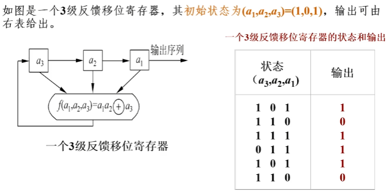

### 线性反馈移位寄存器

线性反馈移位寄存器（Linear Feedback Shift Register，LFSR）：反馈函数是一个线性函数$f(a_1,a_2,\cdots,a_n)=c_1a_n\oplus c_2a_{n-1}\oplus\cdots\oplus c_na_1$（这里的$c_1,c_2,\cdots,c_n$只能取0或1）

即：$a_{n+t}=c_1a_{n+t-1}\oplus c_2a_{n+t-2}\oplus\cdots\oplus c_na_t,t=1,2,\cdots$

如图：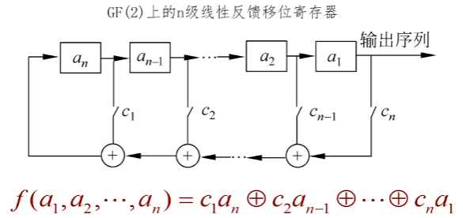

#### 线性反馈移位寄存器特点

实现简单、速度快、有较为成熟的理论，成为构造密钥流生成器最重要的部件之一。

总是假定$c_1,c_2,\cdots,c_n$中至少有一个不为0，否则$f(a_1,a_2,\cdots,a_n)\equiv0$，总是假定$c_n=1$

输出序列的性质完全由反馈函数决定。

n级线性反馈移位寄存器的状态数：最多有$2^n$个。

n级线性反馈移位寄存器的周期：$输出序列周期=状态周期\le 2^n-1$。

选择合适的反馈函数可使序列的周期达到最大值$2^n-1$，周期达到最大值的序列称为m序列。

## 2.5 m序列

### 线性移位寄存器的一元多项式表示

#### 特征多项式

设n级线性移位寄存器的输出序列满足递推关系：$a_{n+t}=c_1a_{n+t-1}\oplus c_2a_{n+t-2}\oplus\cdots\oplus c_na_t,t=1,2,\cdots$

用延迟算子$D（Da_k=a_{k-1}）$作为未定元，给出的反馈多项式为：$p(D)=1+c_1D+\cdots+c_{n-1}D^{n-1}+c_nD_n$

这种递推关系可以用一个一元高次多项式$p(x)=1+c_1x+\cdots+c_{n-1}x^{n-1}+c_nx_n$表示，这个多项式成为LFSR的特征多项式

根据初始状态不同，由以上递推关系生成的非恒0的序列有$2^n-1$个，这$2^n-1$个非零序列的全体记为$G(P(X))$

$p(D)(a_{n+k})$与递推关系等效（所以能表示LFSR）。

证明：
$$
&a_{n+t}=c_1a_{n+t-1}\oplus c_2a_{n+t-2}\oplus\cdots\oplus c_na_t\\
\iff&a_{n+t}\oplus c_1a_{n+t-1}\oplus c_2a_{n+t-2}\oplus\cdots\oplus c_na_t=0\\
$$
而
$$
p(D)(a_{n+k})&=(1-c_1D+\cdots+c_nD^n)(a_{n+k})\\
&=a_{n+k}+c_1D(a_{n+k})+\cdots+c_nD^n(a_{n+k})\\
&=a_{n+k}+c_1a_{n+k-1}+c_2a_{n+k-2}+\cdots+c_na_k
$$
与上式左边相同。

#### 生成函数

给定序列$\{a_i\}$，幂级数$A(X)=\sum^{\infty}_{i=1}a_ix^{i-1}$称为该序列的生成函数。

#### 生成函数的性质

$A(x)=\frac{\phi(x)}{p(x)}$其中$\phi(x)=\sum\limits^n_{i=1}(c_{n-i}x^{n-i}\sum\limits^i_{j=1}a_jx^{j-1})$，$p(x)1+c_1x+\cdots+c_{n-1}x^{n-1}+c_nx_n$。

证明：对$a_{n+t}=c_1a_{n+t-1}\oplus c_2a_{n+t-2}\oplus\cdots\oplus c_na_t,t=1,2,\cdots$两边分别乘以$x^{n+t}$再求和得：
$$
&A(x)-(a_1+a_2x+\cdots+a_nx^{n-1})\\
=&c_1x[A(x)-(a_1+a_2x+\cdots+a_nx^{n-2})]\\
+&c_2x^2[A(X)-(a_1+a_2x+\cdots+a_nx^{n-3})]+\cdots+&c_nx^nA(x)
$$
移项得：$\sum\limits^n_{i=1}(c_ix^i)A(x)=\sum\limits^{n-1}_{i=0}(c_ix^i\sum\limits^{n-i}_{j=1}a_jx^{j-1})$

即$p(x)A(x)=\phi(x)$，证毕。

#### 一些定理和定义

①$p(x)\mid q(x)\iff G(p(x))\subset G(q(x))$
也说明：可以用n级LFSR产生的序列，就能用级数更多的LFSR来产生。

②$p(x)$的周期或阶：设$p(x)$是$GF(2)$上的多项式，使$p(x)\mid(x^p-1)$成立的最小正整数p称为$p(x)$的周期或阶。

③序列$\{a_i\}$的特征多项式$p(x)$定义在$GF(2)$上，p是$p(x)$的周期，则$\{a_i\}$的周期$r\mid p$
也说明：n级LFSR输出序列的周期rt不依赖于初始条件，而依赖于特征多项式$p(x)$。

④设$p(x)$是n次不可约多项式（没有次数比他低的多项式作为它的因子），周期为m，序列$\{a_i\}\in G(p(x))$，则$\{a_i\}$的周期为m

证明：

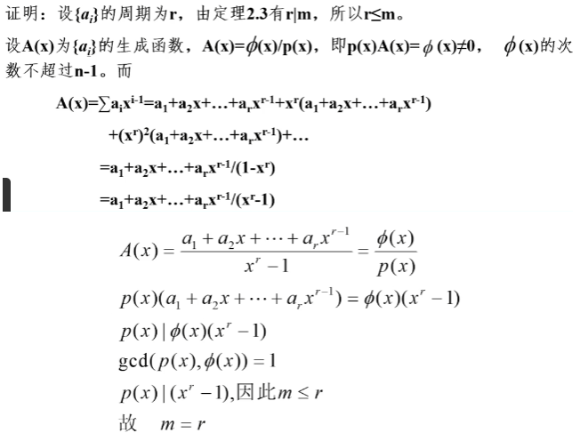

⑤一个n级LFSR产生的序列有最大周期$2^n-1\Rightarrow$它的特征多项式不可约，反之不行。

证明：假设$p(x)$可约，则$p(x)=g(x)h(x)$，其中$g(X)$不可约，且次数$k\lt n$。由于$G(g(X))\subset G(p(x))$，而$G(g(X))$中序列的周期不超过$2^k-1$又等于$2^n-1$，矛盾，所以$p(x)$不可约。

反例：$f(x)=x^4+x^2+x^2+x+1$是$GF(2)$上的不可约多项式，以$f(x)$为特征多项式的LFSR输出序列可以由$a_k=a_{k-1}\oplus a_{k-2}\oplus a_{k-3}\oplus a_{k-4}(k\ge4)$和给定初始状态求出，这是周期为5，不是m序列。

#### m序列产生的充要条件条件

本原多项式：n次不可约多项式$p(x)$的阶为$2^n-1$，则称$p(x)$为本原多项式

⑥设$\{a_i\}\in G(p(x))$，则$\{a_i\}$为m序列$\iff$$p(x)$为本原多项式

证明：$p(x)$为本原多项式$\Rightarrow$其阶为$2^n-1$$\Rightarrow\{a_i\}$周期$=2^n-1$，即$\{a_i\}$为m序列。

反之，$\{a_i\}$为m序列$\iff\{a_i\}$周期$=2^n-1\Rightarrow p(x)$不可约（定理⑤）

又$\{a_i\}的周期=2^n-1\mid p(x)的阶\le 2^n-1$，所以$p(x)的阶=2^n-1$，即$p(x)$为本原多项式。

对于任意正整数n，至少存在一个n次本原多项式，所以对于任意的n级LFSR，至少存在一种连接方式使其输出序列为m序列。

## 2.6 m序列的伪随机性（证明）

Golomb伪随机公设：①在序列的一个周期内，0与1的个数相差至多为1。②在序列的一个周期内，长为i的游程站游程总数的$1/2^i(i=1,2,\cdots)$，且在等长的游程中0的游程个数和1的游程个数相等。③异相自相关函数是一个参数。

伪随机序列定义：设$\underset{\rightarrow}{a}=(a_1,a_2,\cdots,a_n)$是$GF(2)$上的一个周期为$p(\underset{\rightarrow}{a})$的周期序列。若对于一切$t\neq0(modp(\underset{\rightarrow}{a}))$有$R(t)=-1$，则称$\underset{\rightarrow}{a}=(a_1,a_2,\cdots,a_n)$为伪随机序列。

⑦m序列的伪随机性：在$GF(2)$上n长m序列$\{a_i\}$具有以下性质：
在一个周期内，$0,1$出现的次数分别为$2^{n-1}-1$和$2^{n-1}$；
在一个周期内，总游程数为$2^{n-1}$，长为$i(1\le i\le n-2)$的游程有$2^{n-i+1}$个，且0、1游程各半，长为n-1的0游程1个，长为n的1游程1个；
$\{a_i\}$的自相关函数：$R(t)=\left\{\begin{aligned}2^n-1,&t=0\\-1,&0\lt t\le 2^n-2\end{aligned}\right.$（m序列$\{a_i\}$的周期为$2^n-1$）。

证明：①在n长m序列的一个周期内，除了全0状态外，每个n长状态都恰好出现一次。输出为每个状态的$a_1$，即输出1则状态为$^"\cdots 1^"$，输出0则状态为$^"\cdots 0^"$。全状态各出现一次，所以输出$0,1$出现的次数分别为$2^{n-1}-1$和$2^{n-1}$（$^"\cdots 0^"$少了一个全0的）。
②$n=1或2$时，显然成立
$n\gt2$时，当$1\le i\le n-2$时，长为i的0游程数目等于有$^"100\cdots01(后n-i-2位任取0或1)^"$形式的状态的数目。这种状态有$2^{n-i-2}$个，对1游程同理，所以长为$i(1\le i\le n-2)$的游程有$2^{n-i+1}$个，且0、1游程各半。
由于没有全0状态，所以没有0的n游程，但又一个1的n游程。
若出现1的n+1游程，就证明有两个相邻的全1状态，这不可能。所以1的n游程必然出现在$^"0(n个1)0^"$的串中，这n+2位通过移位寄存器的时候就依次产生$^"0(n-1个1)^"$、$^"(n个1)^"$、$^"(n-1个1)0^"$的三个状态。同周期内这3个状态都只能出现一次，所以无1的n-1游程，0的n-1游程同理也只有一个。所以总游程数为$1+1+\sum\limits^{n-2}_{i=1}2^{n-i-1}=2^{n-1}$。
③$\{a_i\}$为周期为$2^n-1$的m序列，对于任一正整数$t(0\lt t\lt2^n-1)$，序列$\{a_i\}$和$\{a_{i+t}\}$的对应为相同，即$\{a_i\}+\{a_{i+t}\}$在一个周期内为0的位数。
设$\{a_i\}$满足递推关系：$a_{h+n}=c_1a_{h+n-1}\oplus c_2a_{h+n-2}\oplus\cdots\oplus c_na_h$，则$a_{h+n+t}=c_1a_{h+n+t-1}\oplus c_2a_{h+n+t-2}\oplus\cdots\oplus c_na_h+t$，则$a_{h+n}\oplus a_{h+n+t}=c_1(a_{h+n-1}\oplus a_{h+n+y-1})\oplus c_2(a_{h+n-2}\oplus a_{h+n+t-2})\oplus\cdots\oplus c_n(a_h\oplus a_{h+t})$，令$b_j=a_j\oplus a_{j+t}$，则序列$\{b_j\}$也满足$b_{h+n}=c_1b_{h+n-1}\oplus c_2b_{h+n-2}\oplus\cdots\oplus c_nb_h$所以$\{b_j\}=\{a_i\}+\{a_{i+t}\}$也是m序列。
所以$R(t)=\sum\limits^T_{k=1}(-1)^{a_k}(-1)^{a_{k+t}}=\sum\limits^T_{k=1}(-1)^{b_k}=2^{n-1}-1-2^{n-1}=-1$

## 2.7 m序列的安全性

已知一段序列，如何获得其相应的反馈多项式（或线性递推式）？两种方法：解方程方法（已知是由n级LFSR产生，知道连续2n位，可以解出）、Berlekamp-Massey算法（也称为线性反馈移位寄存器综合解法，可以算出生成某个连续序列的最短的LFSR的反馈多项式）

### 解方程方法（就是普通的解线性方程组）

例题：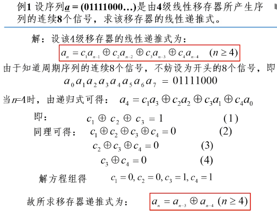
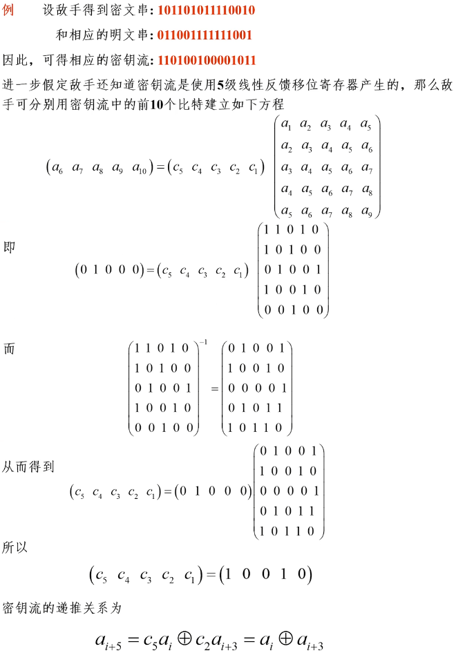

### Berlekamp-Massey算法/线性反馈移位寄存器综合解法

根据密码学的需要，针对线性反馈移位寄存器（LFSR）主要考虑以下两个问题：

①如何利用级数尽可能短的LFSR生成周期大、随机性能好的序列（从密钥生成角度考虑，最小代价产生尽可能好的序列）

②已知一个长为N序列$\mathop{a}\limits_{—}$时，如何构造一个级数尽可能小的LFSR来产生它（从密码分析角度考虑，用线性方法重构密钥序列必须付出的最小代价）

序列$\underline{a}$的线性综合解：设$f(x)$是一个能产生$\mathop{a}\limits_{—}$并且级数最小的线性移位寄存器的特征多项式。l为该寄存器的级数，则称$\langle f(x),l\rangle$为序列$\underline{a}$的线性综合解。

设$\underline{a}=(a_0,a_1,\cdots,a_{N-1})$是$F_2$上的长度为N的序列，而$f(x)=c_0+c_1x+c_2x^2+\cdots+c_lx^l$是$F_2$上的多项式，$c_0=1$。如果序列中的元素满足递推关系$a_k=c_1a_{k-1}\oplus c_2a_{k-2}\oplus\cdots\oplus c_la_{k-l}(k=l,l+1,\cdots,N-1)$则称$\langle f(x),l\rangle$产生二元序列$\underline{a}$。以$\langle f(x),l\rangle$表示$f(x)$为特征多项式的l级线性移位寄存器。

**线性移位寄存器的综合问题**：给定一个N长二元序列$\underline{a}$，如何求出产生这一序列的最小级数的线性移位寄存器，即最短的线性移位寄存器。

①特征多项式$f(x)$的次数$\le l$。因为你产生列且级$\underline{a}$数最小的线性移位寄存器可能是退化的，这种情况下$f(x)$的次数$\le l$，且$f(x)$中的$c_l=0$，因此在特征多项式中仅要求$c_0=1$，不要求$c_l=1$。

②规定：0级线性移位寄存器的特征多项式$f(x)=1$，全0序列仅由0级线性移位寄存器产生。（因为以$f(x)=1$为反馈特征多项式的递归关系式中所有$a_k=0(k=0,1,\cdots,n-1)$）

③求$\underline{a}$的线性综合解：就是求能产生给定N长序列，$\underline{a}$且级数最小的线性移位寄存器，可以用B-M算法。

**Berlekamp-Massey算法**：用归纳法求出一系列线性移位寄存器$\langle f_n(x),l_n\rangle$，每个表$\langle f_n(x),l_n\rangle$示生成N长序列序列的前$\underline{a}$n项的最短线性移位寄存器，直到n=N，求得的$\langle f_N(x),l_N\rangle$就是N长序列$\underline{a}$的线性综合解。

**Berlekamp-Massey算法步骤**：$\underline{a}=(a_0,a_1,\cdots,a_{N-1})$，归纳法求$\langle f_n(x),l_n\rangle$

①取初始值$f_0(x)=1,l_0=0$

由$\langle f_n(x),l_n\rangle$求$\langle f_{n+1}(x),l_{n+1}\rangle$：

②记$f_n(x)=c_0^{(n)}+c_1^{(n)}+\cdots+c_{l_n}^{(n)}x^{l_n},c_0^{(n)}=1$计算第n步差值$d_n=c_0^{(n)}a_n+c_1^{(n)}a_{n-1}+\cdots+c_{l_n}^{(n)}a_{n-l_n}$

③$d_n=0$，则$f_{n+1}(x)=f_n(x),l_{n+1}=l_n$

若$d_n=1,l_0=l_1=\cdots=l_n=0$，则$f_{n+1}(x)=1+x^{n+1},l_{n+1}=n+1$；

若$d_n=1$，有一个$0\le m\lt n$使得$l_m\lt l_{m+1}=l_{m+2}=\cdots=l_n$，则$f_{n+1}(x)=f_n(x)+x^{n-m}f_m(x),l_{n+1}=max\{l_n,n+1-l_n\}$

④重复②③直到得到$\langle f_n(x),l_n\rangle$。

## 2.8 2.9 非线性序列

驱动子系统常用一个或多个线性反馈移位寄存器来实现、非线性组合子系统用非线性组合函数F来实现

目的：使密钥流生成器输出的二元序列尽可能复杂，保证其周期尽可能大、相信复杂度和不可预测性尽可能高

### Geffe序列生成器

Geffe序列生成器：由三个LFSR组成，其中LFSR2作为控制生成器使用

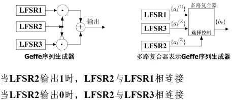

输出序列$\{b_k\}$可以表示为$b_k=a_k^{(1)}a_k^{(2)}+a_k^{(3)}\overline{a_k^{(2)}}=a_k^{(1)}a_k^{(2)}+a_k^{(3)}a_k^{(2)}+a_k^{(3)}$

若LSFRi的特征多项式分别为$n_i$次本原多项式环，且$n_i$两两互素，则Geffe序列的周期=$\prod\limits_{i=1}^3(2^{n_i}-1)$，线性复杂度=$（n_1+n_3）n_2+n_3$

### J-K触发器

J-K触发器：两个输入端用J、K表示，输出$c_k$不仅依赖于输入，还依赖于前一个输出位$c_{k-1}$，即$c_k=\overline{(x_1+x_2)}c_{k-1}+x_1$

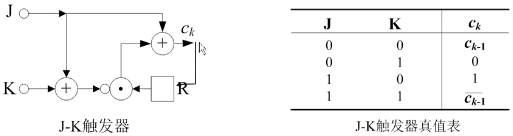

利用J-K触发器的非线性序列生成器，就把LFSR1和LFSR2作为J和K端的输入如图：

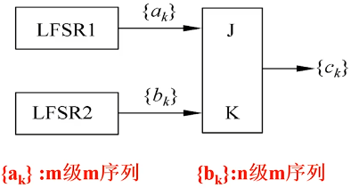

则$c_k=\overline{(a_k+b_k)}c_{k-1}+a_k=(a_k+b_K+1)c_{k-1}+a_k$，当$gcd(m,n)=1,a_0+b_0=1$时，序列$\{c_k\}$的周期为$(2^m-1)(2^n-1)$。

**缺点**：由$c_k=(a_k+b_K+1)c_{k-1}+a_k$得$c_k=\left\{\begin{aligned}a_k,&c{k-1}=0\\\overline{b_k},&c_{k-1}=1\end{aligned}\right.$知道$\{c_k\}$中的相邻位的值$c_{k-1},c_k$，就可以推断出$a_k,b_k$中的一个，知道足够多的信息，就可以分析出序列$\{a_k\},\{b_k\}$。

**解决方法**：Pless生成器：由多个J-K触发器序列驱动的多路符合序列方案

### Pless生成器

Pless生成器：由8个LFSR、4个J-K触发器和1个循环计数器构成，由循环计数器进行选通控制，如图：

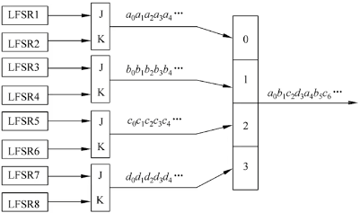

### 钟控序列生成器/停走生成器

钟控序列生成器：用一个LFSR来控制另一个LFSR的移位时钟脉冲。

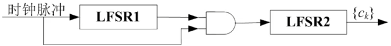

LFSR1输出1，移位时钟脉冲通过与门使LFSR2进行一次移位，生成下一位；

LFSR1输出0，移位时钟脉冲无法通过与门影响LFSR2，LFSR2重复输出前一位。

**钟控序列的周期**：钟控序列$\{c_k\}$的周期$p=\frac{p_1p_2}{gcd(w_1,p_2)},w_1=\sum\limits_{i=0}^{p_i=1}a_i$。

周期至多为$p_1\times p_2$，LFSR1运行一个周期，LFR2运行$w_1=dt$拍，$d=gcd(w_1,p_2)$，LFSR1运行$p_2/d$个周期，LFR2运行$dt\times p_2/d=tp_2$拍，即t个周期。两边都为整数，则运行了$(p_2/d)\times p_1$个节拍

若$\{a_k\},\{b_k\}$的极小特征多项式为$GF(2)$上的m和n次本原多项式，且$m\mid n$，则$p_1=2^m-1,p_2=2^n-1,w_1=2_{m-1}$（$\{a_k\}$一个周期内1的个数），$gcd(w_1,p_2)=1$，所以$p=p_1p_2=(2^m-1)(2^n-1)$

**线性复杂度**：$n(2^m-1)$，**极小特征多项式**：$f_2(x^{2^m-1})$

## 2.10 A5流密码算法

### A5/1流密码算法的基本用法：

用于蜂窝式移动电话系统语音和数字加密：A5/1算法用于用户的手机到基站之间的通信加密，通信内容到基站之后解密为明文，再进行基站之间、基站到用户手机之间的信息加密，完成通信过程中的加密保护。

应用环节：只要考虑用户A到基站1之间通信内容的加解密，中间信息的传送是基站到基站之间的加密。接收方用户B对信息的加解密类似，不过B是解密方。

基本密钥$K_{A1}$：预置在SIM卡中，与基站1共享；生存期：植入卡中就不再改变；用途：分配用户和基站之间的会话密钥

会话密钥k：每次会话时由基站产生64比特的随机数k；分配方式：利用基本密钥$K_{A1}$，使用其他密码算法吧k加密传给用户手机；生存期：仅用于一次通话时间

明文处理：每帧228比特分为若干帧后逐帧加密，每帧处理方式相同。

加密方式：$E_k(M)=E_{k1}(M_1)E_{k2}(M_2)E_{k_3}(M_3)\cdots$，一次通话一个会话密钥，每帧使用不同的帧密钥。

帧会话密钥：帧序号。22比特，产生228比特密钥流，对本帧228比特进行逐位异或加解密。

一次通话量：至多$2^{22}$帧数据，大概$0.89\times2^{30}$比特

### A5/1流密码算法使用的LFSR：

三个，级数为19、22、23的本原反馈移位寄存器，以为方式为左移，编号从0到n-1

### A5/1算法初始化：

也就是用一次通话的会话密钥k和帧序号来设定三个LFSR的初始状态

三个LFSR都设为全0→三个LFSR都规则动作64次。每次1步（第i步动作时，三个LFSR的反馈内容都先和密钥第i位异或，然后把异或结果作为LFSR反馈的内容）→三个LFSR都规则动作22次，每次1步（第i步动作时，三个LFSR的反馈内容都先和帧序号第i位异或，然后把异或结果作为LFSR反馈的内容）

### A5/1算法生成密钥流和加解密

使用钟控方式，钟控信号$x_1,x_2,x_3$分别取自LFSR1第9级，LFSR2第11级，LFSR3第11级。

控制方式：用多项式$g(x)=x_1x_2+x_2x_3+x_3x_1$来确定。

加密：动作100次，不输出→动作114次，动作后输出三个比特的异或，作为密钥流。

解密：动作100次，不输出→动作114次，动作后输出三个比特的模2和，作为密钥流。

### A5/1算法的弱点

①移位寄存器太短，容易遭受穷举攻击：主密钥作为算法中三个寄存器的初始值，长度64比特。如果已知明文攻击，只要知道其中两个寄存器的初始值，就可以得到另一个寄存器的初始值，只要$2^{40}$步就能得到LSFR1和LSFR2的结构

②有严重的安全问题：利用GSM通信加密中的两个安全漏洞，可以通过离线迭代计算生成一个彩虹表，包含有密钥和其对应的输出密码。大小为984GB。得到彩虹表后，可以在9秒内确定用于加密通信数据的密钥。

### 密钥流生成器的基本原则：密钥流生成器的不可预测性

即①长周期②高线性复杂度（移位寄存器尽量少）③统计性能良好④足够混乱⑤足够扩散⑥抵抗不同形式的攻击

## 2.11 祖冲之密码（ZUC）

最初面向4G LTE空口加密设计，2011.9被3GPP LTE采纳为国际加密标准，2012.3发布为国家密码行业标准，2016.10发布为国家标准.
主要用于通信领域，是一个基于字设计的同步序列密码算法。
种子密钥SK、初始向量IV长度128比特，在SK和IV的控制下，每拍输出一个32比特字。
算法结构：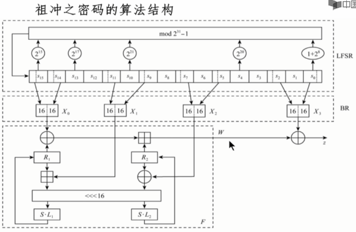
基于ZUC的机密性算法128-EEA3：
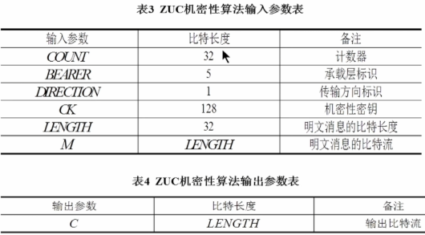
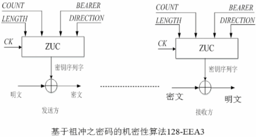