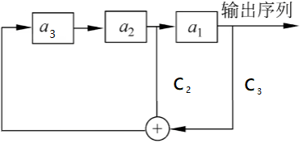

# 测试

1.n级m序列的周期为$2^n-1$。

2.设一个3级线性反馈移位寄存器(LFSR)的递推关系式为$a_{n+1}=a_n\oplus a_{n-2}$，则其输出序列周期为7.

3.n级m序列的一个周期内，0出现的次数为$2^{n-1}-1$。

4.n级线性反馈移位寄存器最多有$2^n-1$种不同的非零状态。

5Golomb随机性公设要求，在序列的一个周期内，0与1的个数相差至多为1。

6序列密码的安全核心问题是密钥序列产生器的设计。

7.Geffe序列生成器由3个LFSR组成,这些LFSR的长度分别为$n_i(i=1,2,3)$，其输出序列均为m-序列，则Geffe序列生成器的线性复杂度为$(n_1+n_3)n_2+n_3$。

8.n级线性反馈移位寄存器输出序列是m-序列的充要条件是其相应的特征多项式是本原多项式。

9.祖冲之密码中的机密性算法初始密钥长度为128。

10.冲之密码算法中， 线性反馈移位寄存器（LFSR）由16个31比特寄存器单元组成。
# 作业

设一个3级线性反馈移位寄存器(LFSR)的特征多项式为$f(x)=1+x^2+x^3$。(1) 画出该LFSR的框图；(2) 给出输出序列的递推关系式；(3) 设初始状态(a0,a1,a2)=(0,0,1)，写出输出序列及序列周期。(4) 列出序列的游程。

解：（1）$f(x)=1+x^2+x^3$，说明$c_1=0,c_2=1,c_3=1$，所以框图为：

（2）递推关系式$a_{n+1}=a_{n-1}\oplus a_{n-2}$

（3）001011100101110010111001……周期为7，一个周期为0010111

（4）0游程：101、1001；1游程：01110、010

