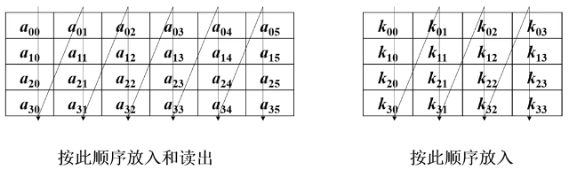

# 第三章 分组密码
## 3.1 分组密码的基本概念
### 3.1.1 分组密码概述
分组密码是许多系统安全的一个重要组成部分，可用于构造：伪随机数生成器、流密码、消息认证码（MAC）和杂凑函数、消息认证技术、数据完整性机制、实体认证协议、单钥数字签字认证的核心组成部分。

应用中对分组密码的要求：安全性、运行速度、存储量（程序的长度、数据分组长度、高速缓存大小）、实现平台（硬件、软件、芯片）、运行模式

明文序列：$x_0,x_1,\cdots,x_{n-1},\cdots$，分组长度为n。
加密函数E：$V_n\times K\rightarrow V_m$，密文分组长度为m。

实质上是字长为n的数字序列的代换密码。
通常取$n=m$，若$n\lt m$，则为**有数据拓展的分组密码**，若$n\lt m$，则为**有数据压缩的分组密码**。

### 3.1.2 分组密码的设计原则
问题在于找到一种算法，能在密钥的控制下从一个足够大且足够好的置换子集中，简单而迅速地选出一个置换，用来对当前输入的明文的数字组进行加密变换。

#### 香浓shannon提出的两个原则

①混淆原则（Confusion）：将密文、明文、密钥三者之间的统计关系和代数关系变得尽可能复杂，使得敌手即使获得了密文和明文，也无法求出密钥的任何信息；即使获得了密文和明文的统计规律，也无法求出明文的新的信息。
即：明文不能由已知的明文、密文和少许密钥比特代数地或统计地表示出来。密钥不能由已知的明文、密文和少许密钥比特代数地或统计地表示出来。

②扩散原则（Diffusion）：应将明文的统计规律和数据结构散射到相当长的一段统计中去。
即：明文中的每一位影响密文中尽可能多的位，密文中的每一位受到明文中尽可能多位的影响。若明文变化一个比特时，密文有些比特不可能发生变化，则这个明文就与那些密文无关，因而在攻击这个明文比特时就可不利用那些密文比特。让密钥中的每一位影响密文中的尽可能多位。

#### 分组密码算法应满足的要求

①分组长度n要足够大:防止**明文穷举攻击法**
②密钥量足够大：尽可能消除弱密钥，使所有密钥同等得好，以防止**密钥穷举攻击**
③由密钥确定置换的算法要足够复杂；充分实现明文和密钥的扩散和混淆，没有简单的关系可循，要能抗击各种已知的攻击。
④加密和解密运算简单：易于软件和硬件高速实现
⑤数据扩展：一般无数据扩展，在采用同态置换和随机化加密技术时可引入数据扩展。
⑥差错传播尽可能地小：一个密文分组的错误尽可能少地影响其他密文分组的解密。

#### 分组密码的实现原则
①软件实现时：使用子块和简单的运算。使用子块，如把分组n划分为子段，每段长8、16或32。选用简单的运算，如加、乘、移位等，避免使用软件难以实现的逐比特置换。
②硬件实现时：加密和解密最好可以用一样的器件来实现。

## 3.2 SP网络（代换-置换网络）

### 3.2.1 代换概述

代换：如果明文和密文的分组长都为n比特，则明文的每一个分组都有$2^n$个可能的曲子。为使加密运算可逆（使解密运算可行），明文的每一个分组都应产生唯一的一个密文分组，这样的变换是可逆的，称明文分组到密文分组的可逆变换为代换。

不同可逆变换的个数有$2^n!$个。

代换表：列出明文和密文之间的映射关系。明文→密文：正向代换；密文→明文：反向代换。

#### 代换的弱点

①如果分组长度太小（如n=4）。系统则等价于古典的代换密码，容易通过对明文的统计分析而被攻破。

Ps.这个弱点不是代换结构固有的，只是因为分组长度太小。如果分组长度n足够大，而且从明文到密文可有任意可逆的代换，那么明文的统计特性将被隐藏而使以上的攻击不能奏效。

②从实现的角度来看，分组长度很大的可逆代换结构是不实际的。

对n比特的代换结构，密钥的大小为$n\times2^n$比特。如对64比特的分组，密钥大小应是$64\times2^{64}=2^{70}\approx10^{21}$比特，因此难以处理。

### 3.2.2 SP网络

香农（shannon）1949年提出替代-置换网络即SP网络。

意义：①这种思想形成了现代密码的基础②SP网络是替代-置换乘积密码的现代形式

SP网络基于替代（Substitution）和置换（Permutation）这两种最基本的密码运算。

代换：是输入集$A$到输出集$A^{'}$的双射变换：$f_k:A\rightarrow A{'}$，其中k是控制输入变量，在密码学中成为密钥。

代换网络：实现代换$f_k$的网络。（双射条件保证在给定k下可从密文唯一地恢复出原明文。）

代换$f_k$的集合：$S=\{f_k|k\in K\}$

全代换网络：网络可以实现所有可能的$2^n!$个代换，则成为全代换网络。

全代换网络密钥个数必须满足条件：$\#\{k\}\le2^n!$

密码设计中要先丁仪代换集$S$，而后还要定义解密变换集，即逆代换网络$S^{-1}$。它以密文y为输入矢量，输出为恢复的明文矢量x。

实现全代换网络并不容易，故常常利用一些简单的基本代换，通过组合实现较复杂的、元素个数较多的代换集。

实用密码体制的集合$S$中的元素个数都远远小于$2^n!$。

代换盒/S盒：在密码设计中选择$n=r\cdot n_0$，其中$r$和$n_0$都为正整数，将设计n个变量的代换网络化为设计r个较小的子代换网络，而每个子代换网络只有$n_0$个输入变量。称每个子代换网络为代换盒（Substitution Box）

DES使用了s盒（6位输入4位输出，但没有公布细节）其设计准则：

①S盒的输出都不是输入的线性或仿射函数

②改变一个输入比特，其输出至少有一般产生变化

③S盒的任一输入位保持不变，其他5位输入变化时（共有$2^5=32$种情况），输出数字中的0和1的总数近于相等。

符合以上三点是的DES的S盒能够实现较好的混淆。

## 3.3 Feistel密码结构

### 3.3.1 Feistel密码的思想

乘积密码：顺序地执行两个或多个基本密码系统，使得最后结果的密码强度高于每个基本密码系统常识的结果。

Feistel提出实现代换和置换的方法。思想实际上是香农（shannon）提出的利用乘积密码实现混淆和扩散思想的具体应用。

#### Feistel密码实现的参数

与这些特性有关：

①分组大小：分组越大安全性越高，加密速度越慢。

②密钥大小：密钥越长安全性越高，加密速度越慢。

③轮数：单轮结构远不足以保证安全性，但多轮结构可以提供足够的安全性。典型地取轮数为16。

④子密钥产生算法：该算法的复杂性越大，则密码分析的困难性就越大。

⑤轮函数：轮函数的复杂性越大，密码分析的困难性也越大。

#### Feistel密码的两个要求

①快速的软件实现：很多情况中，算法被镶嵌在应用程序中，因而无法用硬件实现。此时算法的执行速度是考虑的关键。

②算法容易分析：如果算法能被无疑义地解释清楚，就可容易地分析算法抵抗攻击的能力，有助于设计高强度的算法。

### 3.3.2 Feistel加密结构

加密：输入分组长2w的明文、密钥K。每组明文分成左右两半$L_0$和$R_0$，进行完n轮迭代后，左右两半再合并到一起以产生密文分组，第i轮迭代的输入位前一轮输出的函数：$L_i=R_{i-1},R_i=L_{i-1}\oplus (R_{i-1},K_i)$。其中$K_i$是第i轮用的之谜要，由加密密钥K得到。一般地，各轮子密钥彼此不同而且与K也不同。

解密：本质上与加密过程一样，但输入为密文，解密使用子密钥$K_i$的顺序与加密过程相反。即第一轮用$K_n$，第二轮用$K_{n-1}$，……，最后一轮用$K_1$。这一特性保证了解密和加密可采用同一算法。


#### Feistel密码解密的正确性

加密过程中$LE_{16}=RE_{15},RE_{16}=LE_{15}\oplus(RE_{15},K_{16})$

在解密过程中$LD_1=RF_0=LE_{16}=RE_{15},ED_1=LD_0\oplus F(RD_0,K_{16})=RE_{16}\oplus F(RE_{15},K{16})=[LE_{15}\oplus F(RE_{15},K_{16})]\oplus F(RE_{15},K_{16})=LE_{15}$

所以第一轮输出为$LE_{15}|RE_{15}$，等于加密第16轮输入左右两半交换后的效果。

对每一层加解密同理。

## 3.4 DES算法简介

### 3.4.1 美国制定数据加密标准简况

目的：通信和计算机相结合是人类步入信息社会的一个阶梯，始于60年代末，完成与90年代初。计算机通信网的形成与发展，要求信息作业标准化，安全保密也不例外。只有标准化，才能真正实现网的安全，才能推广和使用加密手段，以便于训练、生产和降低成本。

美国NBS对建议方案的要求①算法必须提供高度的安全性②算法必须有详细的说明，并易于理解③算法的安全性取决于密钥，不依赖算法④算法适用于所有用户⑤算法适用于不同应用场合⑥算法必须高效、经济⑦算法必须能被证实有效⑧算法必须可出口。

DES仍然为迄今为止得到最广泛应用的一种算法，也是一种最有代表性的分组加密体制。

DES（Data Encryption Standard）算法于1977年得到美国政府的正式许可，是一种用56位密钥来加密64位数据的方法，是IBM的研究成果。DES是第一代公开的、完全说明细节的商业级现代算法，并被世界公认。

### 3.4.2 DES的框架和主要参数

分组长度64bits，密文分组长度64bits，密钥长度64bits（其中8bits用于奇偶校验，有效密钥长度56bits）

算法包括：初始置换IP、16轮迭代的乘积变换、逆初始变换$IP^{-1}$以及16个子密钥产生器。


### 初始置换IP和逆初始置换$IP^{-1}$

初始置换：将64bit明文的位置进行置换，得到一个乱序的64bit明文组

逆初始置换$IP^{-1}$：将16轮迭代后给出的64bit组进行置换，得到输出的密文主。输出为阵中元素按行读得的结果。

IP和$IP^{-1}$在密码意义上作用不大，在于打乱原来输入的x的ASCII码字划分的关系。

## 3.5 DES轮函数及密钥

### 3.5.1 DES的轮函数

输入：$(x,y)$，输出：$(y,x\oplus f_k(y))$

等价于两个对合变换的复合：$(x,y)\mapsto(x\oplus f(k,y),y)\mapsto(y,x\oplus f(k,y))$

对合变换：连续变换两次后会回到原来的值

无论f函数如何选区，DES的轮函数都是一个对合变换。
证明：
$$
\begin{aligned}
F(x,y)&=(x\oplus f(k,y),y)\\
F(F(x,y))&=F(x\oplus f(k,y),y)\\
&=((x\oplus f(k,y))\oplus f(k,y),y)\\
&=(x,y)
\end{aligned}
$$
DES算法轮结构：
$f(R,K)$的计算过程：

选择扩展运算E：

选择压缩运算S（8个S盒）：

P盒置换：基本特点：①P盒各输出块的4个比特都来自不同的输入块②P盒的各输入块的4个比特都分配到不同的输出块之中③P盒的第t输出块的4个比特都不来自第t输入块。

3.5.2 DES的密钥编排


$C_i,D_i$作为下一轮密钥的输入，每一轮以为的次数也不同。

具体操作：

## 3.6 DES的安全性

互补性：DES算法中，若明文组x逐位取补，密钥k逐位取补，即$y=DES_k(x)$则有$\overline{y}=DES_{\overline{k}}(\overline{x})$，这会使得DES在选择明文破译下所需的工作量减半

弱密钥：同一密钥下加密两次为恒等变换。$E_K\cdot E_K=1$，DES有4个弱密钥$DES_k(DES_k(x))=x$

半弱密钥：密钥1加密的密文可以用密钥2来解密$E_{K1}=E_{K2}$，至少有12个半弱密钥$y=E_{K1}(x)=E_{K2}(x)$

### 3.6.1 DES的弱密钥

DES算法每次迭代时都有一个子密钥供加密用。如果给定初始密钥k，各轮的子密钥都相同，就称给定密钥k为弱密钥。（只要左28和右28位各自为全0或全1就可以）


### 3.6.2 DES的密钥长度的争论

IBM最初现NBS提交的建议方案采用112bits密钥，但公布的DES标准采用了64bits密钥。有人认为NSA故意限制了DES的密钥长度。

穷举法对DES构成了威胁。

目前攻击DES的主要方法有时间-空间权衡攻击、差分攻击、线性攻击和相关密钥攻击等方法，其中线性攻击方法最为有效。

## 3.7 3DES

如果一个分组密码易受到穷举密钥搜索攻击，那么对同一消息加密多次就有可能增强安全性。

多重DES：使用多个密钥利用DES对明文进行多次加密，可以增加密钥量，大大提高抵抗穷举密钥搜索攻击的能力。

多重加密：类似于一个有着多个相同密码的级联，但各级密码无需独立，且每级密码既可以是一个分组密码的加密函数，也可以是相应的解密函数。

### 3.7.1 双重DES

双重DES：简单的对消息$x_i$利用两个不同的密钥进行两次加密，目的是为了抵抗穷搜索攻击，期望密钥长度扩展为112比特。（但实际上并没有）

中间相遇攻击：由Diffie和Hellman1977年最早提出，可以降低搜索量。若有明文密文对$(x_{i},y_{i})$满足$y_i=E_{k2}[E_{k1}[x_i]]$，则可得$z=E_{k1}[x_i]=D_{k2}[y_i]$。

中间相遇攻击的方法：则有一已知明文对$(x_1,y_1)$，可用$2^{56}$个密钥对$x_1$进行加密，密文存储在一个表里。任选一个$k_2$对$y_1$进行解密，在结果中寻找相同的结果，若找到，则找到对应的$k_1,k_2$。

中间相遇攻击的复杂度：两重加密的密文有$2^{64}$种，密钥数有$2^{112}$种，所以有$2^{112}/2^{64}=2^{48}$个密钥会产生一样的密文。用另一对6比特明文和密文进行检验，虚报率就降为$2^{48-64}=2^{-16}$，攻击所需的存储量为$2^{56}\times8$Byte，最大实验数为$2\times2^{56}=2^{57}$，所以复杂度为$2^{57}$

### 3.7.2三重DES

三个密码组件既可以是一个加密函数，也可以是一个解密函数。

当$k_1=k_3$时，成为双密钥三重DES。

双密钥三重DES方法，也称为加密-解密-加密方案，EDE（encrypt-decrypt-encrypt）方案：

加密：$y=E_{k1}[D_{k2}[E_{k1}[x]]]$

解密：$x=D_{k1}[E_{k2}[D_{k1}[y]]]$

此方案已在ANSI X9.17和ISO 8732标准中采用，并在保密增强邮件（PEM）系统中得到利用。

安全性：穷举密钥搜索量为$2^{112}\approx5\times10^{35}$量级，差分分析破译也超过$10^{52}$量级，有足够的安全性。

## 3.8-3.9 分组密码的工作模式

分组密码的工作模式：根据不同的数据格式和安全性要求，以一个具体的分组密码算法为基础构造一个分组密码系统的方法。

分组密码的工作模式应当力求简单、有效、易于实现

需要采用适当的工作模式来隐蔽明文的统计特性、数据的格式等

降低删除、重放、插入和伪造成功的机会。

分组密码的主要工作模式①电码本（ECB）模式②密码分组连接（CBC）模式③密码反馈（CFB）模式④输出反馈（OFB）模式⑤计数器模式

### 3.8.1电码本（ECB）模式

电码本（Electronic Code Book）模式：直接利用加密算法分别对各组数据进行加密和解密。

优点：①实现简单②不同明文分组的加密可以并行实施，硬件实现时速度很快

缺点：①相同明文分组对应相同密文分组②不能隐蔽明文分组的统计规律和结构规律，不能抵抗替换攻击。

应用：①用于随机数的加密保护②用于单分组明文的加密

### 3.8.2 密码分组链接（CBC）模式

密码分组链接（Clipher Block Chaining）模式： 先将明文分组与上一次的密文块进行按比特异或，然后再进行加密处理。这种模式需要选择一个初始向量$c_0=IV$，用于加密第一块明文。

加密函数：$c_i=E_k(m_i\oplus c_{i-1})$

解密函数：$m_i=D_k(c_i)\oplus c_{i-1}$

特点：①明文块的统计特性得到了隐蔽（各密文块不仅与当前明文快有关，而且还与以前的明文快及初始化向量有关，从而使明文的统计规律在密文中得到了较好的隐藏）②有限的（2步）错误传播特性（一个密文块的传播错误会导致两个密文块不能正确解密）③拥有自同步功能（若从第t块起密文块正确，则从第t+1个明文快开始就能够正确解密）

#### 用CBC模式实现报文的完整性认证

目的：检查文件在（直接或加密）传输和存储中是否遭到有意或无意的篡改

关键技术：①文件的制造者和检验者共享一个密钥②文件的明文需要具有检验者预先知道的冗余度③文件的制造者用共享密钥对具有约定冗余度的明文用CBC模式加密④文件的检验者用共享密钥对密文解密，并检验约定冗余度是否正确。

具体实现：①文件的制造者和检验者共享一个密钥②利用文件的明文n产生一个奇偶校验码r的分组③才欧尼分组密码的CBC模式，对附带校验码的已扩充的明文$(m,r)$进行加密，得到的最后一个明文分组就是认证码。

用CBC模式加密明文，最后一组（校验码）输出的密文$c_{n+1}$就作为认证码

①仅要对明文认证，不用加密：就传送明文m和认证码$c_{n+1}$(也可以只保留$c_{n+1}$的某几个比特作为认证码)

②又要对明文认证，又要加密：就传送密文C和认证码$c_{n+1}$

### 3.9.1 密码反馈（CFB）模式

密码反馈（Cipher Feedback）模式：若待加密信息需按字符、字节或比特处理时，可采用CFB模式，并称待加密信息按r比特处理的CFB模式为r比特CFB模式。

适用范围：每次处理r比特明文块的特定需求的加密情形，能灵活适应数据各格式的需要（如数据库加密要求加密时不能改变明文的字节长度，这是就要以明文字节为单位进行加密）

加密过程：初始向量$IV=c_{-l+1}\cdots c_{-1}c_0$，则加密过程表示为$c_i=x_i\oplus left_r(E_k(c_{i-l}\cdots c_{i-2}c_{i-1}))$

对初始化向量的头r位加密后和明文异或得到密文，随后把密文接在IV后面成为新的IV。


特点：①相同明文：改变IV使得相同明文输入有不同的输出，IV无需保密②链接依赖性：改变密文组的顺序会影响解密③错误的传播：一个或多个比特错误出现在任一个r比特的密文组中会影响这个组和后续$\lceil n/r\rceil$个密文组的解密。④错误恢复：也是只同步的，但需要有$\lceil n/r\rceil$个密文组才能还原。

### 3.9.2 输出反馈（OFB）模式

输出反馈（Output Feedback）模式：和CFB相同，但用于补足移位的是加密的结果，而不是和明文进行异或后的密文（这时DES加密器就作为一个密钥流生成器）。一般使用r=n的全n比特反馈模式。r=1的时候就是流密码算法。

特点：①相同明文：改变IV使得相同明文输入有不同的输出，IV无需保密②链接依赖性：密钥流独立于明文③错误传播有一个或多个比特错误的任一密文字符只会影响该字符的解密④错误恢复：能从密文比特中得以恢复，但在丢失密文比特之后就无法实现自同步了，因为丢失密文比特会破坏密钥流的编排。

### ECB、CBC、CFB、OFB的比较和选择

ECB模式简单高速，但最弱，易受重放和替换攻击，一般用于加密长度小于等于分组长度的消息。

CBC、CFB、OFB的选用取决于实际的特殊需求：

CBC：明文不易丢信号，对明文的格式没有特殊要求的环境。或需要完整性认证功能时。

CFB：容易丢信号的环境，对明文格式有特殊需求的环境

OFB：不易丢信号，但信号特别容易错，且明文冗余较多的环境

### 3.9.3 计数器（CTR）模式

可以看做OFB模式的简化版本。

计数器模式：用固定密钥k对自然数序列$1,2,3,\cdots,n,\cdots$加密，将得到的密文分组序列看做密钥流序列，按加法密码的方式和明文分组逐位异或的一种方式。

可以产生伪随机数序列，其伪随机特性远比计算机产生的伪随机数的性质好。

优点：①效率高：可并行加密、可预处理、吞吐量仅受可使用的并行数量的限制②加密数据块可以随机访问③可证明安全④简单性（只要求实现加密算法）

## 3.10 有限域基础

### 3.10.1 有限域的基本概念

域：F是一个非空集合，定义了加法、乘法两个二元运算，对这两个运算封闭，F就是一个域。

加法：满足交换律、满足结合律、有0元、有负元

乘法：满足交换律、满足结合律、有单位元、有逆元、对加法满足分配率

例如：①$Z_n=\{0,1,2,\cdots,n-1\}_{mod\ n}$，加法和乘法都是模n的运算，运算封闭。

加法满足结合律和交换律，有0元，有负元；乘法满足结合律和交换律，有单位元1，不一定有逆元。

$Z_n$中的数a在$gcd(a,n)=1$时有逆元。所有与n互素的元素在模n乘法下构成乘法交换群。

所以n为素数的时候$Z_n$也为乘法交换群，则$Z_n$为域，其元素个数为n个。

②$F[x]/(f(x))=\{r(x)=\sum\limits_{i=0}^{n-1}r_ix^i|r_I\in F,0\le i\le n-1\}$，加法乘法都是模$f(x)$的运算，运算封闭

加法：满足交换律和结合律，有0元，有负元；乘法：满足交换律和结合律，有单位元1，不一定有逆元。

当且仅当$r(x)$与$f(x)$互素时，$r(x)$在模$f(x)$乘法下有逆元。所有与$$f(x)$互素的元素在在模$f(x)$乘法下构成乘法交换群。

次数比$f(x)$低的多项式都与$f(x)$互素，则$f(x)$为不可约多项式

所以对于任意首项系数为1的不可约多项式$F(X)/(F(x))$是一个域。

若$F=Z_p$则$F(X)/(F(x))$中元素个数为$p^n$个。

$p^n$域的构造方法：选取$Z_p$中的一个n次不可约多项式，然后构造集合$F[x]/(f(x))=\{r(x)=\sum\limits_{i=0}^{n-1}r_ix^i|r_I\in F,0\le i\le n-1\}$，集合中的加法和乘法运算都是模$f(x)$的运算。

### 3.10.2 $GF(2^8)$域

AES加密标准方法是以字节为处理单元，每个字节看做有限域$GF(2^8)$上的一个元素，分别对应于一个次数不高于7的多项式。如$b_7b_6b_5b_4b_3b_2b_1b_1$可表示为$b_7x^7+b_6x^6+b_5x^5+b_4x^4+b_3x^3+b_2x^2+b_1x^1+b_0$，还可以把每个字节表示为一个十六进制数，如$01101011$表示为$6B$，他们之间的运算为$GF(2^8)$中的运算。

#### $GF(2^8)$中的运算

**加法**：定义为二进制多项式的加分，且系数模二。

如：$57+83=D4$
即$(x^6+x^4+x^2+x+1)+(x^7+x+1)=x^7+x^6+x^4+x^2(mod m(x))$
即$01010111+10000011=11010100$

**乘法**：定义为二进制多项式的乘积模一个次数为8的不可约多项式。

如：次数为8的不可约二进制多项式$m(x)=x^8+x^4+x^3+x+1$，十六进制表示为$11B$
$57\cdot 83=C1$
即$(x^6+x^4+x^2+x+z)\cdot(x^7+x+1)=x^7+x^6+1(mod m(x))$
即$01010111\cdot10000011=11000001$

**求乘法逆元**：对任何次数小于8的多项式$b(x)$，利用推广的欧几里得算法得$b(x)a(x)+m(x)c(x)=1$，即$a(x)\cdot b(x)=1\ mod\ m(x)$则$a(x)$是$b(x)$的乘法逆元。

**函数$xtime(x)$**：定义为$GF(2)$上的$x\cdot b(x)$。具体操作：若$b_7=0$，则$x\cdot b(x)$的结果就是把字节b左移一位，且在最右边补上0；若$b_7=1$，则先对$b(x)$在字节内左移一位，且在最右边补上0，再与$1B(00011011)$做逐比特异或。

例子：
$$
57\cdot02=xtime(57)=AE;\\
57\cdot04=xtime(AE)=47;\\
57\cdot08=xtime(47)=8E;\\
57\cdot10=xtime(8E)=07;\\
\begin{aligned}
57\cdot13=&57\cdot(01\oplus02\oplus10)\\
=&57\oplus AE\oplus07\\
=&FE
\end{aligned}
$$
**$GF(2^8)$上的模多项式运算**：4个字节构成的向量可以可以表示为系数在$GF(2^8)$上的次数小于4的多项式，则加法就是对应系数相加（也就是四字节向量的逐比特异或），乘法定义为模$M(x)=x^4+1$的乘法，记为$\otimes$。

设$a(x)=a_3x^3+a_2x^2+a_1x+a_0,b(x)=b_3x^3+b_2x^2+b_1x+b_0,c(x)=a(x)\otimes b(x)=c_3x^3+c_2x^2+c_1x+c_0$

由于$x^jmod(x^4+1)=x^{j\ mod4}$所以$c_0=a_0b_0\oplus a_3b_1\oplus a_2b_2\oplus a_1b_3\\c_1=a_1b_0\oplus a_0b_1\oplus a_3b_2\oplus a_2b_3\\c_2=a_2b_0\oplus a_1b_1\oplus a_0b_2\oplus a_3b_3\\c_3=a_3b_0\oplus a_2b_1\oplus a_1b_2\oplus a_0b_3\\$

用矩阵表示为：$ \begin{pmatrix} c_0\\c_1\\c_2\\c_3\end{pmatrix}=\begin{pmatrix} a_0&a_3&a_2&a_1\\a_1&a_0&a_3&a_2\\a_2&a_1&a_0&a_3\\a_3&a_2&a_1&a_0\end{pmatrix}\begin{pmatrix} b_0\\b_1\\b_2\\b_3\end{pmatrix}$其中元素加法和乘法都是$GF(2^8)$域上的运算。


**模$x^4+1$逆元**：系数在$GF(2^8)$上的多项式$a_3x^3+a_2x^2+a_1x+a_0$是模$x^4+1$可逆的，当且仅当矩阵$\begin{pmatrix} a_0&a_3&a_2&a_1\\a_1&a_0&a_3&a_2\\a_2&a_1&a_0&a_3\\a_3&a_2&a_1&a_0\end{pmatrix}$在$GF(2^8)$上可逆。

证明：多项式$a_3x^3+a_2x^2+a_1x+a_0$是模$x^4+1$可逆的，当且仅当存在多项式$h_3x^3+h_2x^2+h_1x+h_0$满足$(a_3x^3+a_2x^2+a_1x+a_0)(h_3x^3+h_2x^2+h_1x+h_0)=1 mod(x^4+1)$。两边分别乘以$x,x^2,x^3$则有$\begin{pmatrix} a_0&a_3&a_2&a_1\\a_1&a_0&a_3&a_2\\a_2&a_1&a_0&a_3\\a_3&a_2&a_1&a_0\end{pmatrix}\begin{pmatrix} h_0&h_3&h_2&h_1\\h_1&h_0&h_3&h_2\\h_2&h_1&h_0&h_3\\h_3&h_2&h_1&h_0\end{pmatrix}=\begin{pmatrix} 1&0&0&0\\0&1&0&0\\0&0&1&0\\0&0&0&1\end{pmatrix}$

## 3.11 AES算法简介

### 3.11.1 AES算法的背景

DES算法密钥短，难以抵抗现有攻击，因此不再作为加密标准。

1997年1月，美国NIST向全世界密码学界发出征集21世纪高级加密标准（AES——Advanced Encryption Standard）算法的公告，并成立了AES标准工作研究室，1997年4月15日的例会制定了对AES的评估标准。

AES算法征集的要求：①AES是公开的；②AES为对称密钥分组密码体制；③AES的密钥长度可变，可按需要增大；④AES适于用软件和硬件实现；⑤AES可以自由地使用，或按符合美国国家标准（ANST）策略的条件使用。

算法衡量条件：安全性、计算效率、内存要求、使用简便性、灵活性

2000年10月2日，NIST宣布Rijndael作为新的AES

### 3.11.2 AES算法设计思想

①设计简单②在多个平台上速度快，编码紧凑③抵抗所有已知的攻击④Rijndael没有采用Feistel结构，轮函数由3个不同的可逆均匀变换组成，称为3个层。（均匀变换：状态的每个bit都用类似的方法处理）

轮函数的三层：①线性混合层：确保多轮之上的高度扩散②非线性层：将具有最优的“最坏情况非线性特性”的S盒并行使用③密钥加层：单轮子密钥简单的异或到中间状态上，实现一次性掩盖。

算法说明：
①明文分组可变：128、192、256bit
②密钥长度可变：可以独立指定为128、192、256比特
③状态：算法中间的结果也需要分组，称为状态，状态可以用以字节为元素的矩阵阵列表示，该阵列有4行，列数$N_b$为分组长度除以32。
④种子密钥：以字节为元素的矩阵阵列描述，阵列为4行，列数$N_b$为密钥长度除以32。

算法的输入、输出、种子密钥可以看成字节组成的一位数组。

下标范围：种子输入（0-$4N_b-1$）种子密钥（0-$4N_k-1$）

状态和种子密钥放入矩阵的方式（一空是一个字节/8位）：

明文分组和密钥长度不同导致轮数不同：

加解密过程：

## 3.12 AES的轮函数

AES的轮函数包含四个部分：字节代换、行移位、列混淆、轮密钥加

### 字节代换/S盒$ByteSub()$与逆字节变换$InvSubBytes()$

非线性代换，独立地对状态的每一个字节进行，且代换表可逆，记为$ByteSub(State)$，分两步：

①把直接作为$GF(2^8)$上的元素映射到自己的逆元②吧直接做上$GF(2^8)$的仿射变换

即$y=Ax^{-1}+B$，$A=\begin{pmatrix} 1&0&0&0&1&1&1&1\\1&1&0&0&0&1&1&1\\1&1&1&0&0&0&1&1\\1&1&1&1&0&0&0&1\\1&1&1&1&1&0&0&0\\0&1&1&1&1&1&0&0\\0&0&1&1&1&1&1&0\\0&0&0&1&1&1&1&1\end{pmatrix}$是GF(2）上的一个8×8可逆矩阵，$B=\begin{pmatrix} 1\\1\\0\\0\\0\\1\\1\\0\end{pmatrix}$是GF（2）上一个8位列向量

AES的S盒：

解密过程中使用逆S盒做逆字节代换$InvSubBytes()$，计算过程相反，即$y=A^{-1}(x-B)$

AES的逆S盒：

### 行移位$ShiftRow()$与逆行移位$InvShiftRows()$

将状态阵列的各行进行循环移位，不同行的移位量不同，0行不动，1行循环左移C1字节，2行循环左移C2字节，3行循环左移C3字节，记为$ShiftRow(State)$

C1、C2、C3的取值：

解密时使用逆行移位$InvShiftRows()$，循环右移对应字节。

### 列混淆$MixCloumns(State)$逆列混淆$InvMixCloumns()$

把每列视为$GF(2^8)$上的多项式，与固定的多项式$c(x)=03x^3+01x^2+01x+02$进行模$x^4+1$乘法，即$\otimes$，c(x)模$x^4+1$可逆。

列混淆也可以写为矩阵乘法，则$b(x)=c(x)\otimes a(x)$即$\begin{pmatrix} b_0\\b_1\\b_2\\b_3\end{pmatrix}=\begin{pmatrix} 02&03&01&01\\01&02&03&01\\01&01&02&03\\03&01&01&02\end{pmatrix}\begin{pmatrix} a_0\\a_1\\a_2\\a_3\end{pmatrix}$

解密时使用逆列混淆$InvMixCloumns()$，与c(x)模$x^4+1$的乘法逆元相$\otimes$，$d(x)\otimes03x^3+01x^2+01x+02=01$所以$d(x)=0Bx^3+0Dx^2+09x+0E$。

逆列混淆也可以写为矩阵乘法，则$b(x)=d(x)\otimes a(x)$即$\begin{pmatrix} b_0\\b_1\\b_2\\b_3\end{pmatrix}=\begin{pmatrix}0E&0B&0D&09\\09&0E&0B&0D\\0D&0P&0E&0B\\0B&0D&09&0E\end{pmatrix}\begin{pmatrix}a_0\\a_1\\a_2\\a_3\end{pmatrix}$

### 轮密钥加$AddRoundKey(State，RoundKey)$

把轮密钥和状态进行逐比特异或，轮密钥有种子秘钥通过密钥编排算法得到，轮密钥长度与分组长度相同。解密的变换相同。

## 3.13 AES的密钥编排及伪代码

密钥编排：从种子秘钥得到轮密钥的过程吗，由密钥扩展和轮密钥选取两部分组成。

轮密钥：比特数等于分组长度乘以轮数+1，如128比特明文10轮加密，要（10+1）×128=1408比特密钥

密钥编排过程：①种子密钥扩展为扩展密钥②从扩展密钥中取轮密钥，第i轮密钥为扩展密钥的第$(i-1)N_b$到第$iN_b$个字。

扩展密钥：以4字节的字为元素的一维阵列，表示为$W[N_b\times (N_r+1)]$，前$N_k$个字去种子密钥，后面每个字按递归方式定义。

轮常数（伪代码中称为Rcon[i/Nk]）：值与$N_k$无关，定义为：$Rcon[i]=(RC[i],00,00,00)$，其中RC[i]为$GF(2^8)$中值为$x^{i-1}$的元素，即$RC[1]=1,RC[i]=X\cdot RC[i-1]=x^{i-1}$。

扩展算法（$N_k\le6$时）
```c
KeyExtension(byteKey[4*Nk],W[Nb*(Nr+1)]){
	for(i=0;i<Nk;i++) W[i]=(Key[4*i],Key[4*i+1],Key[4*i+2],Key[4*i+3]);
	for(i=Nk;i<Nb*(Nr+1);i++){
    	temp=W[i-1];
        if(i%Nk==0)//在第整数倍的Nk个字的话要进行S盒、循环移位再于轮常数异或
            temp=SubByte(RotByte(temp))^Rcon[i/Nk];
        W[i]=W[i-Nk]^temp//W[i]定义为前一个字和之前Nk个字进行异或
	}
}
```
如这里求$W_4$时：
扩展算法（$N_k\gt6$时）

```c
KeyExtension(byteKey[4*Nk],W[Nb*(Nr+1)]){
	for(i=0;i<Nk;i++) W[i]=(Key[4*i],Key[4*i+1],Key[4*i+2],Key[4*i+3]);
	for(i=Nk;i<Nb*(Nr+1);i++){
    	temp=W[i-1];
        if(i%Nk==0)//在第整数倍的Nk个字的话要进行S盒、循环移位再于轮常数异或
            temp=SubByte(RotByte(temp))^Rcon[i/Nk];
        else if(i%Nk==4)//在i-4为Nk的整数倍时，要进行SubByte变换
            temp=SubByte(temp);
        W[i]=W[i-Nk]^temp//W[i]定义为前一个字和之前Nk个字进行异或
	}
}
```
AES全过程的伪代码

```c
加密：
Cipher(byte in[4*Nb],byte out[4*Nb],word w[Nb*Nr+1])
begin
	byte state[4,Nb]
	state = in
	AddRoundKey(state, w[0, Nb-1])
	for round =1 step 1 to Nr-1
		SubBytes(state)
		ShiftRows(state)
		MixColumns(state)
		AddRoundKey(state,w[round*Nb,(round+1)*Nb-1])
	end for
	SubBytes(state)
	ShiftRows(state)
	AddRoundKey(state, w[Nr*Nb, (Nr+1)*Nb-1])
	Out = state
end
解密：
InvCipher(byte in[4*Nb], byte out[4*Nb], word w[Nb*Nr+1)
begin
	byte state[4,Nb]
	state= in
	AddRoundKey(state,w[Nr*Nb,(Nr+1)*Nb-1])
	for round = Nr-1 step -1 downto 1
		InvShiftRows(state)
		InvSubBytes(state)
		AddRoundKey(state,w[round*Nb,(round+1)*Nb-1])
		InvMixColumns(state)
	end for
	SubBytes(state)
	ShiftRows(state)
	AddRoundKey(state, w[0, Nb-1])
	Out= state
end
密钥编排：
KeyExpansion (byte key[4*Nk],word w[Nb*(Nr+1)], Nk)
begin
	word temp
	i=0
	while(i<Nk)
		w[i]=word(Key[4*i],Key[4*i+1],Key[4*i+2],Key[4*i+3])
		i=i+1
	end while
	i=Nk
	while(i<Nb*(Nr+1)
		temp=W[i-1]
		if (I mod Nk= =0)
			temp=SubByte(RotByte(temp)xor Rcon[i /Nk]
		else if(Nk>6 and imod Nk=4)
			temp=SubWord(temp)
		end if
		w[i]=w[i-Nk]xor temp 
	end while
end
```
## 3.14 SM4算法

是国家密码管理局在2006.1.6公布的无线局域网产品使用的密码算法，是国内官方公布的第一个商用密码算法。

是一个分组密码算法，分组长度和密钥长度均为128比特。加密算法和密码扩展算法都采用32轮非线性迭代结构

解密算法和加密算法的结构相同，只是轮密钥的使用顺序相反，解密轮密钥是加密轮密钥的逆序

### SM4术语说明

$Z^e_2$表示e比特的向量级，$Z^8_2$中的元素成为直接，$Z^{32}_2$中的元素称为字

S盒是一个8比特输入9比特输出的置换，记为$Sbox()$

SM4中采用了两个基本运算：$\oplus$（32比特异或）、$<<<i$（32比特循环左移i位）

加密密钥长度128比特，表示为$MK=(MK_0,MK_1,MK_2,MK_3)（其中的MK_i为4字节字）$

轮密钥为$(rk_0,rk_1,\cdots,rk_{31})（其中的rk_i为字）$由加密密钥通过密钥扩展算法生成。

$FK=(FK_0,FK_1,FK_2,FK_3)$为系统参数，$CK=(CK_0.CK_1,\cdots,CK_{31})$为固定参数，用于密钥扩展算法。

SM4算法的整体结构：

轮函数：设输入为$(X_i,X_{i+1},x_{i+2},X_{i+3})\in(Z^{32}_2)^4$，轮密钥为$rk_i\in Z^{32}_2$，则轮函数为∶$X_{i+4}=F(X_i,X_{i+1},x_{i+2},X_{i+3},rk_i)=X_i\oplus T(X_i\oplus X_{i+1}\oplus x_{i+2}\oplus X_{i+3}\oplus rk_i),i=0,1,\cdots,31$，其中$T:z^{32}_2\rightarrow z^{32}_2$称为合成置换，是一个由非线性变换和一个线性变换合成而成的可逆变换，即$T(.)=L(\tau (.))$。

轮函数的结构：

SM4的S盒比起AES的S盒多了一个仿射变换：$y=A(Ax+B)^{-1}+B$

SM4有很高的灵活性，采用的S盒可以灵活地被替换，以应对突发性的安全威胁。算法的32轮迭代采用串行处理，与AES中每轮使用代换和混淆并行地处理整个分组有很大不同。

### 加密算法和解密算法

设明文输入为$(X_0,X_1,X_2,X_3)\in (Z^{32}_2)^4$，密文为$(Y_0,Y_1,Y_2,Y_3)\in (Z^{32}_2)^4$，轮密钥为$rk\in Z^{32}_2$。

加密变换为$X_{i+4}=F(X_i,X_{i+1},x_{i+2},X_{i+3},rk_i)=X_i\oplus T(X_i\oplus X_{i+1}\oplus x_{i+2}\oplus X_{i+3}\oplus rk_i),i=0,1,\cdots,31$

则$(Y_0,Y_1,Y_2,Y_3)=(X_{35},X_{34},X_{33},X_{32})$

解密变换和加密变换相同，不同的只是密钥使用顺序完全相反。加密轮密钥使用顺序为$(rk_0,rk_1,\cdots,rk_{31})$，解密轮密钥使用顺序为$(rk_{31},rk_{30},\cdots,rk_0)$。

### SM4密钥扩展
加密密钥为$MK=(MK_0,MK_1,MK_2,MK_3)（其中的MK_i为4字节字）$

轮密钥为$(rk_0,rk_1,\cdots,rk_{31})（其中的rk_i为字）$

密钥扩展方法：$(K_0,K_1,K_2,K_3)=(MK_0\oplus FK_0,MK_1\oplus FK_1,MK_2\oplus FK_2,MK_3\oplus FK_3)\\rK_i=K_{i+4}=K_i\oplus T^{'}(K_{i+1}\oplus K_{i+2}\oplus K_{i+3}\oplus CK_i)$

SM4密钥扩展初始化：

SM4密钥扩展过程：