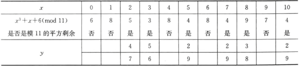

# 第四章 公钥密码

## 4.1 公钥密码的基本概念

传统的对称密码体制（如：DES,AES）允许两个用户利用提前共享的秘密来建立“安全信道”。通信双方共享秘密并不容易。

传统的对称密码体制的缺点：①密钥管理：N个用户两两之间都要进行安全通信。则每个用户需要与剩余的N-1个用户共享私钥，整个系统要管理N(N-1)/2个密钥②密钥分发：在安全通信前共享秘密是困难的③不支持开放系统：没有预先建立关系的用户需要建立安全通信。

Diffie和Hellman因为提出公钥密码概念获得2015年ACM图灵奖。

公钥密码体制数学基础：一些问题呈现出非对称性（从一个方向计算非常容易，从另一方向计算则很困难）。

每个用户生成一个密钥对：一个公钥pk，一个私钥sk。公钥在系统内公开，私钥由用户本人安全保管。

公钥密码体制也成为非对称密码体制。

传输机制：

公钥密码体制的优势：①密钥分发：公钥能够采用公开（认证的）信道进行传输②密钥管理：在N用户的系统中，每个用户只需安全保管自己的私钥和N-1个其他用户的公钥。整个系统仅仅需要维护N个公钥。③开放系统：没有预先建立关系的用户也能通过对方的公钥建立安全通信。

公钥密码体制的应用：HTTPS、PGP……

## 4.2 完全剩余系

集合根据等价关系可分为两两互不相交的集合。

整数的同余关系是一个**等价关系**。

给定正整数m，全体整数可按照模m是否同余分为若干**两两不相交的集合**，使得每一个集合中的任意两个正整数对模m一定同余，而属于不同集合的任意两个整数对模m不同余，每一个这样的集合称为模m的**同余类或剩余类**。

定理①：对于给定的正整数m，有且恰有m个不同的模m的剩余类。

证明：根据带余除法，对于任意整数$a$，都有$a=qm+r,0\lt r\lt m$。也就是说任何一个整数模m必然与$\{0,1,2,\cdots,m-1\}$中的一个同余，而且这m个整数模m互不同余。所以模m的剩余类有且只有m个。

模m的m个剩余类可以记为$[i]$，i为剩余类中整数除m所得的**余数**，可如下表示
$$
[0]&=&\{\cdots,-2m,-m,0,m,2m,\cdots\}\\
[1]&=&\{\cdots,-2m+1,-m,1,m+1,2m+1,\cdots\}\\
[2]&=&\{\cdots,-2m+2,-m,2,m+2,2m+2,\cdots\}\\
\cdots&&\cdots\\
[m-1]&=&\{\cdots,-m-1,-1,m-1,2m-1,3m-1\cdots\}\\
$$

在整数模m的所有剩余类中各取一个代表元$a_1,a_2,\cdots,a_m(a_i\in [i-1],i=1,2,\cdots,m)$，则称$a_1,a_2,\cdots,a_m$为模m的**完全剩余系**。完全剩余系$0,1,2,\cdots,m-1$称为**最小非负完全剩余系**。

例子：取m=7，则m的剩余类为
$$
[0]&=&\{\cdots,-14,-7,0,7,14,\cdots\}\\
[1]&=&\{\cdots,-13,-6,1,8,15,\cdots\}\\
[2]&=&\{\cdots,-12,-5,2,9,16,\cdots\}\\
[3]&=&\{\cdots,-11,-4,3,10,17,\cdots\}\\
[4]&=&\{\cdots,-10,-3,4,11,18,\cdots\}\\
[5]&=&\{\cdots,-9,-2,5,12,19,\cdots\}\\
[6]&=&\{\cdots,-8,-1,6,13,20,\cdots\}\\
$$

$7,15,16,-4,-10,5,-1$为模7的一组完全剩余系，$0,1,2,3,4,5,6$为模7的最小非负完全剩余系。

$Z_m$表示由m的最小非负完全剩余系集合，$Z_m=\{0,1,2,\cdots,m-1\}$。定义$Z_m$中的加法、减法、乘法运算为模m下的运算。

定理②：设m为正整数，整数a满足$gcd(a,m)=1$，b为任意整数。若x遍历模m的一个完全剩余系，则ax+b也遍历模m的一个完全剩余系。

证明：即证明$a_1,a_2,\cdots,a_m$模m两两不同余$\Rightarrow aa_1+b,aa_2+b,\cdots,aa_m+b$模m两两不同余，使用反证法。
$$
若&\exist a_i,a_j,i\not=j,aa_i+b\equiv aa_j+b(mod\ m)\\
\Rightarrow&m\mid a(a_i-a_j)\\
\because&gcd(a,m)=1\\
\therefore&m\mid a(a_i-a_j)\iff a_i\equiv a_j(mod\ m)\\
与已知&矛盾。\\
\therefore&aa_1+b,aa_2+b,\cdots,aa_m+b模m两两不同余
$$

例子：m=12时。$\{0,1,2,3,4,5,6,7,8,9,10,11\}$构成模12完全剩余系$gcd(5,12)=1$，则令$a=5,b=0$可得出一个顺序不一样的摸12完全剩余系$\{0,5,10,3,8,1,6,11,4,9,2,7\}$。

定理③：设$m_1,m_2$是两个互素的正整数。如果x遍历$m_1$的一个完全剩余系，y遍历模$m_2$的一个完全剩余系，则$m_1y+m_2x$遍历模$m_1m_2$的一个完全剩余系。

证明：即证明所有的$m_1y+m_2x$模$m_1m_2$两两互不同余。
$$
若&x_1,x_2\in 模m_1的一个完全剩余系，y_1,y_2\in 模m_2的一个完全剩余系\\
满足&m_1y_1+m_2x_1\equiv m_1y_2+m_2x_2(mod\ m_1m_2)\\
\therefore&m_1y_1+m_2x_1\equiv m_1y_2+m_2x_2(mod\ m_1)（同余的性质⑦）\\
即&m_2x_1\equiv m_2x_2(mod m_1)\\
\therefore&m_1\mid m_2(x_1-x_2)\\
又&m_1,m_2互素\\
\therefore&m_1\mid(x_1-x_2)\\
即&x_1,x_2模m_1同余\\
同理&y_1,y_2模m_2同余，矛盾。
$$
例子：m=3时。$\{0,1,2\}$构成模3完全剩余系，当n=2时，$\{0,1\}$构成模2完全剩余系，则
$$
0\times2+0\times3=0\\
0\times2+1\times3=3\\
1\times2+0\times3=2\\
1\times2+1\times3=5\\
2\times2+0\times3=4\\
2\times2+1\times3=7=1\\
$$
$\{0,1,2,3,4,5\}$构成模6完全剩余系。

## 4.3 简化剩余系

在模m的一个剩余类当中，如果有一个数和m互素，则该剩余类中所有的数均与m互素，这时称该**剩余类和m互素**。

**欧拉函数$\varphi(m)$**：$\varphi(m)$等于$Z_m$中与m互素的数的个数。对于任意一个素数p，$\varphi(p)=p-1$。

在和m互素的$\varphi(m)$个模m的剩余类中各取一个代表元$a_1,a_2,\cdots,a_{\varphi(m)}$，他们组成的集合就成为模m的一个**既约剩余系或简化剩余系**。

$Z_m$中与m互素的数构成模m的一个既约剩余系，就称为**最小非负简化剩余系**。

例子：设m=12，则$1,5,7,11$构成模12的简化剩余系。

定理①：设m为正整数，整数a满足$gcd(a,m)=1$。若x遍历模m的一个既约剩余系，则ax也遍历模m的一个既约剩余系。

证明：
$$
\because&gcd(a,m)=1,gcd(x,m)=1\\
\therefore&gcd(ax,m)=1\\
又若&ax_i\equiv ax_j(mod\ m)\\
则&acd(a,m)=1\Rightarrow x_i\equiv x_j(mod\ m)\\
\therefore&x遍历模m的一个既约剩余系，则ax也遍历\varphi(m)个数\\
又&这些数都属于某个模m既约剩余类的剩余，而且两两互不同余\\
\therefore&ax也遍历模m的一个既约剩余系
$$
例子：设m=12，则$\{1,5,7,11\}$构成模12简化剩余系，$gcd(5,12)=1$，所以$5\times\{1,5,7,11\}=\{5,1,11,7\}$也是模12的简化剩余系。

定理②：设$m_1,m_2$是两个互素的正整数。如果x遍历$m_1$的一个既约剩余系，y遍历模$m_2$的一个既约剩余系，则$m_1y+m_2x$遍历模$m_1m_2$的一个既约剩余系。
证明：即证明$m_1y+m_2x$与$m_1m_2$互素，且任何一个既约剩余都可以表示为$m_1y+m_2x$的形式，其中x与$m_1$互素，y与$m_2$互素。
$$
由完全剩余系性质②得m_1y+m_2x模m_1m_2两两互不同余\\
先证：gcd(x,m_1)=1,gcd(y,m_2)=1\Rightarrow m_1y+m_2x与m_1m_2互素\\
\begin{gather}
若&m_1y+m_2x与m_1m_2不互素\\
则&\exist素数p,p\mid m_1y+m_2x,p\mid m_1m_2\\
\because&gcd(m_1,m_2)=1\\
\therefore&p\mid m_1或\mid m_2\\
不妨设&p\mid m_1\\
则&m_1，m_2互素\Rightarrow p\nmid m_2\\
又&gcd(x,m_1)=1\\
\therefore&p与x互素\\
又&p\mid m_1y+m_2x\Rightarrow p\mid m_2x\Rightarrow p\mid x(矛盾)\\
\therefore&m_1x+m_2x与m_1m_2互素
\end{gather}\\
再证:m_1m_2的任何一个既约剩余都可以表示为m_1y+m_2x，\\
其中gcd(x,m_1)=1,gcd(y,m_2)=1\\
\begin{gathered}
设&整数a满足gcd(a,m_1,m_2)=1\\
完全剩余系性质②&\exist x,y,a\equiv m_1y+m_2x(mod\ m_1m_2)\\
\therefore&gcd(m_1y+m_2x,m_1m_2)=1\\
最大公因数的性质&gcd(x,m_1)=gcd(m_2x,m_1)=gcd(m_1y+m_2x,m_1m_2)=1\\
同理&gcd(y,m_2)=1\\
\end{gathered}\\
定理得证。
$$
例子：m=3时，$\{1,2\}$构成模3简化剩余系；m=5时，$\{1,2，3，4\}$构成模3简化剩余系，则
$$
5\times1+3\times1=8\\
5\times1+3\times2=11\\
5\times1+3\times3=14\\
5\times1+3\times4=2\\
5\times2+3\times1=13\\
5\times2+3\times2=1\\
5\times2+3\times3=4\\
5\times2+3\times4=7\\
$$
$\{1,2,4,7,8,11,13,14\}$构成模15简化剩余系。

## 4.4 欧拉定理

推论①：设m、n是两个互素的整数，则$\varphi(mn)=\varphi(m)\varphi(n)$。

定理①：若$m=p_1^{e_1}p_2^{e_2}\cdots p_k^{e_k}$，则$\varphi(m)=m\prod\limits_{i=1}^k(1-\frac{1}{p_i})$（其中$p^i$都为素数）

证明：当$m=p_1^{e_1}$为单个素数的方幂时，在模m的完全剩余系${0,1,2,\cdots,p^e-1}$的$p^e$整数中与p不互素的只有p的倍数，共有$p^{e-1}$个，因此与$p^e$互素的数共有$p^e-p^{e-1}$个，即$\varphi(p^e)=p^e-p^{e-1}=p^e(1-\frac{1}{p})$，再由既约剩余系的推论①有$\varphi(m)=\varphi(p_1^{e_1})\varphi(p_2^{e_2})\cdots\varphi(p_k^{e_k})=\prod\limits_{i=1}^kp_i^{e_i}(1-\frac{1}{p})=m\prod\limits_{i=1}^k(1-\frac{1}{p})$。

例题：求$\varphi(11),\varphi(121),\varphi(143),\varphi(120)$

解：$\varphi(11)=11-1=10\\\varphi(121)=\varphi(11^2)=11^2-11=110\\\varphi(143)=\varphi(11)\varphi(13)=(11-1)\times(13-1)=120\\\varphi(120)=\varphi(2^3\times3\times5)=120\cdot(1-\frac{1}{2})\cdot(1-\frac{1}{3})\cdot(1-\frac{1}{5})=32$

**欧拉定理**（信息安全数学基础3.3推论③提供用群的证明）：设m是正整数，$r\in Z_m$，若$gcd(r,m)=1$，则$r^{\varphi(m)}\equiv1(mod\ m)$。

证明：取模m的一组既约剩余系$r_1,r_2,\cdots,r_{\varphi(m)}$，
$$
由既约剩余系性质①&rr_1,rr_2,\cdots,rr_{\varphi(m)}也是模m的一组既约剩余系\\
\therefore&\forall1\le i\le\varphi(m),gcd(r,m)=1\\
\because&\prod_{i=1}^{\varphi(m)}r_i\equiv\prod_{i=1}^{\varphi(m)}rr_i\equiv r^{\varphi(m)}\prod_{i=1}^{\varphi(m)}r_i(mod\ m)\\
即&gcd(\prod_{i=1}^{\varphi(m)}r_i,m)=1\\
\therefore&r^{\varphi(m)}\equiv1(mod\ m)
$$

习题：$3^{801}=3^{4\times200+1}$所以最后2位是03；$\varphi(420)=\varphi(2^2\times5\times3\times7)=120\times(1-\frac{1}{2})\times(1-\frac{1}{3})\times(1-\frac{1}{5})\times(1-\frac{1}{7})=96$

## 4.5 RSA加密算法

### 4.5.1 RSA公钥密码体制历史

麻省理工学院Ron Rivest、Adi Shamir和Leonard Adlema在1978年一起提出RSA加密算法，并得到广泛关注。

为表彰Ron Rivest、Adi Shamir和Leonard Adlema发明RSA公钥算法，2002年美国计算机协会（ACM）为三位学者颁发图灵奖（Turing Award）

RSA被部署到HTTP等不同的场景，目前为止商业化和工业化最成功的公钥加密算法

### 4.5.2 RSA公钥加密体制原理

密钥生成：①选择两个大素数$p,q$②计算$n=pq,z=\varphi(n)=(p-1)(q-1)$③随机选取e（其中$e\lt n$），e与z没有公因数（$gcd(e,z)=1$，互质）。④选取d使得ed-1能够被z完全整除（即$ed\ mod\ z=1$）⑤公钥为$ \underbrace{(n,e)}_{K^+_N}$，私钥为$\underbrace{(n,d)}_{K^-_N}$。

加密：由$c=m^e\ mod\ n$把明文m转变为密文c（即当$m^e$除以n所得的余数）注意：$m\lt n$（若需要就分块）

解密：$m=c^d\ mod\ n$（即：$c^d$除以n所得的余数）

核心思想：$m=(\underbrace{m^e\ mod\ n}_c)^d\ mod\ n$

原理：由欧拉定理，当$gcd(a,N)=1$时，$a^{\varphi(N)}mod\ N=1$。

在RSA中：$N=pq,\varphi(N)=(p-1)(q-1)$，d和e是关于模$\varphi(N)$的逆元，所以$ed=1+k\cdot\varphi(N)(k\gt0,k\in Z)$

所以：$c^{ed}=(M^e)^d=M^{1+k\cdot\varphi(N)}=M^1\cdot(M^{\varphi(N)})^k=M^1\cdot(1)^k=M^1=M\ mod\ N$

例子：$p=5,q=7$则$n=35,z=24$，选$e=5$，则d=29。

则公钥：35,5，私钥：35,29，则加密过程：$m=c^5mod\ 35$，解密过程：$c=m^{29}mod\ 35$。

## 4.6 群的概念

设G是一个具有**代数运算**$\circ$的**非空集合**，并且满足：
①**结合律**：$\forall a,b,c\in G,有(a\circ b)\circ c=a\circ (b\circ c)$
②**有单位元**：$\exist e\in G,\forall a \in G,e\circ a=a\circ e=a$
③**有逆元**：$\forall a\in G,\exist a^{-1}\in G,a\circ a^{-1}=a^{-1}\circ a=e$
则称非空集合G关于代数运算$\circ$构成一个群。

如①全体整数Z对于加法构成一个群，称为**整数加群$(z,+)$**，单位元为0，a的逆元为-a，同理全体有理数集合Q，全体实数集合R，全体复数集合C也对加法构成群，分别记为$(Q,+),(R,+),(C,+)$。
②非零实数$R^*$对于通常的乘法构成一个群，全体正实数$R^+$对于通常的乘法也构成一个群
③模正整数n的最小非负完全剩余系$Z_n$对于模n的加法构成一个群，称为**整数模n加群**，其单位元为0，a的逆元为n-a。
④元素在数域P的全体n级可逆矩阵对于矩阵的乘法构成一个群，这个群记为$GL_n(P)$，称为**n级一般线性群**。

如果群G上的乘法运算还满足交换律，即对于群G中的任意元素$a,b\in G$都有$ab=ba$则称群G为**交换群或阿贝尔群**

群G中只含有有限个元素，则称G为**有限群**。

群G中含有无限多个元素，则称G为**无限群**。

群G中的元素个数称为**群的阶**，记为|G|，如对整数模n加群$Z_n$，有$|Z_n|=n$。

**有限群的判定定理**：有乘法的**有限**集合G，若其乘法在G中**封闭**，且满足**结合律**和**消去律**，则G是群。
证明：设集合G中元素个数为n，则设$G=\{a_1,a_2,\cdots,a_n\}$。
全部左乘$a,a\in G$，得到$G^{'}=\{aa_1,aa_2,\cdots,aa_n\}\subseteq G$（封闭性）。
$i\neq j$时，$aa_i\neq aa_j$，否则由于消去律可得$a_i=a_j$，矛盾。
所以$G^{'}$的元素个数与G相同，也为n，所以$G^{'}=G$。
所以$\forall b\in G,\exist a_k\in G^{'}=G,b=aa_k$。即$ax=b$在G中有解，同理，右乘一个$a\in G$可证$ya=b$在G中也有解。
根据群的判定定理①，G是群，得证。

例子：证明模m的最小非负简化剩余系$Z_m^*$，关于模m的乘法构成一个群。

解：$Z_M^*$的元素个数为$\varphi(m)$个，显然其对于模m的乘法封闭（因为$gcd(a,m)=1,gcd(b,m)=1\Rightarrow gcd(ab,m)=1$），且满足结合律。由2.2乘法逆元的定义，$Z_m^*$中的所有元素都存在模m的乘法逆元。对于任意$a,b,c\in Z_m^*$，若
$ab\equiv ac(mod\ m)$
则有
$a^{-1}ab\equiv a^{-1}ac(mod\ m)$
即$b\equiv c(mod\ m)$。因此，模m的乘法在$Z_M^*$上满足消去律。根据有限群的判定定理，$Z_m^*$是群。

## 4.7 循环群

**元素的方幂（乘法）**：对乘法构成群的时候，规定$a^n=\overbrace{aa\cdots a}^{n个}\\a^0=e\\a^{-n}=(a^{-1})^n$所以$a^ma^n=a^{m+n}\\(a^m)^n=a^{mn}$。

**元素的方幂（加法）**：对乘法构成群的时候，规定$n\times a=\overbrace{a+a+\cdots+a}^{n个}\\0\times a=e\\-n\times a=n\times a^{-1}$所以$n\times a+m\times a=(m+n)\times a\\n\times m\times a=(mn)\times a$。

设G是一个群，若存在一个元素a，使得G=$\langle a\rangle$，则称G为**循环群**。元素a为G的**生成元**（并不唯一）。若$o(a)=\infin$，则G称为**无限循环群**，若$o(a)=n（n是某个正整数）$，则G称为**有限循环群**。

如：整数加法群Z为循环群，其生成元为1或-1。模整数m剩余类加群$Z_m$是循环群，其生成元为$[1]$。模整数m的简化剩余类乘群$Z^*_m$是循环群。

群中的离散对数问题：设$G=\langle a\rangle$是循环群。群G中的离散对数指给定G中一个元素h，找到正整数k使得$h=a^k$则k称为h相对于生成元的离散对数，记作$k=\log_{a}h$。

离散对数的例子：
①对整数加法群(Z,+)，两个生成元$\langle1\rangle,\langle-1\rangle$，$\log_1h=h,\log_{-1}h=-h$。
②对模m剩余类组成的加法群$Z_m$，a为$Z_m$的一个生成元，因为$ax\equiv h(mod\ m)$所以$log_ah=x\equiv ha^{-1}(mod\ m)$。（$a^{-1}$可以用欧几里得算法求出。）

例子：$Z^*_m$是模m简化剩余系组成的乘法群，g为$Z^*_m$的一个生成元，离散对数问题为：给定$h\in Z^*_m$，求解x使得$g^x\equiv h(mod\ m)$，这个问题是困难的。

如m=7时，${1,2,3,4,5,6}$关于模7乘法构成循环群，3为该群的生成元，生成的顺序为$\{1,3,2,6,4,5\}$当数字足够大时，该顺序更加混乱。

## 4.8 EI-Gamal加密

### 4.8.1 EI-Gamal公钥密码体制历史

1985年EI-Gmal提出

### 4.8.2 EI-Gamal公钥密码体制原理

密钥生成：p是一个较大素数，g是$Z_P^*$的生成元，$\alpha\in Z_{p-1},\beta=g^amod\ p$，则$p,g,\beta$为公钥，$\alpha$为私钥。

加密：随机生成一个秘密数$k,k\in Z_{p-1}$，$E(x,k)=(r=g^kmod\ p,s=x\beta^kmod\ p)$。

解密：$D(r,s)=s(r^{\alpha})^{-1}mod\ p=xg^{\alpha k}g^{-\alpha k}mod\ p=x$。

### 4.8.3 EI-Gamal和RSA的区别

①基于的数学困难问题不同：RSA中基于大整数难分解EI-Gamal基于循环群中离散对数问题

②公开参数设置不同：RSA中要寻找2个不同的大素数p、q并计算n、z，EI-Gamal只要寻找一个大素数p和$z^*_p$的生成元即可。

### 求解离散对数问题的研究进展

Shanks算法：时间复杂度为$O(m)$，其中m为$\sqrt{n}$的上取整；

Pollard ρ算法：时间复杂度为$O(n)$，其中n为生成元元素的阶；

Pohling-Hellman算法：时间复杂度为$O(c\sqrt{p})$，其中c，q为算法选定的；

指数演算：时间复杂度为$O(e^{1/2 + o(1)\sqrt{\ln p\ln(\ln p)}})$，其中p为选定的大素数。

## 4.9 实数域上的椭圆曲线

椭圆曲线是双线性配对的理论基础。

椭圆曲线并非椭圆，之所以称为椭圆曲线是因为它的曲线方程与计算椭圆周长的方程相似。

一般的，椭圆曲线指的是由维尔斯特拉斯（Weierstrass）方程$y^2+axy+by=x^3+cx^2+dx+e$所确定的曲线。是有方程的全体解$(x,y)$加上一个无穷远点O构成的集合，其中$a,b,c,d,e$是满足一些简单条件的实数，x和y也在实数集上取值。

上述曲线方程可以通过坐标变换转化为$y^2=x^3+ax+b$的形式。由它确定的椭圆曲线常记为$E(a,b)$，简记为E。

**非奇异椭圆曲线和阿贝尔群**：当$4a^3+27b^2\neq0$时，称$E(a,b)$为一条**非奇异椭圆曲线**。对于非奇异椭圆曲线，可以基于集合$E(a,b)$定义一个群，称为**Abe群**。

阿贝尔群具有重要的“加法规则”属性。

**加法规则的几何描述**：椭圆曲线上的加法运算定义如下∶如果椭圆曲线上的3 个点位于同一直线上，那么它们的和为$O$。从这个定义出发，可以定义椭圆曲线的加法规则：

①：$O$为加法的零元，对于椭圆曲线上的任何一点$P$有$P+O=P$。

②：对于椭圆曲线上的一点$P=(x,y)$，它的逆元为$-P=(x,-y)$。注意到$P+(-P)=P-P=O$。

③：设P和Q是椭圆曲线上$x$坐标不同的两点，$P+Q$的定义为：做一条通过$P$和Q的直线$l$与椭圆曲线相交于$R$点（这一点是唯一的，除非这条直线在P点和Q点于该椭圆曲线相切，这时分别取$R=Q$和$R=P$），然后过$R$点作$y$轴的平行线$l^{'}$，$l^{'}$与椭圆曲线相交的另一点$S$就是$P+Q$，如下图所示：

④：上述几何解释也适用于具有相同.坐标的两个点$P$和$-P$的情形。用一条垂直的线连接这两个点，可看做是在无穷远点与椭圆曲线相交，因此有$P+(-P)=O$。这与上述第②条叙述是一致的。

⑤：为计算点$Q$的两倍，在$Q$点作一条切线并找到与椭圆曲线的另一个交点$T$，则$Q＋Q=2Q=-T$。

以上定义的加法满足加法运算的一般性质，如交换律、结合律等。

**加法的代数描述**：对于椭圆曲线上不互为逆元的两点$P(x_1,y_1),Q(x_2,y_2)$，则$S(X_3,Y_3)=P+Q$符合：
$$
x_3=\lambda^2-x_1-x_2\\y_3=\lambda(x_1-x_3)-y_1\\
\lambda=\begin{cases}
\frac{y_2-y_1}{x_2-x_1}\quad P\neq Q\\
\frac{3x^2_1+a}{2y_1}（a就是椭圆曲线公式里的a）\quad p=Q
\end{cases}
$$
## 4.10 有限域上的椭圆曲线

椭圆曲线密码体制使用的是有限域上的椭圆曲线，即变量和系数都为有限域中的元素。

有限域$GF(p)$上的椭圆曲线是指满足方程$y^3\equiv x^3=ax+b(mod\ p)$的所有点$(x,y)$再加上无穷远点O构成的集合。其中，$a,b,x,y$均在有限域$GF(p)$上取值，p是素数。

这里把该椭圆曲线记为$E_p(a,b)$。该椭圆曲线也只有有限个点，其个数N由Hasse定理确定。

**Hasse定理**：设E是有限域$GF(p)$上的椭圆曲线，$N$是$E$上点的个数，则$p+1-2\sqrt{p}\le N\le p+1+2\sqrt{p}$。当$4a^3+27b^2(mod\ p)\neq0$时，基于集合$E_p(a,b)$可以定义一个阿贝尔（Abel）群，其加法规则和实数域上描述的代数方法一致。设$P,Q\in E_p(a,b)$，则：

①：$O$为加法的单位元，对于椭圆曲线上的任何一点$P$，有$P+O=P$。

②：对于$P(x,y)$，它的逆元$-P$为$(x,-y)$，$P+(-P)=O$。

③：$P(x_1,y_1),Q(x_2,y_2)$，则$S(X_3,Y_3)=P+Q$符合：
$$
x_3=\lambda^2-x_1-x_2(mod\ p)\\y_3=\lambda(x_1-x_3)-y_1(mod\ p)\\
\lambda=\begin{cases}
\frac{y_2-y_1}{x_2-x_1}(mod\ p)\quad P\neq Q\\
\frac{3x^2_1+a}{2y_1}(mod\ p)（a就是椭圆曲线公式里的a）\quad p=Q
\end{cases}
$$
④：倍点运算定义为重复加法，如$4P=P+P+P+P$。

例子：p=11,a=1,b=6，即椭圆曲线方程为$y^2\equiv x^3+x+6(mod\ 11)$，要确定椭圆曲线上的点，对于每个$x\in GF(11)$，首先计算$z\equiv x^3+x+6(mod\ 11)$，然后再判定z是否是模11的平方剩余（方程$y^2\equiv z\ mod\ 11$是否有解），若不是，这椭圆曲线上没有与这一x相对应的点；若是，这求而出z的两个平方根。该椭圆曲线上的点如下表所示。

只有$x=2,3,5,7,8,10$时才有点在椭圆曲线上，所以$E_{11}(1,6)=\{O,(2,4),(2,7),(3,5),(3,6),(5,2),(5,9),(7,2),(7,9),(8,3),(8,8),(10,2),(10,9)\}$
设$P=(2,7)$，则计算2P先计算$\lambda\equiv\frac{3\times2^2+1}{2\times7}(mod\ 11)=\frac{2}{3}(mod\ 11)\equiv 8$
所以$\begin{cases}x_3\equiv8^2-2-2(mod\ 11)\equiv5\\y_3\equiv8\times(2-5)-7(mod\ 11)\equiv2\end{cases}$，所以$2P=(5,2)$。

同理：
$$
6P=(7,9)&7P=(7,2)&8P=(3,5)&9P=(10,9)\\
10P=(8,8)&11P=(5,9)&12P=(2,4)&13P=O
$$
，所以$E_{11}(1,6)$是一个循环群，其生成元为$P=(2,7)$。

## 4.11 椭圆曲线密码学

为了使用椭圆曲线来构造密码体制，需要找到类似大整数因子分解和离散对数这样的困难问题。

**椭圆曲线$E_p(a,b)$上点P的阶**：指满足$nP=\underbrace{P+P+\cdots+P}_{n个}=O$的最小正整数，记为$ord(P)$，其中O是无穷远点。

**椭圆曲线上的离散对数问题（Elliptic Curve Discrete Logarithm Problem，ECDLP）**：设G是椭圆曲线$E_p(a,b)$上的一个循环子群，P是G的一个生成元，$Q\in G$，已知P和Q，求满足$mP=Q$的整数$m,0\le m\le ord(P)-1$，称为**椭圆曲线上的离散对数问题**。计算$mP$的过程称为**点乘运算（Point multi-plication）**。

使用椭圆曲线密码体制是，首先要把要发送的明文m编码为椭圆曲线上的点$P_m=(x_m,y_m)$，然后再对点$P_m$做加密变换，在解密后还得把$P_m$逆向译码才能获得明文。

**椭圆曲线上的EI-Gamal密码体制**：

①密钥生成：在椭圆曲线$E_p(a,b)$上选区一个阶为n（n为一个大素数）的生成元P。随机选取整数$x(1\le x\le n)$，计算$Q=xP$。公钥为$P,Q$，私钥为x。

②加密：为了加密$P_m$，随机选取一个整数$k,1\lt k\le n$，计算$C_1=kP,C_2=P_m+kQ$，则密文$c=(C_1,C_2)$。

③解密：为了解密一个密文$c=(C_1,C_2)$，计算$C_2-xC_1=P_m+kQ-xkP=P_m+kxP-xkP=P_m$。

攻击者要想从$c=(C_1,C_2)$计算出$P_m$就必须知道k，而要从P和kP中计算出k就要求解椭圆曲线上的离散对数问题。

## 4.12 SM2公钥加密算法

### 4.12.1 SM2公钥密码算法简介

SM2是中国国家密码管理局颁布的中国商用公钥密码标准算法，它是一组椭圆曲线密码算法，其中包含加解密算法、数字签名算法。

2004年，由中国科学院软件研究所张振峰研究员主持研制完成
2010年12月，首次公开发布
2012年3月，成为中国商用密码标准（GM/T 0003-2012）
2016年8月，成为中国国家密码标准（GB/T 32918-2016）
2017年11月3日，在第55次ISO/IEC联合技术委员会信息安全技术分委员会（SC27）德国柏林会议上，含有我国SM2与SM9数字签名算法的IS0/IEC14888-3/AMD1《带附录的数字签名第3部分：基于离散对数的机制-补篇1》获得一致通过，成为ISO/IEC国际标准，进入标准发布阶段。

### 4.12.2 SM2公钥加密算法原理

略

### 4.12.3 SM2与ECC的区别

SM2算法与国际标准的ECC算法比较∶

（1）ECC算法通常采用NIST等国际机构建议的曲线及参数，而SM2算法的参数需要利用一定的算法产生。而由于算法中加入了用户特异性的曲线参数、基点、用户的公钥点信息，故使得SM2算法的安全性明显提高。

（2）在ECC算法中，用户可以选择MD5、SHA-1等国际通用的哈希算法。而SM2算法中则使用SM3哈希算法，SM3算法输出为256 比特，其安全性与SHA-256算法基本相当。

传统ECC：  计算点$X_2(x_2,y_2)=kP_B$； 计算密文$C=Mx_2mod\ n$； 最终密文是$\langle X_1,C\rangle$。
①利用分量$x_2$作为密钥进行加密∶$C=Mx_2mod\ n$，分量$y_2$没有利用
②加密运算是乘法，比较复杂
③$\langle X_1,C\rangle$为密文。

SM2：  计算点$kP_B=(x_2,y_2)$； 计算$t=KDF(x_2||y_2,klen)$； 计算$C_2=M\oplus t$； 最终密文是$\langle C_1,C_2,C_3\rangle$。
①利用分量$x_2$和$y_2$经过密钥派生函数产生中间密钥t，再用t进行加密$C_2=M\oplus t$，加密运算是模2加，效率较高
②密钥派生函数提高了安全性，但增加了时间消耗
③$\langle C_1,C_2,C_3\rangle$为密文，密文扩张较前者严重
④SM2中采取了很多检错措施，提高了密码系统的数据完整性和系统可靠性，进而提高了密码系统的安全性。