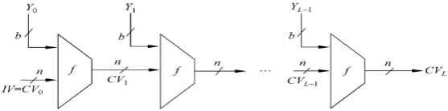
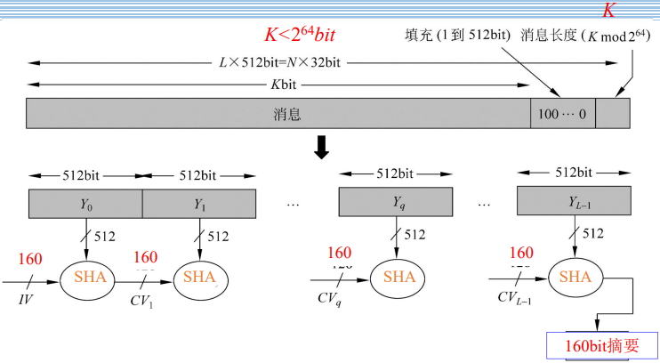
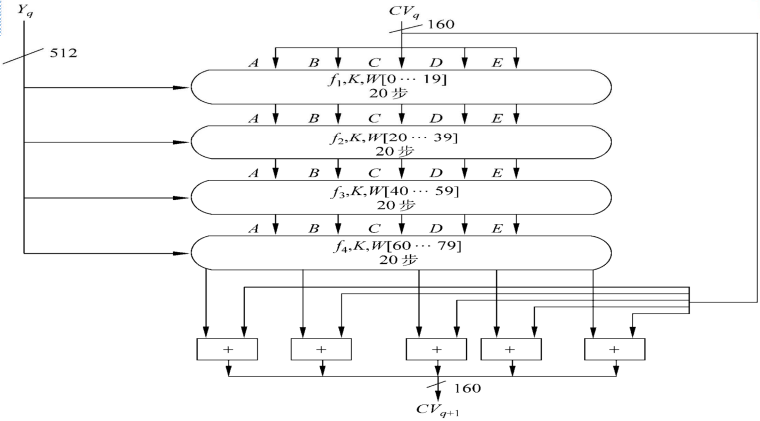
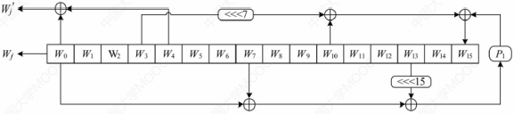
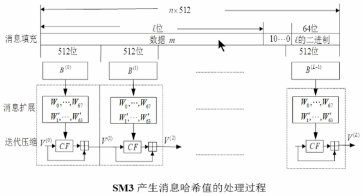

# 第五章 Hash函数

## 5.1 Hash概念和基本要求

### 5.1.1 Hash函数的定义

**Hash函数/哈希函数/散列函数/压缩函数/杂凑函数/指纹函数……**：把任意长的信息M映射为较短的、固定长度的一个值$H(M)$。

Hash函数的函数值$H(M)$常称为**哈希值/散列值/杂凑码/指纹/信息摘要……**

Hash函数一般是公开的。

例子①（简单的Hash函数）：M是一个长消息，设$M=(M_1,M_2,\cdots,M_k)$，其中$M_i$为l长的比特串，定义函数$H(M)=M_1\oplus M_2\oplus\cdots\oplus M_k$，这就是一个哈希函数。

### 5.1.2 Hash函数满足条件及安全性定义

Hash函数的目的：为需认证的数据产生一个“指纹”。

Hash函数应该满足以下条件：
①Hash函数的输入可以是任意长
②Hash函数的输出是固定长
③易于在软件和硬件实现。

Hash函数为了实现安全认证，需要满足以下安全条件：
①单向性：已知x，求H(x)较为容易；但是，已知h，求使得$H(x)=h$的x在计算上是不可行的。
②抗弱碰撞性：已知x，找出$y(y\neq x)$使得$H(y)=H(x)$在计算上是不可行的。
③抗强碰撞性：找出任意两个不同的输入$x,y$，使得$H(x)=H(y)$在计算上是不可行的。

例子①符合单向性，不符合抗强碰撞性和抗弱碰撞性。

三个安全性的关系：$抗强碰撞性\Rightarrow抗弱碰撞性\Rightarrow单向性$。

### 5.1.3 Hash函数迭代构造

迭代型Hash函数的一般结构：

其中$\begin{cases}M=(CV_0,CV_1,\cdots,CV_L)（最后一组不正好n位的要补齐）\\CV_0=IV=n比特长的初始值\\CV_i=f(CV_{i-1},Y_{i-1})(1\le i\le L)\\H(M)=CV_L\end{cases}$。

## 5.2 生日攻击

### 5.2.1 生日攻击相关问题

**第一类生日攻击问题**：已知一个Hash函数H有n个可能的输出，H(x)是一个特定的输出，如果对H随机取k个输入，则至少有一个输入y使得$H(y)=H(x)$的概率为0.5时，k有多大？

**第一类生日攻击**：对Hash函数寻找上述y的攻击称为**第一类生日攻击**。

**第一类生日攻击问题的解**：因为H有n个可能的输出，所以输入y产生的输出H(y)等于特定输出H(x)的概率是$\frac{1}{n}$，反过来说$H(y)\neq H(x)$的概率是$1-\frac{1}{n}$。

y取k个随机值而函数的k个输出中没有一个等于H(x)，其概率等于每个输出都不等于H(x)的概率之积，为$1-\frac{1}{n}$，所以y取k个随机值得到函数的k个输出中至少有一个等于H(x)的概率为$1-(1-\frac{1}{n})^k$。

由当$\abs{x}<<1,(1+x)^k\approx1+kx$，可得$1-(1-\frac{1}{n})^k\approx1-(1-\frac{k}{n})=\frac{k}{n}$

若使上述概率等于0.5，则$k=\frac{n}{2}$。特别地，如果H的输出为m比特长，即可能的输出个数$n=2^m$，则$k=2^{m-1}$。

问题2（**生日悖论**）：在k个人中至少有两个人的生日相同的概率大于0.5时，k至少多大？

**生日悖论的解**：设有k个整数项，每一项都在1到n之间等可能地取值。

设$P(n,k)$：k个整数项中至少有两个取值相同的概率。 生日悖论即求使得$P(365,k)\ge0.5$的最小k。

设$Q(365,k)$：k个数据项中任意两个取值都不同的概率。则$P(365,k)=1-Q(365,k)$。

若$k\gt365$，则不可能使得任意两个数据都不相同，故$k\le365$。k个数据项中任意两个都不相同的取值方式有$365\times364\times\cdots\times(365-k+1)=\frac{365!}{(365-k)!}$而去除该条件的取值方式有$365^k$种。

所以$\begin{cases}Q(365,k)-\frac{365!}{(365-k)!365^k}\\P(365,k)=1-Q(365,k)=1-\frac{365!}{(365-k)!365^k}\end{cases}$

所以$k=23$时，$P(365,23)=0.5073$即只要有23个人，则其中有两个人生日相同的概率就超过0.5了。

而$k=100$时，$P(365,100)=0.9999997$概率极大。

由于人数k给定时，得到的至少有两个人的生日相同的概率比想象中大得多，故称之为生日悖论。

**生日悖论推广问题**：已知一个在1到n之间均匀分布的整数型随机变量，若改变量的k个曲子中至少有2个取值相同的概率大于0.5，这k至少多大？

**生日悖论的推广问题的解**：$P(n,k)=1-\frac{n!}{(n-k)!n^k}$，令$P(n,k)\gt0.5$，可得$k=1.18\sqrt{n}\approx\sqrt{n}$，取n=365时，$k=1.18\sqrt{365}=22.54$。

**生日攻击**：设Hash函数有$2^m$个可能的输出（即输出长为m比特），若H的k个随机输入中至少有两个产生相同输出的概率大于0.5，则$k\approx\sqrt{2^m}=2^{\frac{m}{2}}$

**第二类生日攻击**：寻找函数H的具有相同输出的两个任意输入的攻击方式。

这种生日攻击给出了消息摘要长度的下界：一个40比特的消息摘要是非常不安全的，因为在大约$2^{20}$个（大约100万）个随机值中就能以$\frac12$的概率找到一个碰撞。

通常建议消息摘要的最小可接受长度为128比特，在DSS签名标准中使用160比特的消息摘要就是基于这个考虑。

## 5.3 SHA-1算法

安全杂凑算法（Secure ash Algorithm,SHA）由美国NIST设计，于1997年作为联邦信息处理标准公布。SHA是基于MD4的算法，其结构与MD4非常类似。

算法的输入：小于$2^{64}$比特长的任意消息，分为512比特长的分组。

算法的输出：160比特长的信息摘要。

算法的框图：与MD5一样，但杂凑值的长度和链接变量的长度为160比特。

SHA-1的结构：

步骤①：对消息填充：使得比特长在模512下为448，填充后消息的长度为512的某一倍数减64，留出的64比特备步骤②使用。

即使消息长度已满足要求也要填充。如消息长448比特，则需要填充512比特使其变为960比特，$1\le填充的比特数\le512$。

填充的方式：第一位为1，其余为0

步骤②：附加消息的长度：留出的64比特用来表示消息被填充前的长度。如果消息长度大于$2^{64}$比特，则以$2^{64}$为模数取模。使用大端模式（数据的高字节保存在内存的低地址中），MD5使用的是小端模式。

步骤③：对MD缓冲区初始化：使用160比特长的缓冲区存储中间结构和最终杂凑值。缓冲区为5个32比特以大端方式存储数据的寄存器$(A,B,C,D,E)$初始值为$\begin{cases}A=67452301\\B=EFCDAB89\\C=98BADCFB\\D=10325476\\E=C3D2E1F0\end{cases}$

步骤④：以分组为单位对消息进行处理：每一分组$Y_q$都经一压缩函数处理，压缩函数由四轮处理过程构成，每一轮又由20步迭代组成。第四轮的输出（即第80步迭代的输出）再与第一轮的输入$CV_q$相加，以产生$CV_{q+1}$，其中加法是缓冲区5个字中的每一个字和$CV_q$中相应的字模$2^{32}$相加。

SHA的分组处理框图：

步骤⑤：输出消息：输出消息的L个分组都被处理完后，最后一个分组的输出即为160比特的信息摘要。

步骤③-⑤的处理过程：$\begin{cases}CV_0=IV\\CV_{q+1}=SUM_{32}(CV_q,ABCDE_q)\\MD=CV_L\end{cases}$，其中$\begin{cases}IV&：&缓冲区ABCDE的初值\\ABCDE_q&：&第q个消息分组经最后一轮处理过程处理后的输出\\L&：&消息（包括填充位和长度字段）的分组数\\SUM_{32}&：&对应字的模2^{32}加法\\MD&：&最终的摘要值\end{cases}$。

SHA的压缩函数：由4轮处理过程组成，每轮处理过程20步迭代运算组成，每一步迭代运算的形式为$\begin{pmatrix}A\\B\\C\\D\\E\end{pmatrix}\leftarrow\begin{pmatrix}(E+f_t(B,C,D)+CLS_5(A)+W_t+K_t)\\A\\CLS_{30}(B)\\C\\D\end{pmatrix}$，其中$\begin{cases}A,B,C,D,E&：&缓冲区的5个字\\t&：&迭代的步数(0\le t\le 79)\\f_t(B,C,D)&：&第t步迭代使用的基本逻辑函数\\CLS_s&：&循环左移s位\\W_t&：&由当前512比特长的分组导出的一个32比特长的字\\K_t&：&加法常量\\+&：&模2^{32}加法\end{cases}$。

基本逻辑函数$f_t=\begin{cases}(B\land C)\vee(\overline{B}\land D)&(0\le t\le19)\\B\oplus C\oplus D&(20\le t\le39)\\(B\land C)\vee(B\land D)\vee(C\land D)&(40\le t\le59)\\B\oplus C\oplus D&(60\le t\le79)\end{cases}$，其中$\begin{cases}\land&：&与\\\vee&：&或\\\overline{ }&：&非\\\oplus&：&异或\end{cases}$。

字$W_t=CLS_1(W_{t-16}\oplus W_{t-14}\oplus W_{t-8}\oplus W_{t-3})$。

常量值$K_t=\begin{cases}5A827999&(0\le t\le19)\\6ED9EBA1&(20\le t\le39)\\8F1BBCDC&(40\le t\le59)\\CA62C1D6&(60\le t\le79)\end{cases}$。

## 5.4 SM3算法

SM3是中国国家密码管理局颁布的中国商用密码标准算法，它是一类密码杂凑函数，可用于数字签名及验证、消息认证码生成及验证、随机数生成。

标准起草人∶王小云、李峥、于红波、张超、罗鹏、吕述望

2012年3月，成为中国商用密码标准（GM/T0004-2012）

2016年8月，成为中国国家密码标准（GB/T32905-2016）

2018年11月22日，含有我国SM3杂凑密码算法的ISO/IEC10118-3:2018《信息安全技术杂凑函数第3部分∶专用杂凑函数》最新一版（第4版）由国际标准化组织（ISO）发布，SM3算法正式成为国际标准。

输入数据长度为l比特$(l\lt 2^{64})$，输出哈希值长度为256比特。

常数：初始值IV=7380166F4914B2B9172442D7DA8A0600A96F30BC163138AAE38DEE4DB0FB0E4E；
$T_j=\begin{cases}79CC4519&(0\le j\le15)\\7A879D8A&(16\le j\le63)\end{cases}$
函数：（式中$X,Y,Z$为32位字，$\begin{cases}\land&：&与\\\vee&：&或\\\overline{ }&：&非\\\oplus&：&逐比特异或\end{cases}$）
布尔函数：$\begin{cases}FF_j(X,Y,Z)=\begin{cases}X\oplus Y\oplus Z&(0\le j\le15)\\(X\land Y)\vee(X\land Z)\vee(Y\land Z)&(16\le j\le63)\end{cases}\\GG_j(X,Y,Z)=\begin{cases}X\oplus Y\oplus Z&(0\le j\le15)\\(X\land Y)\vee(\overline{X}\land Z)&(16\le j\le63)\end{cases}\end{cases}$
置换函数：$\begin{cases}P_0(X)=X\oplus(X\lll9)\oplus(X\lll17)\\P_1(X)=X\oplus(X\lll15)\oplus(X\lll23)\end{cases}$，集中X为32位字，$a\lll n$表示把a循环左移n位。

步骤①：填充并附加信息的长度：填充第一个1后面是0，直到填充后的数据长度为512的整数倍。然后再添加64位比特串，表示原始信息的比特数l。

步骤②迭代压缩：对经过步骤①的信息按512比特进行分组得到$m^{'}=B^{(0)}B^{(1)}\cdots B^{(L-1)}$压缩方式：
```c
IV=0x7380166F4914B2B9172442D7DA8A0600A96F30BC163138AAE38DEE4DB0FB0E4E;
V[0]=IV;
B[i]=填充后的消息分组
int CF(V,B){
    压缩函数;
}
for(i=0;i<=L-1;i++){
	V[i+1]=CF(V[i],B[i]);
}
Hash(m)=V[L];
```

步骤③：消息扩展：对消息分组进行迭代压缩之前，要先进行消息扩展，步骤如下：①把消息分组$B^{(i)}$划分为16个字$W_0,W_1,\cdots,W_{15}$。②$\begin{cases}W^{'}_j=W_j\oplus W_{j+4}&(0\le j\le63)\\W_j=P_1(W_{j-16}\oplus W_{j-9}\oplus(W_{j-3}\lll15))\oplus(W_{J-13}\lll7)\oplus W_{j-6}&(16\le j\le67)\end{cases}$。
$B^{(i)}$经消息扩展后得到132个字$W_0,W_1,\cdots,W_{67},W^{'}_0,W^{'}_1,\cdots,W^{'}_{63}$

SM3信息扩展过程：

步骤④：压缩函数：有$A,B,C,D,E,F,G,H$八个字寄存器，$SS_1,SS_2,TT_1,TT_2$四个中间变量，压缩函数$V^{(i+1)}=CF(V^{(i)},B^{(i)})(0\le i\le n-1)$的计算过程如下：
$$
\begin{aligned}
&ABCDEFGH=V^{[i]}\\
&FOR\quad j=0\quad to\quad 63\\
&\begin{aligned}
&\qquad\qquad SS_1&\leftarrow&((A\lll12)+E+(T_j\lll j))\lll7\\
&\qquad\qquad SS_2&=&SS1\oplus(A\lll12)\\
&\qquad\qquad TT_1&=&FF_j(A,B,C)+D+SS_2+W^{'}_j\\
&\qquad\qquad TT_2&=&GG_j(E,F,G)+H+SS_1+W_j\\
&\qquad\qquad D&=&C\\
&\qquad\qquad C&=&B\lll9\\
&\qquad\qquad B&=&A\\
&\qquad\qquad A&=&TT_1\\
&\qquad\qquad H&=&G\\
&\qquad\qquad G&=&F\lll19\\
&\qquad\qquad F&=&E\\
&\qquad\qquad E&=&P_0(TT_2)
&\end{aligned}\\
&ENDFOR\\
&V^{[i+1]}=ABCDEFGH\oplus V^{(i)}\\
\end{aligned}
$$

其中+为模$2^{32}$加运算，字的存储为大端模式。

步骤⑤：输出哈希值：$Hash(m)=ABCDEFGH=V^{(L)}$。

SM3产生消息哈希值的过程：

压缩函数是哈希函数安全的关键：
①SM3的压缩函数CF中的布尔函数$FF_j(X,Y,Z)$和$GG_j(X,Y,Z)$是非线性函数，经过循环迭代后提供**混淆**作用。
②置换函数$P_0(x)$和$P_1(x)$是线性函数，经过循环迭代后提供**扩散**作用。
③再加上CF中的其他运算的共同作用，压缩函数CF具有很高的安全性，从而确保SM3具有很高的安全性。
