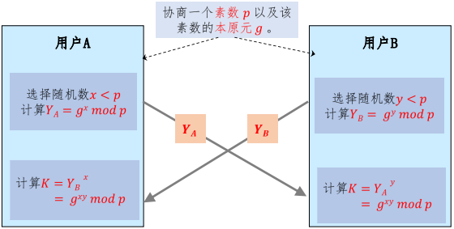
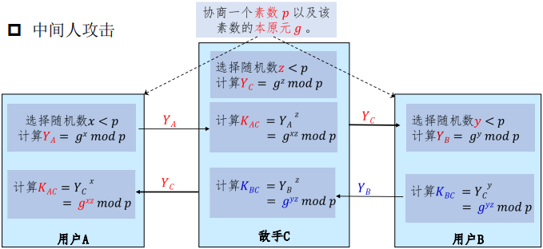
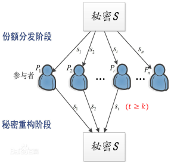

# 第七章 密码协议

## 7.1 Diffie-Hellman密钥交换

密钥交换是实现安全通信的基础（如：商用加密算法AES和DES需要在安全通信之间，实现通信双方的密钥共享）

密钥交换的方法：
①基于RSA的密钥交换：整数颁发机构CA（Certificate Authority）
②基于DES/AES：密钥分发中心KDC（Key Distributed Crnter）
③Diffie-Hellman密钥交换（简称DH算法）：一种端到端的密钥交换协议，允许两个终端生成相同的共享密钥，而不需要第三方协助。
④基于物理层的密钥交换。

常用到DH的情况如：使用IPsec VPN交换数据、使用SSL或TLS在互联网中加密数据、交换SSH数据

### 7.1.1 Diffie-Hellman密钥交换协议

DH算法是不安全信道下实现安全密钥共享的一种方法，由W.Diffie和M.Hellman在1976年提出的第一个公开的密钥密码算法。

DH算法步骤：

DH协议的例子：
①假设素数$p=97$，其本原元$g=5$
②若用户A和B选取的随机数分别为$x=36,y=58$
③用户A计算$Y_A=5^{36}(mod\ 97)=50(mod\ 97)$；用户B计算$Y_B=5^{58}(mod\ 97)=44(mod\ 97)$
④用户A计算密钥$K=44^{36}(mod\ 97)=75(mod\ 97)$；用户B计算$K=50^{58}(mod\ 97)=75(mod\ 97)$

### 7.1.2 Diffie-Hellman密钥交换中的安全问题

安全性分析：
①攻击者可以利用的信息包括$素数p，本原元g，中间Y_A,Y_B$。
②若攻击者想要获取密钥K，必须通过$Y_A=g^x(mod\ p)$和$Y_B=g_y(mod\ p)$计算x和y这是一个离散对数求解问题。因此，算法的安全性基于求离散对数的安全性。

存在的安全性问题：
①容易受到阻塞攻击：因为幂运算是计算密集性的，当敌手发起大量的密钥请求，受攻击者将花费大量计算资源来做幂运算。
②容易遭受中间人攻击：敌手可分别冒充用户A和B中的一方，和另一方交换密钥（敌手就可以监听和传递A和B的秘密信息而不被发现）
中间人攻击：

解决方法：奥克利（Oakley）协议

## 7.2 Shami秘密共享

### 7.2.1 秘密共享的概念

问题1∶保险柜中存放有10个人的共有财产。要从保险柜中取出物品。必须有半数以上的人在场才可取出，半数以下则不行。如何构造锁的设计方案?

问题2∶导弹的发射控制、重要安保场所的通行检验，通常需要多人同时参与才能生效。因此，需要将秘密分给多人掌管，并且由一定掌管秘密的人数同时到场才能恢复秘密。方案如何设计?

**秘密分割门限方案**：秘密s通过某种方案被分为n个部分，每个部分称为**份额**（share）或**影子**（shadow），由一个参与者持有，使得
①由k个或多于k个参与者所持有的部分信息可重构s；
②由少于k个参与者所持有的部分信息则无法重构s。
称该方案为**$(k,n)$秘密分割门限方案**，k称为**门限值**。少于k个参与者所持有的部分信息得不到s的任何信息称该门限方案是**完善的**。

秘密分割门限方案：

7.2.2 Shamir秘密共享方案

构造思路：一般的，设$\{(x_1,y_1),\cdots,(x_k,y_k)\}$是平面上不同的点构成的点集，那么在平面上存在唯一的k-1次多项式$f(x)=a0+a_1x+\cdots+a_{k-1}x^{k-1}$通过这k个点。

若把秘密s取为$f(0)$，n个份额取做$f(i)(i=1,\cdots,n)$，那么利用其中任意k个份额可以重构$f(x)$，从而可以得到秘密s。

**Shamir门限方案**：
①设$GF(q)$为大素数q生成的有限域，其中$q\ge n+1$，秘密$s\in GF(q)/\{0\}$。
②在$GF(q)$上构造一个k-1次多项式k-1次多项式$f(x)=a0+a_1x+\cdots+a_{k-1}x^{k-1}$，其中$a_0=s,a_i\in_R GF(q)/\{0\}(i\neq0)$
③n个参与者$P_1,\cdots,P_n$。其中$P_i$的份额为$f(i)$，攘夷k个参与者要得到秘密s，可使用$\begin{cases}a_0+a_i(i_1)+\cdots+a_{k-1}(i_1)^{k-1}=f(i_k)\\\enspace\vdots\hspace{2em}\vdots\hspace{6em}\vdots\hspace{6em}\vdots\\a_0+a_i(i_k)+\cdots+a_{k-1}(i_k)^{k-1}=f(i_k)\end{cases}$。

④由拉格朗日插值公式$f(x)=\sum\limits^k_{j=1}f(i_j)\prod\limits^k_{l=1,l\neq j}\frac{x-i_l}{i_j-i_l}(mod\ q)$，所以$s=(-1)^{k-1}\sum\limits^k_{j=1}f(i_j)\prod\limits^k_{l=1,l\neq j}\frac{i_l}{i_j-i_l}(mod\ q)$。

Shamir门限方案的完善性：
①若对k-1个参与者想获得s，可构造k-1个方程，有k个未知量。
②对任意$s_0$，设$f(0)=s_0$。这样可以得到第k个方程，得到$f(x)$。
③对每个$s_0$都有唯一的多项式满足所有由k-1个份额得不到任何s的信息。
因此，该方案是完善的。

例子：$(3,5)$门限方案：设$k=3,n=5,q=19,s=11$，随机选择系数$a_1=2,a_2=7$，则$f(x)=7x^2+2x+11(mod\ 19)$，计算可知$f(1)=1,f(2)=5,f(3)=4,f(4)=17,f(5)=6$。

若已知$f(2),f(3),f(5)$，由拉格朗日插值公式可知：$f(x)=5\frac{(x-3)(x-5)}{(2-3)(2-5)}+4\frac{(x-2)(x-5)}{(2-3)(3-5)}+6\frac{(x-2)(x-3)}{(5-2)(5-3)}=7x^2+2x+11$，所以$s=f(0)=11$。

或者，$s=(-1)^{3-1}[5\frac{3\times5}{(2-3)(2-5)}+4\frac{2\times5}{(3-2)(3-5)}+6\frac{x\times3}{(5-2)(5-3)}]=11$

课后练习：假定房间里有4个人，其中一个是外国间谍，其余三个拥有Shamir秘密分享方案的书堆，任何两个人都能确定秘密。国外特务随机选择了一个数对，四个数对为：$(1,4),(3,7),(5,1),(7,2)$，所有数对都是模11的。哪个是特务?
