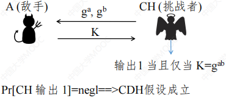

# 第八章 可证明安全

## 8.1 Boneh-Franklin身份基加密算法

### 8.1.1 身份基密码体制背景知识

PKI公钥密码体制的问题①发送者必须拥有接收者的证书②证书管理和CRL的复杂性③安全性悖论：证书数据库被暴露给组织/机构

身份基公钥密码体制的优势：①针对未准备用户的密码学②公钥是用户身份的某些属性，例如电子邮件地址、电话号码或生物识别数据③发送者只需知道接收者的身份属性即可发送加密邮件④接收者在收到加密邮件之后才需要与系统交互。

1984年由Shamir提出：Shamir提出了一个身份基签名（Identitybased signature，IBS）的工作系统，但没有提出身份基加密（Identitybased encryption，IBE）的系统。

第一个身份基加密的系统有Boneh和Franklin在2001提出，该系统基于Weil配对。

身份基加密：

身份基签名：

### 8.1.2 数学基础

离散对数问题（Discrete Logarithm Problem）：对于乘法群$Z_p^*$，给定$r,q,p$，寻找整数k使得$r=q^k(mod\ p)$。

标量乘法（Scalar multiplication）：$P,2P,3P=2P+P,4P=3P+P,\cdots,kP$

椭圆曲线上的离散对数问题（ECDLP）：给定$P,Q$，寻找整数k使得$kP=Q$。

双线性映射（Bilinear map）：映射$e:G_1\times G_1\rightarrow G_2$且符合$\forall P,Q\in G_1,a,b\in Z,E(aP,bQ)=e(P,Q)^{ab}$。

Weil配对（Weil Pairing）：是双线性映射：$G_1$是椭圆曲线$F_p$上的点的群，$G_2$是$F^*_{p^2}$的一个子群。用米勒算法（Miller`s algorithm）可高效计算。

符号定义：
①$p,q$是素数，$p=2(mod\ 3),p=6q-1$
②$E$是由$F_p$上$y^2=x^3+1$定义的椭圆曲线
③$G_q$是由$P\in E/F_p$生成的阶数$q=(p+1)/6$的群
④$\hat{e}:G_q\times G_q\rightarrow\mu_q$
⑤$\mu_q$是$F^*_{p^2}$的子群，包含所有的q阶元素
⑥非退化：$\hat{e}(P,P)\in F^*_{p^2}$是$\mu_q$的生成元

WDH假设（Weil Differ-Hellman Assumption）：给定$\langle P,aP,bP,cP\rangle$，其中随机选择$a,b,c\in Z^*_q,P\in E/F_p$，计算$W=\hat{e}(P,P)^{abc}\in F^*_{P^2}$。当p是随机k位素数时，不存在一个算法可以在概率多项式时间内解决WDH问题。

MapToPoint算法：用于将任意字符串$ID\in\{0,1\}^*$转换为一个q阶的点$Q_{ID}\in E/F_p$

MapToPoint算法步骤（其中哈希函数$G:\{0,1\}^*\rightarrow F_p$）：
①$y_0=G(ID),x_0=(y^2_0-1)^{1/3}$
②$Q=(x_0,y_0)\in E/F_p,Q_{ID}=6Q$

### 8.1.3 Boneh-Franklin身份基加密算法

#### 8.1.3.1初始化（Setup）

使用已定义的椭圆曲线群

选择q阶的$P\in E/F_p$，选择随机的$s\in Z^*_q$并设置$P_{pub}=sP$

选择哈希函数$\begin{cases}H:F_{p^2}\rightarrow\{0,1\}^n\\G:\{0,1\}^*\rightarrow F_p\end{cases}$

消息空间：$M=\{0,1\}^n$，密文空间：$C=E/F_p\times\{0,1\}^n$

系统参数：$\langle p,n,P,P_{pub},G,H\rangle$，主密钥：s。

#### 8.1.3.2 密钥生成（Extract）

使用MapToPoint把$ID$映射到点$Q_{ID}$，与$ID$对应的私钥是$d_{ID}=sQ_{ID}$。

#### 8.1.3.3 加密（Encrypt）

使用MapToPoint把$ID$映射到点$Q_{ID}$，选择随机$r\in Z_q$。

$c=\langle rP,M\oplus H(g^r_{ID})\rangle$，其中$g_{ID}=\hat{e}(Q_{ID},P_{pub})\in F_{p^2}$。

#### 8.1.3.4 解密（Decrypt）

设上文的$c=\langle rP,M\oplus H(g^r_{ID})\rangle=\langle U,V\rangle$。

若U不是q阶的点，则拒绝密文，否则$M=V\oplus H(\hat{e}(d_{ID},U))$。

正确性：$\because&\hat{e}(d_{ID},U)=\hat{e}(sQ_{ID},rP)=\hat{e}(Q_{ID},P)^{sr}=\hat{e}(Q_{ID},P_{pub})^r=g^r_{ID}\\\therefore&V\oplus H(\hat{e}(d_{ID},U))=M\oplus H(g^r_{ID})\oplus H(g^r_{ID})=M$。

## 8.2 可证明安全性与EI-Gamal加密方案简介

### 8.2.1 密码游戏与规约

**密码游戏**：由挑战者（CH）定义，由任意多个敌手有多项式时间的交互，若敌手能攻破这个游戏，则CH输出1。

若$P(CH输出1)=neg1\Rightarrow$密码游戏是安全的。几乎所有的计算性的假设和安全性都能用密码游戏来表示。

要证明$G_1$的可证明安全性：常常基于假设$G_2$来证明$G_1$的安全性（即要证明$G_2安全\Rightarrow G_1安全\\\uparrow\\G_1不安全\Rightarrow G_2不安全\\\uparrow\\\exist敌手攻破G_1\Rightarrow \exist敌手攻破G_2$）

故证明$G_1$的安全性，要构造一个$G_1$到$G_2$的规约。

**规约**：假设存在一个敌手能够攻破密码游戏$G_1$，试图构造一个规约算法，通过和攻破$G_1$的敌手进行交互来攻破$G_2$，若能成功攻破$G_2$，则可归谬证明$G_1$是安全的。

### 8.2.2 CDH假设

$G:$阶为q的循环群$\{g^1,g^2,\cdots,g^q\}$
$Z_q=\{1,2,\cdots,q\}$

则**CDH假设**：

### 8.2.3 加密方案的定义

**加密方案**：一个加密方案一般包含三个算法$\begin{cases}Gen(1^k)\rightarrow(pk,sk)\\Enc(pk,m)\rightarrow ct\\Dec(sk,ct)=m\end{cases}$。

其正确性即为$Dec(sk,Enc(pk,m))\overset{?}{=}m$。

单向性：

### 8.2.4 EI-Gamal加密方案

**EI-Gamal加密方案**：包含三个算法$\begin{cases}Gen(1^k):x\leftarrow _q,pk=g^x,sk=x\\Enc(pk,m):r\leftarrow Z_q, ct=(c=mg^{xr},c^{'}=g^r\\Dec(sk,ct=(c,c^{'})):m=(cc^{'})^{-x}\end{cases}$。

正确性：$(cc^{'})^{-x}=mg^{xr}g^{-xr}=m$

### 8.2.5 EI-Gamal加密方案基于CDH假设的单向性

$P(规约算法解决CDH困难问题)=P(c/m=g^{rk})=P(c=mg^{rk})=P(失手A打破单向性)$

所以若CDH假设成立，则不存在敌手能打破EI-Gamal加密的单向性。