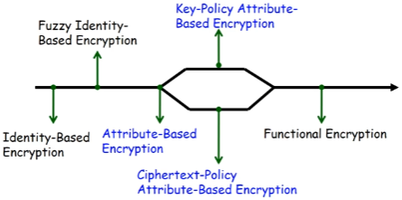

# 第九章 密码学的新方向

## 9.1 属性基加密

传统的访问控制模型：①优点：灵活、可拓展、MAC、DAC、RBAC②缺点：数据容易受到损害

问题：云服务器不可行/云服务器被攻破时的数据泄露。传统的访问控制模型假设云服务器是可行的，这是不现实的。

解决方案：以加密形式存储数据（即使对于“可信”的服务器也是很好的做法）→深度防御原则。

通过加密进行访问控制：①需要密钥才能访问数据②密文（Ciphertexts）存储在服务器上③每个用户都可以解密自己的数据。

与他人共享加密数据：①公钥解决方案：公钥证书管理的开销很大；一对一加密②对称密钥解决方案：在线密钥分发

在不可行服务器上存储加密数据的期望：①密钥管理是可拓展和离线的②无需一个在线的可信任方来调解访问控制③灵活和可拓展的访问控制策略

基于属性的加密（Attribute-Based Encryption，ABE）就可以实现上述期望。

属性基加密的演化：

属性基加密：①可以将数据加密给具有某些属性的用户②一对多公钥加密③内置访问控制机制

## 9.2 全同态加密

### 9.2.1 同态的定义

就和近世代数的同态差不多：设$\langle G,\times\rangle,\langle H,\cdot\rangle$是两个群。f是群G到群H的映射，如果$\forall a,b\in G,f(a\times b)=f(a)\cdot f(b)$，则称f是群G到群H的一个同态映射。

**算法对运算的同态**：设$E(k,x)$表示用加密算法E和密钥k对x进行加密，F表示一种运算，如果对于加密算法E和运算F，存在有效算法G使得$E(k,F(x_1,x_2,\cdots,x_n))=F(E(k,x_1),E(k,x_2),\cdots,E(k,x_n))$则称加密算法E对于运算F是**同态**的。

**加法同态加密算法**：若$F(x_1,x_2,\cdots,x_n)=\sum\limits^n_{i=1}x_i$，则称该加密算法为**加法同态加密算法**

**乘法同态加密算法**：若$F(x_1,x_2,\cdots,x_n)=\prod\limits^n_{i=1}x_i$，则称该加密算法为**乘法同态加密算法**

**全同态加密方案**：若定义中的等式对包含加法和乘法混合运算的$F(x_1,x_2,\cdots,x_n)$都成立，那么该加密方案就是一个**全同态加密方案**。

同态加密的起源：1978年Rivset,Adleman和Dertouzos，隐私同态。

应用场景：“保密数据库（private data banks）”①用户将个人敏感数据加密后存储在一个不可行的服务器中，并给出正确的查询应答②“保密数据库”的思想已经基本完整涵盖了数据存储和数据处理过程，完全可以将其视作当今流行的安全云存储与安全云计算融合的一种概念性雏形。

全同态加密思想有着与公钥加密思想比肩齐名的重要地位，实用的全同态加密方案将催生新型分布式计算模式。

全同态加密概念自提出后近30年来，一直被密码学界誉为“密码学圣杯”。

### 9.2.2 早期的同态加密算法

#### 9.2.2.1 RSA的同态性

设$n=pq$，$(n,e)$为公钥，d为私钥

RSA的加密函数为$E(m)=c=m^e(mod\ n)$。

所以若有$c_1=E(m_1)=m_1^e(mod\ n)$，$c_2=E(m_2)=m_2^e(mod\ n)$。

则有$c_1c_2=E(m_1)E(m_2)=m_1^em_2^e(mod\ n)=(m_1m_2)^e(mod\ n)=E(m_1m_2)$

所以RSA满足乘法同态。

#### 9.2.2.2 EI-Gamal的同态性

设p为一个素数，g是$Z_p$中的生成怨。EI-Gamal的加密密钥$y=g^x(mod\ p)$，其中x是随机选取的私钥。

EI-Gamal的加密函数为$C_1=g^k(mod\ p)$，$C_2=y^kM(mod\ p)$。

所以若有$\begin{cases}E(M_1)=(C_{11},C_{12})=(g^{k_1}(mod\ p),y^{k_1})M_1(mod\ p)\\E(M_2)=(C_{11},C_{12})=(g^{k_2}(mod\ p),y^{k_2})M_2(mod\ p)\end{cases}$。

则有$\begin{align}E(M_1)E(M_2)&=(g^{k_1}(mod\ p),y^{k_1})M_1(mod\ p)\cdot (g^{k_2}(mod\ p),y^{k_2})M_2(mod\ p)\\&=(g^{k_1+k_2}(mod\ p),y^{k_1+k_2})M_1M_2(mod\ p))\\&=E(M_1M_2)\end{align}$

即EI-Gamal满足乘法同态性。

### 9.2.3 全同态加密

全同态加密是指能够在不知道密钥的情况下，对密文进行任意计算，即对于任意有效的f及明文m，有性质$f(E(m))=E(f(m))$。这种特殊的性质使得全同态加密由广泛的理论与实际应用，如云计算安全、密文检索、安全多方计算等。

从理论上讲，所有的函数都可以由加法和乘法多次复合来实现，因此全同态加密算法在设计的时候可以首先考虑其对加法和乘法都同态，再将其扩展到任意函数之上。

基于格的全同态加密发展的三个阶段：

①基于理想格以Gentry方案为蓝图的FHE构造：2009年，Gentry的FHE体制，基于理想格（ideal lattice）上的有界编码问题（BDDP）和稀疏子集和问题（SSSP）

构造过程：①设计一个具备有限次密文运算的同态加法和同态乘法的近似同态（SWHE）加密体制②引入“Booststrapping”程序，利用重加密的方法对密文进行更新，以此控制噪声膨胀，保证解密安全性，从而实现任意次的密文同态运算。

缺点：无法抵抗选择密文空寂（CCA），只能达到选择明文攻击（CPA）安全。

②基于LWE假设，利用密钥交换等技术来实现FHE1的构造：2011年Brakerski和Vaikuntanathan，基于Ring-LWE假设。

构造步骤：①生成一个便于描述和分析的SWHE方案，其安全性量子规约到理想格上的最坏情形困难问题②利用Gentry的压缩范式（squashing）和Booststraping程序将SWHE转化为真正的FHE方案。

改进方案：①使用Relinearization技术，将基于LWE假设的Regev方案转换为SWHE方案。②提出一种新的Dimension-Modulus Reduction技术来实现Bootstraping程序，二不再使用Gentry的压缩范式

③基于LWE假设，利用近似特征向量构造的FHE方案：2013年，Gentry-Sahai-Waters（GSW）方案，近似特征向量方法来构建FHE方案

构造方法：①该方案的同态加法和同态乘法都只是通过做简单的矩阵加法和乘法来实现②GSW-FHE方案相对简单、快捷、容易理解。③实施同态运算时不需要使用计算公钥，而只需借助用户的公钥即可实现。

全同态的应用：①基于全同态加密的安全多方计算②基于全同态加密的密文处理③函数加密④不可区分性混淆器

## 9.3 后量子密码学

### 9.3.1 量子计算对密码学的影响
#### 9.3.1.1 量子计算对密码学的威胁
贝尔实验室，Grove算法，1996年
①针对所有密码（包括对称密码）的通用的搜索破译算法
②所有密码的安全参数要相应增大
贝尔实验室，Shor算法，1994年
①多项式时间求解数论困难问题如大整数分解问题、求解离散对数问题等
②RSA、ElGamal、ECC、DSS等公钥密码体制都不再安全

| 密码算法    | 类型     | 目的                 | 受到大规模量子计算机的影响 |
| ----------- | -------- | -------------------- | -------------------------- |
| AES         | 对称密钥 | 加密                 | 密钥规模增大               |
| SHA-2、SHA3 | Hash函数 | 完整性               | 输出长度增加               |
| RSA         | 公钥密码 | 加密、签名、密钥建立 | 不再安全                   |
| ECDSA、ECDH | 公钥密码 | 签名、密钥交换       | 不再安全                   |
| DSA         | 公钥密码 | 签名                 | 不再安全                   |

#### 9.3.1.2 量子计算机的研究发展

2001年，科学家在具有15个量子位的核磁共振量子计算机上成功利用Shor算法对15进行因式分解。

2007年2月，加拿大D-Wave系统公司宣布研制成功16位量子比特的超导量子计算机，但其作用仅限于解决一些最优化问题，与科学界公认的能运行各种量子算法的量子计算机仍有较大区别。

2009年11月15日，世界首台可编程的通用量子计算机正式在美国诞生。同年，英国布里斯托尔大学的科学家研制出基于量子光学的量子计算机芯片，可运行Shor算法。

2010年3月31日，德国于利希研究中心发表公报：德国超级计算机成功模拟42位量子计算机。

2011年5月11日, 加拿大的D-Wave System Inc. 发布了一款号称 “全球第一款商用型量子计算机”的计算设备“D-Wave One”。

2011年9月，科学家证明量子计算机可以用冯·诺依曼架构来实现。 同年11月，科学家使用4个量子位成功对143进行因式分解。

2012年2月，IBM声称在超导集成电路实现的量子计算方面取得数项突破性进展。 同年4月，一个多国合作的科研团队研发出基于金刚石的具有两个量子位的量子计算机，可运行Grover算法，在95%的数据库搜索测试中，一次搜索即得到正确答案。该研究成果为小体积、室温下可正常工作的量子计算机的实现提供可能。

2013年5月D-Wave System Inc宣称NASA和Google共同预定了一台采用512量子位的D-Wave Two量子计算机。

2017年，中科大和浙江大学联合宣布基于超导量子计算方案实现了10位量子比特的纠缠操控。这一成果打破了美国之前保持的9个量子比特操纵的记录，形成了一个完整的超导计算机的系统，使我国在超导体系量子计算机研究领域也进入世界一流水平行列。

#### 9.3.1.3 全球在抗量子密码方面的行动

2006年开始至今召开了9届后量子密码学国际学术研讨会。

各国资助机构对后量子密码的支持：①欧洲联盟（欧盟）项目pqcrypto和safecrypto②日本的CREST密码数学项目

行业标准组织的活动：
①自2013年以来，欧洲电信标准协会（ETSI）组织了三个“量子安全密码”研讨会。
②2015年NIST举行题为“后量子世界的网络安全”研讨会。
③2016 年 2 月美国国家标准与技术研究院正式面向全球公开了后量子密码④标准化的路线图，并在同年秋正式公布征集后量子密码系统建议的计划，其中包括公钥密码、数字签名以及密钥交换算法。
⑤2017年11月30日，第一轮算法征集截止，并公布了69个候选算法。

### 9.3.2 后量子密码学的研究方向

**①基于Hash的签名体制**

安全性：Hash函数的安全性

电信方案：Merkle, R.C.: A certified digital signature. CRYPTO 1989

优点：签名和验证签名效率较高

缺点：签名和密钥较长，产生密钥的代价较大

改进方案：Buchmann, J., Dahmen, E., Hulsing, A.: XMSS - a practical forward secure signature 
scheme based on minimal security assumptions. PQCrypto 2011

挑战：有状态性和参数优化

**②基于纠错码的公钥密码学**

安全性：任意线性码的译码问题是NP-完全妄图

典型方案：McEliece, R.J.: A public-key cryptosystem based on algebraic coding theory. 
DeepSpace Network Progress Report (1978)
Landais, G., Sendrier, N.: Implementing CFS. INDOCRYPT 2012.
Persichetti, E.: Secure and anonymous hybrid encryption from coding theory. PQCrypto 2013

优点：加解密效率高（McEliece），签名长度短（CFS）

缺点：密钥量大，签名效率较低（CFS）

挑战：降低密钥量，提高效率

**③基于格的公钥密码学**

安全性：格中困难问题如最短向量问题（SVP）、最近向量问题（CVP）、learning with errors problem（LWE）和最小整数解问题（SIS）

典型方案：Ducas, L., Durmus, A., Lepoint, T., Lyubashevsky, V.: Lattice signatures  and bimodal gaussians. CRYPTO 2013
Hoffstein, J., Pipher, J., Silverman, J.H.: NTRU: a ring-based public key  cryptosystem. ANTS 1998
Gentry, C.: Fully homomorphic encryption using ideal lattices. STOC 2009

优点：强安全性（允许最坏情形困难性规约到一般情形困难性）

缺点：参数较大

挑战：参数优化，效率提升

**④多变量公钥密码学**

安全性：求解有限域上随机生成的多变量非线性多项式方程组是NP-困难的

典型方案：Ding, J., Schmidt, D.: Rainbow, a new multivariable polynomial signature 
scheme. ACNS 2005.
Petzoldt, A., Chen, M.-S., Yang, B.-Y., Tao, C., Ding, J.: Design principles for HFEv- based multivariate signature schemes. ASIACRYPT 2015

优点：效率较高

缺点：公钥量大，安全性不确定

挑战：可证明安全的密码体制，降低密钥量